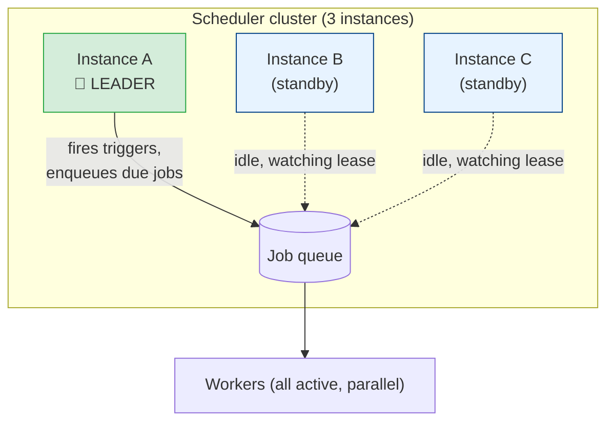
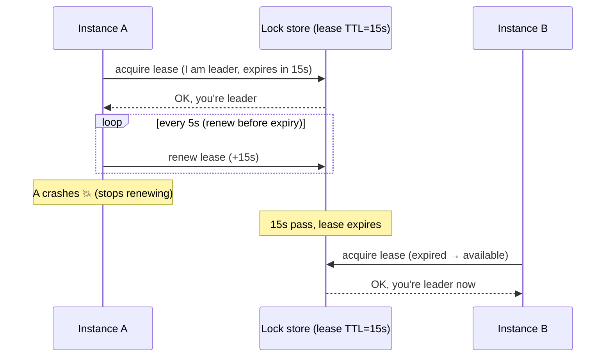
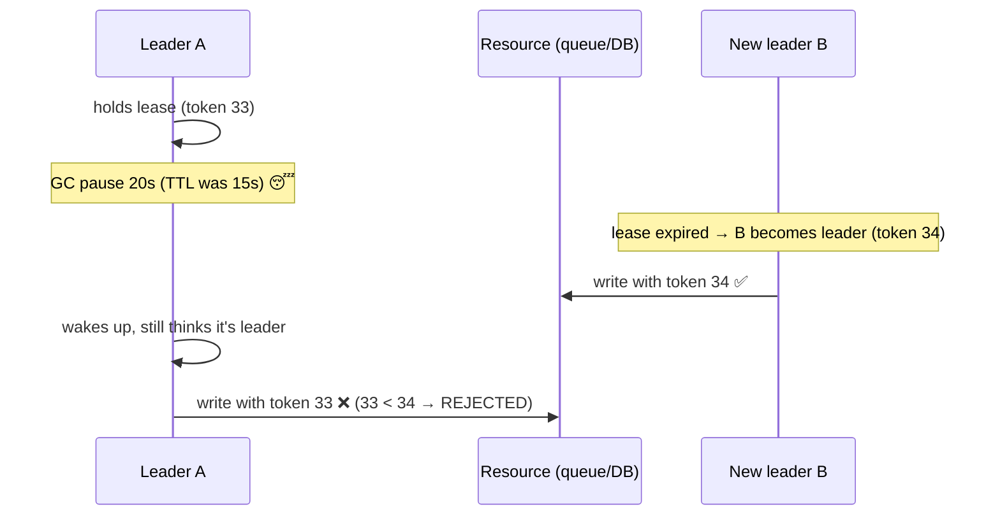

# Leader Election

[< Back](./failure-modes.md) | [Index](./README.md) | [Next: Heartbeats & Failure Recovery >](./heartbeats-and-recovery.md)

---

[Chapter 1](./failure-modes.md) set the trap: run one scheduler and it's a single point of
failure; run three and they all fire every trigger, tripling your work. **Leader election** is the
escape. You run several scheduler instances for availability, but at any moment exactly **one** —
the *leader* — is allowed to make trigger decisions. The others stand by, ready to take over the
instant the leader dies.

> **Important scope note:** you usually only need a single leader for the *trigger side* (deciding
> which jobs are due). The *execution side* — actual workers running jobs — should stay **fully
> parallel**; they pull work off the queue concurrently using `SKIP LOCKED` (Chapter 6). Electing
> a leader for execution would throw away all your throughput. Elect a leader for the decider, not
> the doers.

## The goal: single-writer, high-availability



Election must guarantee two properties:

- **Safety** — at most one leader "acts" at a time. Violating this = **split-brain** = duplicates.
- **Liveness** — if the leader dies, a new one is eventually elected. Violating this = no leader =
  lost jobs.

There's tension between them: to be *safe* you'd wait forever to be sure the old leader is dead;
to be *live* you'd elect a new one instantly. Real systems pick a bounded compromise: the **lease**.

## The core primitive: a lease (a lock with a TTL)

A plain distributed lock has a fatal flaw for this use case: if the leader holds the lock and then
*dies*, the lock is held forever and no one can take over. The fix is a **lease** — a lock that
**expires** unless continually renewed.



Two knobs define the behavior:

- **Lease TTL** — how long leadership is valid without a renewal (e.g., 15s).
- **Renewal interval** — how often the leader refreshes it (e.g., every 5s, i.e. TTL/3).

**Failover time is bounded by the TTL.** A short TTL (fast failover) means more renewal traffic and
more false failovers from a brief GC pause; a long TTL means slower recovery. Typical: renew at
TTL/3 so you can miss two renewals before losing leadership.

## Implementation A: Postgres advisory lock (simplest if you already run Postgres)

A **session-level advisory lock** is held for as long as the connection lives. If the leader
process dies, its connection drops and Postgres releases the lock automatically — a built-in
"lease" tied to TCP liveness. No TTL bookkeeping needed.

```python
LEADER_LOCK_KEY = 424242  # any app-wide constant

def try_become_leader(conn) -> bool:
    # Non-blocking: returns True if we got the lock, False if another instance holds it.
    return conn.execute(
        "SELECT pg_try_advisory_lock(%s)", (LEADER_LOCK_KEY,)
    ).scalar()

def leader_loop(conn):
    while True:
        if try_become_leader(conn):
            log.info("acquired leadership")
            run_scheduler_until_connection_dies(conn)   # fire triggers here
        else:
            time.sleep(5)   # someone else leads; retry later
```

- **Pro:** trivial, no extra infra, releases automatically on crash.
- **Con:** liveness depends on the DB *noticing* the dead connection (TCP keepalive / `tcp_keepalives_idle`) — a hung-but-not-closed connection can hold the lock longer than you'd like. For a scheduler this is usually fine.

## Implementation B: Redis lease with explicit TTL

When you don't want a long-lived DB connection, use a key with a TTL and renew it. `SET key value
NX PX 15000` sets the key **only if absent** (`NX`) with a 15s expiry (`PX`).

```python
import uuid
TOKEN = str(uuid.uuid4())   # unique per instance, proves ownership

def acquire_or_renew(redis, ttl_ms=15000) -> bool:
    # Try to acquire if free...
    if redis.set("scheduler:leader", TOKEN, nx=True, px=ttl_ms):
        return True
    # ...or renew if we already hold it (compare-and-extend, atomically via Lua).
    lua = """
    if redis.call('get', KEYS[1]) == ARGV[1] then
      return redis.call('pexpire', KEYS[1], ARGV[2])
    else
      return 0
    end"""
    return bool(redis.eval(lua, 1, "scheduler:leader", TOKEN, ttl_ms))
```

The Lua script is essential: **check-then-extend must be atomic**, or you can renew a lease that
already expired and got taken by someone else.

> **The Redlock caveat.** A single Redis node is a single point of failure; the multi-node
> "Redlock" algorithm is [famously contested](https://martin.kleppmann.com/2016/02/08/how-to-do-distributed-locking.html)
> for correctness-critical locking. For *leader election of a scheduler*, a lease that occasionally
> hiccups is acceptable **because the execution side is idempotent** — that's your real safety net.
> If you need provably-correct leadership, use a consensus system (below).

## Implementation C: Consensus systems (the "correct" way)

**etcd**, **ZooKeeper**, and **Consul** implement leader election on top of a consensus algorithm
(Raft/ZAB — see [distributed-systems/consensus](../distributed-systems/consensus.md)). They give
you real safety guarantees because a quorum agrees on who the leader is.

| System | Primitive | How election works |
|--------|-----------|--------------------|
| **etcd** | Lease + key | Put a key with a lease; whoever holds the key leads; campaign API automates it |
| **ZooKeeper** | Ephemeral sequential znode | Lowest sequence number wins; node vanishes on disconnect → next in line leads |
| **Consul** | Session + KV lock | Acquire a KV key with a session TTL; session invalidation releases it |
| **Kubernetes** | `Lease` object (coordination.k8s.io) | `client-go/leaderelection` renews a Lease; standard for operators/controllers |

If you run on Kubernetes, the built-in **Lease** object + `leaderelection` package is often the
path of least resistance — it's exactly what controllers like `kube-controller-manager` use.

## Split-brain and the fencing token

Here's the subtle bug that bites everyone. Leader A gets the lease. Then A suffers a **stop-the-
world GC pause** (or a slow disk, or a network partition) for 20 seconds — longer than the 15s
TTL. The lease expires; B legitimately becomes leader. Then A wakes up, *still believing it's the
leader*, and fires a trigger. **Two leaders acted. Split-brain.**



The defense is a **fencing token**: a number that **monotonically increases** every time
leadership changes. The leader includes its token on every action, and the protected resource
**rejects any token lower than the highest it has seen**. Stale leader A carries token 33; the
resource has already seen 34 from B; A's write is fenced out.

```sql
-- The protected resource enforces monotonic tokens.
UPDATE job_dispatch_guard
   SET last_token = :my_token
 WHERE last_token < :my_token;   -- 0 rows updated ⇒ you're a stale leader, ABORT
```

Postgres/etcd/ZooKeeper hand you a monotonic number for free: etcd's key `mod_revision`,
ZooKeeper's `zxid`, or a Postgres `SEQUENCE`. Use it.

> **Leases give you liveness, fencing gives you safety.** A lease alone assumes processes die
> promptly and cleanly — but a paused process is *indistinguishable from a dead one* to everyone
> else, and it can come back. If duplicate action is catastrophic, you need fencing (or an
> idempotent resource) in addition to the lease, not instead of it.

## Choosing an approach

| You have... | Use |
|-------------|-----|
| Postgres already, modest scale | Advisory lock (Implementation A) — simplest |
| Redis, tolerant of rare hiccups | Redis lease + idempotent execution |
| A hard correctness requirement | etcd / ZooKeeper / Consul (consensus) |
| A Kubernetes cluster | `Lease` + `client-go` leaderelection |

For most teams building a scheduler, the honest answer is: **use the simplest lease you have, and
lean on idempotency ([Chapter 4](./job-deduplication.md)) as the real guarantee.** Perfect
leadership is expensive; harmless duplicates are cheap.

## Takeaways

- Run many scheduler instances for availability, but let only **one leader** fire triggers. Keep
  **workers parallel** — never elect a leader for execution.
- Election needs **safety** (≤1 acting leader) and **liveness** (a new leader eventually). The
  **lease** (a lock with a TTL, renewed at ~TTL/3) is the standard compromise; failover time ≈ TTL.
- **Postgres advisory locks** and **Redis `SET NX PX`** are easy leases; **etcd/ZooKeeper/Consul**
  and **k8s Leases** give consensus-grade guarantees.
- **Split-brain** (a paused old leader waking up) is the killer bug. A lease can't prevent it —
  add **fencing tokens** (monotonic numbers the resource enforces) or make the action idempotent.

---

[< Back](./failure-modes.md) | [Index](./README.md) | [Next: Heartbeats & Failure Recovery >](./heartbeats-and-recovery.md)
