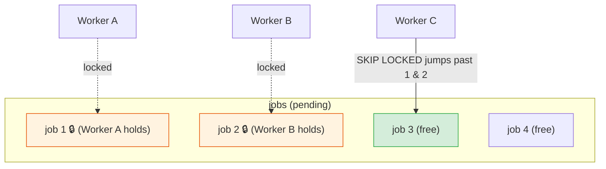
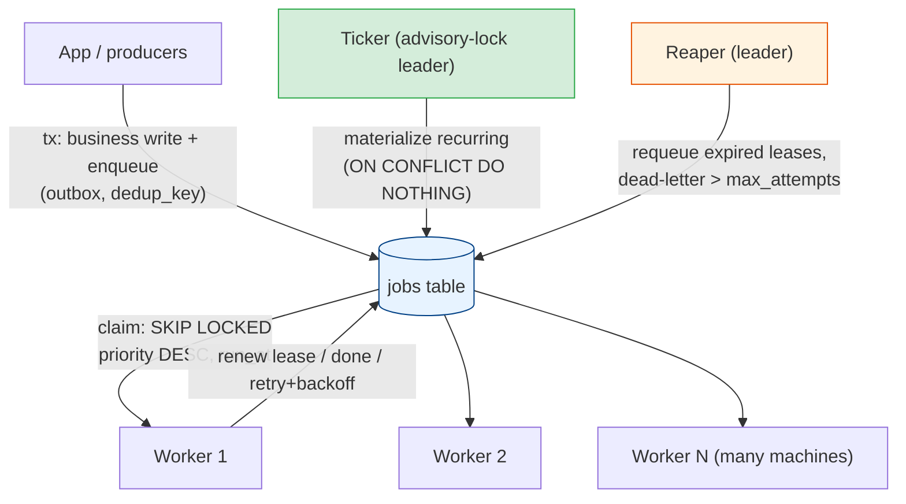

# A Postgres-Backed Distributed Scheduler

[< Back](./priority-queues.md) | [Index](./README.md)

---

Time to assemble everything. The previous five chapters were mechanisms in isolation:
[failure modes](./failure-modes.md), [leader election](./leader-election.md),
[heartbeats & recovery](./heartbeats-and-recovery.md), [deduplication](./job-deduplication.md), and
[priority](./priority-queues.md). This chapter builds **one real, distributed scheduler** that uses
all of them — on nothing but **PostgreSQL**. No Kafka, no Redis, no ZooKeeper. Just a table and a
few queries.

The punchline you should internalize: **for the vast majority of systems, "the database you
already have" is a perfectly good distributed scheduler.** The pattern is boring, durable, and
correct — which is exactly what you want at 2am.

## Why Postgres (and when not to)

| ✅ Reasons it works beautifully | ⚠️ Where it hits limits |
|--------------------------------|-------------------------|
| **ACID transactions** — enqueue in the same tx as your business write (no [dual-write / lost jobs](./failure-modes.md)) | **Throughput ceiling** — great to ~1k–10k jobs/sec, not millions. Beyond that, reach for Kafka/dedicated queues |
| **`FOR UPDATE SKIP LOCKED`** — a concurrent, lock-free-feeling work queue for free | **Table churn / bloat** — high insert+delete rates create dead tuples; needs autovacuum tuning + archiving |
| **Durability** — jobs survive restarts; they're on disk | **Connection limits** — many pollers exhaust connections; use PgBouncer |
| **You already run it** — one fewer system to operate, back up, monitor | **Polling latency** — naive polling adds delay; mitigate with `LISTEN/NOTIFY` |
| Rich querying: priority, delays, dedup, retries are all just SQL | Not built for very long queues of millions of rows sitting unprocessed |

> **The rule of thumb:** if your job volume fits comfortably in the thousands-per-second and you
> value operational simplicity, Postgres wins. This is what libraries like **`pg_cron`**,
> **`graphile-worker`**, **River** (Go), **`solid_queue`** (Rails 7.1+), **Que**, and **Oban**
> (Elixir) all do under the hood.

## The schema

One table carries the whole design. Every column maps to a concept from an earlier chapter.

```sql
CREATE TABLE jobs (
    id                bigserial PRIMARY KEY,
    type              text        NOT NULL,          -- which handler runs it
    payload           jsonb       NOT NULL DEFAULT '{}',
    priority          int         NOT NULL DEFAULT 0,   -- Ch5: higher = sooner
    run_at            timestamptz NOT NULL DEFAULT now(),  -- Ch5: delayed/scheduled
    status            text        NOT NULL DEFAULT 'pending',  -- pending|running|done|failed
    attempts          int         NOT NULL DEFAULT 0,
    max_attempts      int         NOT NULL DEFAULT 5,
    locked_by         text,                            -- Ch3: which worker holds it
    lease_expires_at  timestamptz,                     -- Ch3: when its lease lapses
    dedup_key         text UNIQUE,                     -- Ch4: enqueue dedup
    last_error        text,
    created_at        timestamptz NOT NULL DEFAULT now()
);

-- The one index that matters: only over rows a worker might claim.
-- A PARTIAL index keeps it tiny even when millions of 'done' rows pile up.
CREATE INDEX idx_jobs_claimable
    ON jobs (priority DESC, run_at)
    WHERE status = 'pending';

-- For the reaper (Ch3): quickly find expired leases.
CREATE INDEX idx_jobs_running_lease
    ON jobs (lease_expires_at)
    WHERE status = 'running';
```

## The heart of it: `SELECT … FOR UPDATE SKIP LOCKED`

This single feature is why Postgres makes a great queue. When many workers poll at once, you need
each to grab a *different* job without blocking one another. `FOR UPDATE` row-locks the selected
row; `SKIP LOCKED` tells other transactions "don't wait on locked rows — **skip past them** to the
next available one."



Without `SKIP LOCKED`, Worker C would **block** waiting for job 1's lock — serializing all your
workers. With it, C instantly skips to job 3. This turns a plain table into a high-concurrency
queue. The atomic **claim** query:

```sql
-- Claim one job: pick the highest-priority due job that nobody else is working,
-- stamp a lease on it, and return it — all in one atomic statement.
UPDATE jobs
   SET status           = 'running',
       locked_by        = :worker_id,
       lease_expires_at = now() + interval '60 seconds',   -- Ch3 lease
       attempts         = attempts + 1
 WHERE id = (
     SELECT id
       FROM jobs
      WHERE status = 'pending'
        AND run_at <= now()                                -- Ch5: not in the future
      ORDER BY priority DESC, run_at ASC                   -- Ch5: priority + FIFO
      FOR UPDATE SKIP LOCKED                               -- the magic
      LIMIT 1
 )
RETURNING id, type, payload, attempts, max_attempts;
```

## The worker loop

Each worker (there can be dozens, across many machines) runs the same loop: claim → run →
complete/retry, renewing its lease while it works.

```python
import time, threading

WORKER_ID = f"{socket.gethostname()}:{os.getpid()}"
HANDLERS = {"send_receipt": send_receipt, "daily_report": build_report}   # type -> fn

def worker_loop(pool):
    while True:
        job = claim_one(pool)              # the UPDATE ... SKIP LOCKED above
        if job is None:
            time.sleep(1)                  # nothing due; back off (or LISTEN, below)
            continue
        run_one(pool, job)

def run_one(pool, job):
    stop = threading.Event()
    threading.Thread(target=renew_lease, args=(pool, job.id, stop), daemon=True).start()
    try:
        HANDLERS[job.type](job.payload)    # do the work (make it idempotent — Ch4!)
        complete(pool, job.id)
    except Exception as e:
        fail(pool, job.id, job.attempts, job.max_attempts, str(e))
    finally:
        stop.set()

def complete(pool, job_id):
    # Fencing (Ch3): only mark done if WE still own the lease. If a reaper reclaimed
    # it (we were falsely declared dead), this updates 0 rows and the other worker owns it.
    pool.execute(
        "UPDATE jobs SET status='done' WHERE id=%s AND locked_by=%s",
        (job_id, WORKER_ID),
    )

def fail(pool, job_id, attempts, max_attempts, err):
    if attempts >= max_attempts:
        pool.execute("UPDATE jobs SET status='failed', last_error=%s WHERE id=%s", (err, job_id))
    else:
        # Retry with exponential backoff (Ch1 misfire / Ch3 recovery).
        pool.execute(
            "UPDATE jobs SET status='pending', locked_by=NULL, last_error=%s, "
            "run_at = now() + make_interval(secs => least(3600, power(2, attempts))) "
            "WHERE id=%s AND locked_by=%s",
            (err, job_id, WORKER_ID),
        )

def renew_lease(pool, job_id, stop, lease=60):
    while not stop.wait(lease / 3):        # heartbeat at 1/3 lease (Ch3)
        pool.execute(
            "UPDATE jobs SET lease_expires_at = now() + make_interval(secs => %s) "
            "WHERE id=%s AND locked_by=%s",
            (lease, job_id, WORKER_ID),
        )
```

## The reaper: recovering crashed workers

If a worker dies mid-job, its lease stops renewing. A **reaper** (run periodically, ideally by the
leader) returns those jobs to the pool — this is [Chapter 3](./heartbeats-and-recovery.md) in one
query:

```sql
-- Reclaim jobs whose worker died (lease expired). Retry if attempts remain, else dead-letter.
UPDATE jobs
   SET status    = CASE WHEN attempts >= max_attempts THEN 'failed' ELSE 'pending' END,
       locked_by = NULL,
       run_at    = now() + make_interval(secs => least(3600, power(2, attempts)))
 WHERE status = 'running'
   AND lease_expires_at < now();
```

## Recurring jobs: the leader-guarded ticker

A cron-like scheduler needs *something* to materialize recurring jobs ("every day at 02:00") into
concrete `jobs` rows. Run this **ticker** on every instance, but guard it with a
[Postgres advisory lock](./leader-election.md) so only the leader actually inserts — and let the
[unique `dedup_key`](./job-deduplication.md) be the backstop if two ever race.

```python
LEADER_KEY = 918273

def ticker(pool):
    while True:
        with pool.connection() as conn:
            # Only the leader proceeds; others skip this tick (Ch2).
            if conn.execute("SELECT pg_try_advisory_lock(%s)", (LEADER_KEY,)).scalar():
                try:
                    materialize_due_recurring(conn)
                finally:
                    conn.execute("SELECT pg_advisory_unlock(%s)", (LEADER_KEY,))
        time.sleep(1)

def materialize_due_recurring(conn):
    for sched in due_schedules(conn):          # e.g. cron rows whose next_run <= now()
        slot = sched.next_run.strftime("%Y-%m-%dT%H:%M")
        # dedup_key makes this safe even if two tickers run: only one row survives (Ch4).
        conn.execute(
            "INSERT INTO jobs (type, payload, priority, dedup_key) "
            "VALUES (%s, %s, %s, %s) ON CONFLICT (dedup_key) DO NOTHING",
            (sched.type, sched.payload, sched.priority, f"{sched.name}:{slot}"),
        )
        advance_next_run(conn, sched)          # compute the following fire time
```

Belt **and** braces: the advisory lock prevents redundant work; the unique key guarantees
correctness even if the lock ever hiccups. That's the whole philosophy of this module in three
lines.

## Transactional enqueue (killing the lost-job window)

Because the queue *is* a table, you enqueue a job in the **same transaction** as the business
change that triggers it. This is the [outbox pattern](../microservices/README.md), and it makes
[lost jobs from dual writes](./failure-modes.md) impossible:

```python
with pool.transaction():                        # one atomic unit
    order_id = insert_order(cart)               # business write
    enqueue(pool, "send_receipt",               # job write — same tx
            payload={"order_id": order_id},
            dedup_key=f"receipt:{order_id}")     # + idempotent enqueue (Ch4)
# Commit → both exist. Rollback → neither does. There is no window to lose the job.
```

## Avoiding busy-poll: `LISTEN` / `NOTIFY`

Polling every second adds up to a second of latency and constant idle queries. Postgres's
**`LISTEN`/`NOTIFY`** lets producers *wake* workers the instant a job lands. Keep a slow poll as a
safety net (for delayed jobs and missed notifications) and use `NOTIFY` for immediate wakeups:

```sql
-- Producer, after inserting a ready job:
NOTIFY jobs_ready;
```

And the worker waits to be woken instead of polling tightly:

```python
# Worker: block until notified OR a short timeout, then try to claim. Latency ~ms, not ~1s.
conn.execute("LISTEN jobs_ready")
while True:
    if not conn.notifies(timeout=5):     # woken by NOTIFY, or fall through every 5s
        pass                             # timeout → still poll (covers delayed/missed jobs)
    drain_claimable(pool)
```

## Putting it all together



Every failure mode from Chapter 1 has a defense here: **dead scheduler** → advisory-lock leader
plus many stateless workers; **overlapping runs** → single claim and lease; **lost jobs** → durable
table with transactional enqueue and a reaper; **duplicates** → `dedup_key` with fencing on
`complete()`; **ordering** → `ORDER BY priority, run_at`.

## Operational checklist

- **Index** the claim path with a **partial index** (`WHERE status='pending'`) so it stays small as
  `done` rows accumulate.
- **Archive/delete** completed jobs (move to a `jobs_archive` table or `DELETE` in batches). A queue
  table full of `done` rows bloats and slows scans. Consider **partitioning** by day.
- **Tune autovacuum** aggressively on this hot table — high insert/update/delete churn generates
  dead tuples fast. Watch for bloat.
- **Pool connections** (PgBouncer) — many polling workers otherwise exhaust `max_connections`.
- **Monitor**: queue depth (pending count), oldest `pending` age (are you falling behind?),
  `failed`/dead-letter count (alert!), and reaper reclaim rate (rising = workers dying).
- **Cap poll rate / use `LISTEN`** to avoid hammering the DB with empty `SELECT`s.

## Takeaways

- A single `jobs` table + **`SELECT … FOR UPDATE SKIP LOCKED`** turns Postgres into a durable,
  concurrent, distributed job queue — no extra infrastructure.
- The schema encodes every prior chapter: `priority`/`run_at` (ordering & delay), `lease_expires_at`
  (heartbeats/recovery), `dedup_key` (dedup), `attempts`/`max_attempts` (retries/dead-letter).
- **Workers are stateless and parallel**; a **reaper** recovers crashed ones; a **leader-guarded
  ticker** (advisory lock + `ON CONFLICT`) materializes recurring jobs exactly once.
- **Transactional enqueue** (outbox) eliminates lost-job dual-write windows; **fencing** on
  completion + idempotent handlers make at-least-once safe.
- Postgres scales to thousands of jobs/sec with simple ops (partial indexes, archiving, autovacuum,
  PgBouncer, `LISTEN/NOTIFY`). Past that, graduate to a dedicated queue — but most systems never
  need to.

---

[< Back](./priority-queues.md) | [Index](./README.md)
