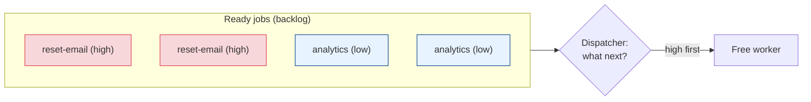
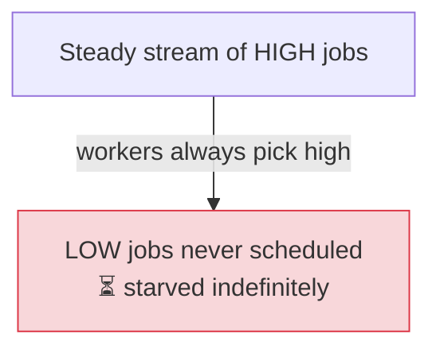

# Priority Queues & Fairness

[< Back](./job-deduplication.md) | [Index](./README.md) | [Next: A Postgres-Backed Distributed Scheduler >](./postgres-backed-scheduler.md)

---

So far every job has been equal. It isn't. A **password-reset email** and a **nightly analytics
rollup** may sit in the same queue, but if a worker frees up and both are waiting, the reset must
go first — a user is staring at a spinner while the rollup can wait an hour. When demand exceeds
capacity (and eventually it always does), the scheduler must answer: **what runs next?** That's the
job of a priority queue — and the trap hiding inside it is **starvation**.

## Priority is only interesting under contention

If you always have spare workers, everything runs immediately and priority is moot. Priority
matters precisely when the queue has a **backlog** — more ready jobs than workers. Then ordering
decides who waits.



## Three ways to implement priority

### Option A — Multiple queues, one per priority (strict priority)

Keep separate queues — `high`, `default`, `low` — and have workers **always drain `high` first**,
only touching `default` when `high` is empty, and `low` only when both are empty.

```python
QUEUES = ["jobs:high", "jobs:default", "jobs:low"]   # order = priority

def next_job(redis):
    # BRPOP checks queues left-to-right, returns from the first non-empty one.
    # A high job, if present, always wins over default/low.
    queue, job = redis.brpop(QUEUES, timeout=5)
    return queue, job
```

- **Pro:** dead simple, O(1), maps directly onto Redis lists, SQS, RabbitMQ, Sidekiq, Celery.
- **Con:** **strict** priority → **starvation**. A steady stream of high jobs means low jobs *never
  run*. Also coarse: you get 3–5 buckets, not a fine ranking.

### Option B — A priority column + `ORDER BY` (DB-backed)

In a [Postgres-backed queue](./postgres-backed-scheduler.md), priority is just a sortable column.
The dequeue query orders by it. This gives arbitrarily fine priority *and* a natural tiebreak.

```sql
-- Highest priority first; among equal priority, oldest-due first (FIFO fairness).
SELECT id FROM jobs
 WHERE status = 'pending' AND run_at <= now()
 ORDER BY priority DESC, run_at ASC
 FOR UPDATE SKIP LOCKED
 LIMIT 1;
```

- **Pro:** fine-grained, transactional, easy tiebreaks, no extra system.
- **Con:** an `ORDER BY` over a big backlog needs the right index (`(status, priority, run_at)`),
  or it degrades. Still prone to starvation unless you add aging (below).

### Option C — A sorted set (Redis ZSET) keyed by a score

A Redis **sorted set** keeps members ordered by a numeric **score**. Make the score encode
priority, and popping the lowest/highest score is O(log n). This is also how you get **delayed
jobs** for free — set the score to the *execution time*.

```python
import time

# Delayed queue: score = when the job should run (unix seconds).
def enqueue_at(redis, job_id, run_at_epoch):
    redis.zadd("jobs:scheduled", {job_id: run_at_epoch})

def due_jobs(redis, now=None):
    now = now or time.time()
    # Everything whose scheduled time has arrived, oldest-first.
    return redis.zrangebyscore("jobs:scheduled", 0, now)

# Priority via a composite score: bucket * a big constant + timestamp.
# Lower score = runs first. High-priority (bucket 0) always precedes low (bucket 2),
# and WITHIN a bucket, earlier-enqueued wins — priority with FIFO fairness baked in.
def enqueue_prio(redis, job_id, priority_bucket, ts=None):
    ts = ts or time.time()
    score = priority_bucket * 1e12 + ts
    redis.zadd("jobs:ready", {job_id: score})
```

- **Pro:** O(log n), one structure does **priority + delay/scheduling**, exact ordering.
- **Con:** you manage atomic pop yourself (use `ZPOPMIN` or a Lua script) and must move due jobs
  from the scheduled set to a ready set — more moving parts than a plain list.

| Option | Granularity | Delay support | Starvation risk | Best for |
|--------|-------------|---------------|-----------------|----------|
| Multi-queue (A) | Coarse (buckets) | No (needs add-on) | High (strict) | Simple, high-throughput, few tiers |
| Priority column (B) | Fine | Yes (`run_at`) | Medium (fixable) | DB-backed schedulers |
| Sorted set (C) | Fine | **Yes (native)** | Medium (fixable) | Redis-based delay + priority |

## The starvation problem (and how to fix it)

**Strict priority is a starvation machine.** If high-priority work arrives faster than workers can
drain it, lower tiers wait forever. The nightly rollup that's "low priority" still has to run
*eventually*, or it's just a [lost job](./failure-modes.md) with extra steps.



Three standard cures:

### 1. Aging (priority boosting)

Let a job's *effective* priority rise the longer it waits. A low job that's been queued for an hour
eventually outranks fresh high jobs, guaranteeing it *will* run. This is the classic OS-scheduler
trick (multilevel feedback queues).

```sql
-- Effective priority = base priority + a bonus that grows with wait time.
-- A low-priority job waiting long enough overtakes newer high-priority ones.
SELECT id FROM jobs
 WHERE status = 'pending' AND run_at <= now()
 ORDER BY (priority + EXTRACT(EPOCH FROM (now() - created_at)) / 600) DESC,  -- +1 tier / 10 min
          run_at ASC
 FOR UPDATE SKIP LOCKED
 LIMIT 1;
```

### 2. Weighted fair queuing (reserve capacity)

Instead of "always high first," dispatch by **weights**: e.g., pull high:default:low in a 5:3:2
ratio. High still gets the lion's share, but low always gets *some* workers — no tier is fully
starved. Round-robin with weights, or dedicate a fraction of the worker pool to lower tiers.

```python
# Weighted pick: high wins most rounds, but low still gets a guaranteed slice.
import itertools
schedule = itertools.cycle(["high","high","high","high","high",
                            "default","default","default",
                            "low","low"])              # 5:3:2 over 10 picks
def next_queue():
    return next(schedule)                              # then pop from that queue
```

### 3. Separate worker pools

Run dedicated workers per class. A few workers *only* handle `low`, so even a flood of `high` can't
consume them. This also isolates blast radius (a bug in low-priority jobs can't starve high). It's
the [bulkhead pattern](../distributed-systems/failure-handling.md) applied to priority.

> **Pick fairness on purpose.** Strict priority is right when low-tier lateness is truly
> acceptable (best-effort telemetry). If *every* tier must eventually run, you **must** add aging,
> weighting, or reserved pools — otherwise "low priority" silently means "never," and you've built
> a lost-job generator.

## Beware priority inversion

A subtle cross-cutting bug: a **high**-priority job blocks waiting on a resource (a lock, a row)
held by a **low**-priority job — which itself isn't being scheduled because workers are busy with
*other* high jobs. The high job is effectively stuck behind the low one. Classic fixes are
**priority inheritance** (temporarily boost the resource-holder's priority) or simply avoiding
shared locks between priority tiers. It's rare in job systems but vicious when it bites.

## Takeaways

- Priority only matters **under contention** (a backlog). It decides who waits when workers are
  scarce.
- Three implementations: **multi-queue** (simple, coarse, strict), **priority column + `ORDER BY`**
  (fine, DB-native), **sorted set** (fine, and gives **delayed jobs** natively via a time score).
- **Strict priority starves** lower tiers. Fix with **aging** (wait boosts effective priority),
  **weighted fair queuing** (guaranteed slice per tier), or **separate worker pools**.
- Break ties within a priority by `run_at`/enqueue time for **FIFO fairness**.
- Watch for **priority inversion** — a high job stuck behind a low job holding a shared lock.

---

[< Back](./job-deduplication.md) | [Index](./README.md) | [Next: A Postgres-Backed Distributed Scheduler >](./postgres-backed-scheduler.md)
