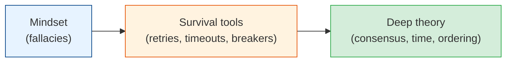

# Distributed Systems

The moment you have more than one machine, physics changes. Networks fail, clocks disagree,
messages arrive twice or out of order, and "the server is down" is the *easy* case. This
module covers the concepts that make multi-machine systems actually work — and the ones that
take years of production scars to truly internalize.

## Contents

| # | Topic | File | Level |
|---|-------|------|-------|
| 0 | The map (this file) | *(here)* | Intermediate |
| 1 | The fallacies of distributed computing | [fallacies.md](./fallacies.md) | Intermediate |
| 2 | Consensus: leader election, Raft, quorums | [consensus.md](./consensus.md) | Advanced |
| 3 | Time, ordering & idempotency | [time-and-idempotency.md](./time-and-idempotency.md) | Advanced |
| 4 | Failure handling: retries, timeouts, circuit breakers | [failure-handling.md](./failure-handling.md) | Intermediate |

---

## How to read this module

- **Read chapter 1 first, no matter your level.** The fallacies are the mindset shift; every
  distributed bug is a violation of one of them.
- **Chapter 4** is the practical toolkit — retries, timeouts, circuit breakers — that you'll
  use in every service you ever write.
- **Chapters 2 and 3** are the deep theory (consensus, time, ordering). Read them when you're
  building or debugging the guts of a distributed store, or when eventual-consistency bugs
  start haunting you.

## The one truth

> **In a distributed system, everything that can fail, will fail — often partially, often
> silently, often at the worst time.** You don't prevent failure; you design so that failure
> is survivable and recoverable.

Start with [fallacies.md](./fallacies.md). **Next >**
