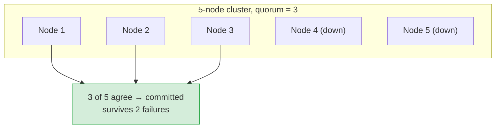
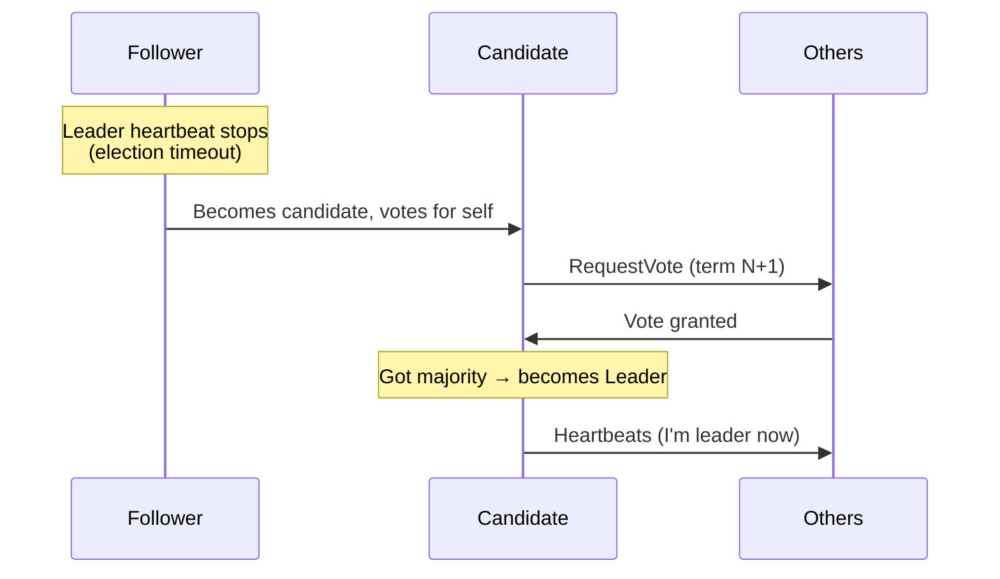

# Consensus: Leader Election, Raft & Quorums

[< Back](./fallacies.md) | [Index](./README.md) | [Next: Time & Idempotency >](./time-and-idempotency.md)

---

**Consensus** is the problem of getting a group of unreliable machines to **agree on a single
value** (who's the leader, what's the next log entry, is this transaction committed) — even
when some of them crash and the network misbehaves. It's the beating heart of every
distributed database, coordination service, and config store.

## Why consensus is hard

You'd think "just vote" is easy. But:

- Messages can be lost, delayed, duplicated, or reordered.
- Nodes can crash and come back with stale state.
- You can't tell "crashed" apart from "slow" (the network hides the difference).

The **FLP impossibility** result proves that in a fully asynchronous network, no algorithm can
*guarantee* consensus if even one node can fail. Real systems dodge this with **timeouts** and
**randomization** — they give up perfect guarantees for "works in practice, almost always."

## Quorums: the majority rules

The core trick behind consensus and replication: require a **majority** (more than half) to
agree before anything counts.

- A cluster of `N` nodes tolerates `⌊(N-1)/2⌋` failures with a majority quorum.
- **3 nodes** tolerate 1 failure; **5 nodes** tolerate 2. This is why clusters are usually
  **odd-numbered** — an even count gives you no extra fault tolerance but risks split votes.
- Two majorities always **overlap** in at least one node, which is what prevents two
  conflicting decisions ("split brain").

## Leader election

Most consensus systems elect a single **leader** to serialize all decisions (it's far simpler
than everyone deciding together). The leader handles writes; if it dies, the cluster elects a
new one.

## Raft (the one you should actually understand)

**Raft** was designed to be *understandable* (unlike its predecessor Paxos, which is famously
brain-melting). It's used by **etcd, Consul, CockroachDB, TiDB** and many others. Three pieces:

1. **Leader election** — nodes are Follower, Candidate, or Leader. Time is divided into
   **terms**. If a follower hears no heartbeat within a randomized timeout, it becomes a
   candidate and requests votes. A candidate with a majority becomes leader. Randomized
   timeouts prevent everyone campaigning at once.

2. **Log replication** — all writes go to the leader, which appends to its log and replicates
   to followers. Once a **majority** has the entry, it's **committed** and applied. The leader
   tells followers to commit on the next heartbeat.

3. **Safety** — a node only votes for a candidate whose log is at least as up-to-date as its
   own, guaranteeing committed entries are never lost. Terms + majority overlap prevent two
   leaders from both committing conflicting entries.

> **Split brain** — two nodes both thinking they're leader — is the nightmare consensus
> prevents. Because a leader needs a *majority* to act, and two majorities must overlap, only
> one leader can ever make progress. A partitioned-off "leader" simply can't commit anything.

## Where you'll meet consensus in the wild

| System | Uses consensus for |
|--------|--------------------|
| **etcd / ZooKeeper / Consul** | Config, service discovery, distributed locks, leader election |
| **Kafka (KRaft) / older ZK** | Controller election, partition leadership |
| **CockroachDB / Spanner / TiDB** | Committing transactions across replicas |
| **Kubernetes** | Stores all cluster state in etcd (Raft under the hood) |

## The practical takeaways

1. **You rarely implement consensus yourself** — you *use* a system that did (etcd, ZooKeeper,
   a managed DB). Implementing Raft correctly is a multi-year, bug-ridden journey.
2. **Odd node counts (3 or 5).** Even counts waste a node and risk tie votes.
3. **Consensus costs latency** — every committed decision needs a majority round-trip. That's
   the tax for correctness; don't put consensus on your hot path unless you must.
4. **Understand quorums and majority overlap** — that single idea explains replication
   consistency, split-brain prevention, and why 3 nodes tolerate exactly 1 failure.
5. **The lesson of Raft:** favor *understandable* designs. A system the team can reason about
   beats a cleverer one nobody can debug at 3 a.m.

---

[< Back](./fallacies.md) | [Index](./README.md) | [Next: Time & Idempotency >](./time-and-idempotency.md)
