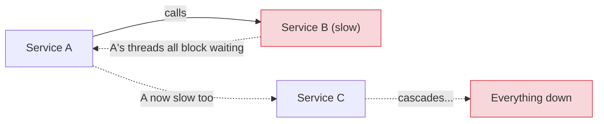
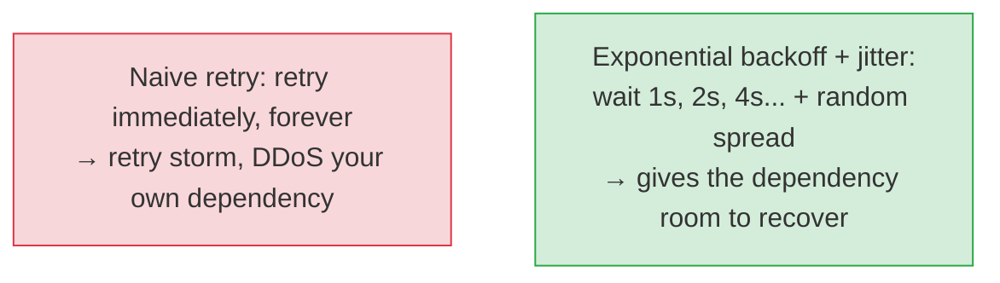
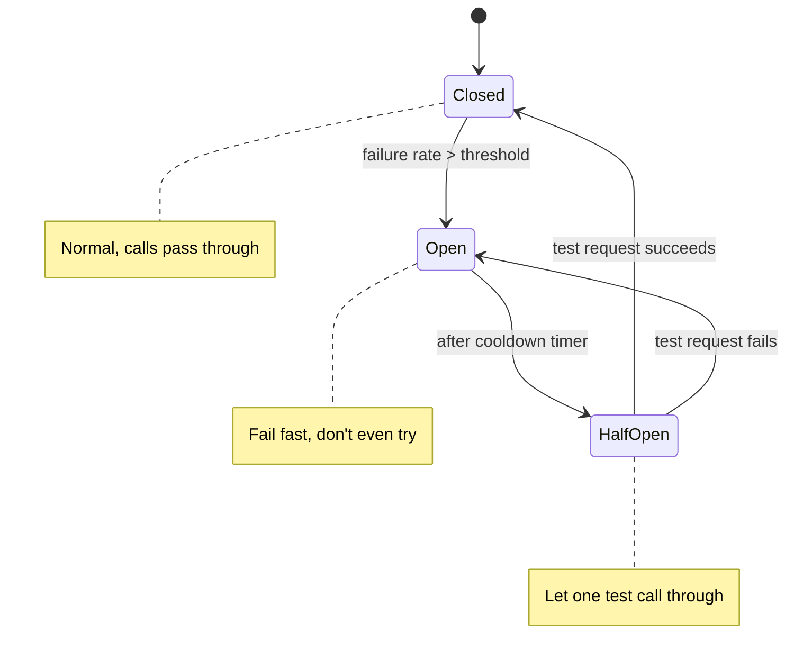

# Failure Handling: Retries, Timeouts & Circuit Breakers

[< Back](./time-and-idempotency.md) | [Index](./README.md)

---

This is the everyday survival kit. You will use these patterns in **every** service you write
that calls another service. Skipping them is how a single slow dependency takes down your
entire system in a cascading failure.

## The core problem: dependencies fail

Your service calls other services (DBs, APIs, caches). Any of them can be slow, down, or
flaky. Without protection, one sick dependency poisons you: requests pile up, threads block,
memory fills, and *you* go down too — then everything calling *you* goes down. That's a
**cascading failure**, and it's how small incidents become company-wide outages.



## 1. Timeouts (the non-negotiable baseline)

**Never make a network call without a timeout.** A call with no timeout waits *forever*,
holding a thread/connection hostage. Default library timeouts are often absurd (or none) —
set them explicitly.

- **Connect timeout** — how long to wait to establish a connection.
- **Request/read timeout** — how long to wait for the response.
- Set timeouts based on the dependency's real p99 latency, not a random guess.
- **Budget timeouts across a call chain:** if A has 1s and calls B then C, B and C can't each
  take 1s. Propagate a shrinking deadline down the chain.

> The #1 cause of cascading outages is a missing or too-generous timeout. Fix this first.

## 2. Retries (with backoff and jitter)

Transient failures (a dropped packet, a brief blip) often succeed on a second try. But naive
retries are dangerous — they **amplify** load exactly when a system is already struggling.



**Rules for safe retries:**

1. **Exponential backoff** — double the wait each attempt (1s, 2s, 4s, 8s). Don't hammer.
2. **Add jitter** — randomize the delay so all clients don't retry in sync and create a
   **thundering herd**. (See [rate-limiting](../infrastructure/rate-limiting.md).)
3. **Cap the attempts** — retry 3-4 times, then give up. Infinite retries make outages worse.
4. **Only retry idempotent operations** — retrying a non-idempotent `POST` can double-charge.
   (See [idempotency](./time-and-idempotency.md).) Use an idempotency key if you must retry
   writes.
5. **Only retry retryable errors** — retry a `503`/timeout, never a `400`/`401` (retrying a bad
   request just fails again).

```python
import random, time

def call_with_retry(fn, max_attempts=4, base=0.5, cap=8.0):
    for attempt in range(max_attempts):
        try:
            return fn()
        except TransientError:
            if attempt == max_attempts - 1:
                raise
            backoff = min(cap, base * (2 ** attempt))
            time.sleep(backoff + random.uniform(0, backoff))  # full jitter
```

## 3. Circuit breakers (stop kicking a dead dependency)

If a dependency is clearly down, retrying just wastes resources and delays recovery. A
**circuit breaker** detects sustained failure and **stops calling** for a while, failing fast
instead — giving the dependency room to heal and keeping your threads free.



- **Closed** — normal; requests flow. Track the failure rate.
- **Open** — too many failures; **reject immediately** without calling. Fail fast.
- **Half-open** — after a cooldown, let a trial request through. Success → close; failure →
  open again.

## 4. Bulkheads (isolate the blast radius)

Named after ship compartments: isolate resources so one flooded compartment doesn't sink the
ship. Give each dependency its **own** connection/thread pool, so a slow dependency can't
consume *all* your threads and starve the healthy paths.

## 5. Graceful degradation & fallbacks

When a dependency is down, degrade instead of dying:

- **Serve stale cache** rather than erroring.
- **Return a default** (empty recommendations rather than a 500).
- **Disable the non-critical feature** but keep the core flow working.

> A shopping site whose recommendation engine is down should still let people *buy*. Losing a
> feature beats losing the checkout. Decide in advance what's essential vs droppable.

## 6. Load shedding & backpressure

When overloaded, **reject some requests early** (return `429`/`503`) to protect the rest. It's
better to serve 90% of users well than to serve 100% of users a crash. **Backpressure** pushes
the "slow down" signal upstream so producers stop overwhelming consumers.

## The defense-in-depth checklist

Wrap every remote call with these, in order:

1. **Timeout** — always. Non-negotiable.
2. **Retry** — with exponential backoff + jitter, capped, idempotent-only.
3. **Circuit breaker** — stop calling a dead dependency; fail fast.
4. **Bulkhead** — isolated pools so one failure can't drain all resources.
5. **Fallback** — degrade gracefully; serve stale/default.
6. **Load shed** — reject early under overload to protect the core.

> These aren't advanced luxuries — they're table stakes. The difference between a blip and a
> multi-hour outage is almost always whether these six were in place *before* the incident.
> You can't add them mid-outage.

---

[< Back](./time-and-idempotency.md) | [Index](./README.md)
