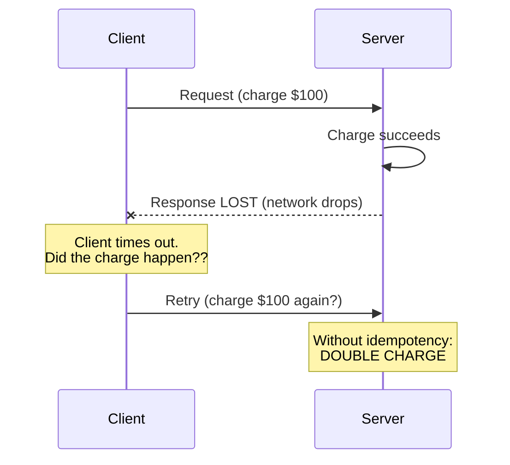

# The Fallacies of Distributed Computing

[Index](./README.md) | [Next: Consensus >](./consensus.md)

---

In 1994, engineers at Sun Microsystems wrote down the false assumptions that everyone building
distributed systems makes — and keeps making thirty years later. Every distributed bug you
ever hit is, at its root, one of these fallacies biting back.

## The eight fallacies

### 1. The network is reliable
It isn't. Packets drop, connections reset, whole links vanish. **Consequence:** every remote
call can fail or, worse, *time out without telling you whether it succeeded.* Design for it:
retries, idempotency, timeouts.

### 2. Latency is zero
A remote call is ~1,000,000× slower than a local one (see the
[latency numbers](../system-design-fundamentals/core-properties.md)). **Consequence:** the
"chatty" design that makes 50 tiny calls is death. Batch, cache, and co-locate. Every network
hop is a tax.

### 3. Bandwidth is infinite
It's finite and shared. **Consequence:** don't ship 10 MB payloads when 10 KB will do.
Paginate, compress, and send only what's needed.

### 4. The network is secure
Assume the network is hostile. **Consequence:** encrypt in transit (TLS), authenticate every
service (mTLS/zero-trust), and never trust input from "inside." (See
[encryption](../encryption/README.md) and [security](../security/README.md).)

### 5. Topology doesn't change
Nodes are added, removed, and moved constantly (autoscaling, deploys, failures).
**Consequence:** never hardcode IPs; use service discovery and DNS. Your client must handle
nodes appearing and disappearing.

### 6. There is one administrator
Real systems span teams, clouds, and vendors. **Consequence:** you don't control the whole
path. Design for dependencies you can't see or fix, and degrade gracefully when they break.

### 7. Transport cost is zero
Serialization, network gear, and egress bandwidth all cost real money and CPU.
**Consequence:** at scale, the *shape* of your traffic is a line item. Efficient encoding
(protobuf over JSON) and fewer round trips save real dollars.

### 8. The network is homogeneous
Different services, languages, protocols, and versions coexist. **Consequence:** rely on open
standards and explicit contracts (schemas, API versions), not "everyone runs the same thing."

## Why this matters (the mindset shift)

A junior engineer writes code as if a remote call is a local function that always returns. A
senior engineer writes code assuming the call might:

- succeed,
- fail cleanly,
- **succeed but the response is lost** (the nastiest case — did it work or not?),
- hang until a timeout,
- succeed *twice* (because a retry fired).

That "response lost" scenario is why **idempotency** (chapter 3) and **timeouts + retries with
backoff** (chapter 4) aren't optional niceties — they're the load-bearing walls of every
reliable distributed system.

## The takeaway

> Memorize the eight fallacies. When something breaks in production and makes no sense, walk
> the list — one of these assumptions snuck into the code. The whole discipline of distributed
> systems is just refusing to believe these eight comfortable lies.

---

[Index](./README.md) | [Next: Consensus >](./consensus.md)
