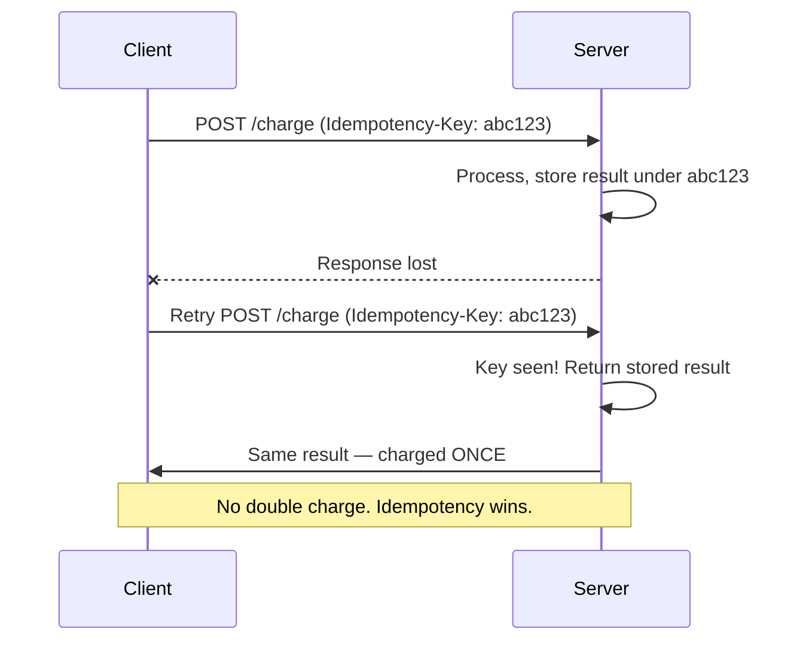

# Time, Ordering & Idempotency

[< Back](./consensus.md) | [Index](./README.md) | [Next: Failure Handling >](./failure-handling.md)

---

Two of the deepest, most bug-generating problems in distributed systems: **"what time is it?"**
and **"did this already happen?"** They sound trivial. They are not.

## Why you can't trust clocks

Every machine has its own clock, and they **drift** apart. Even with NTP syncing them, two
servers can disagree by milliseconds — sometimes seconds. Worse, clocks can jump *backwards*
(NTP corrections, leap seconds).

**The killer bug:** using wall-clock timestamps to order events across machines. "Last write
wins" based on timestamps can silently discard the *newer* write if the clocks disagree. Two
events milliseconds apart on different servers cannot be reliably ordered by their clocks.

## Logical clocks: ordering without wall time

Since physical time lies, distributed systems track **causality** instead.

### Lamport timestamps
A simple counter that increments on every event and travels with every message. If A causally
happened-before B, then `L(A) < L(B)`. It gives a **total order** but can't tell you whether
two events were truly concurrent or just unrelated.

### Vector clocks
Each node keeps a vector of counters (one per node). Comparing vectors tells you whether event
A happened-before B, B before A, or they're **concurrent** (a conflict to resolve). This is how
Dynamo-style stores detect conflicting writes.

| Mechanism | Tells you | Doesn't tell you |
|-----------|-----------|------------------|
| **Wall clock** | Roughly when (per machine) | Reliable cross-machine order |
| **Lamport clock** | A total order consistent with causality | Whether two events were concurrent |
| **Vector clock** | Causal order *and* concurrency | (heavier: size grows with node count) |

> **Google Spanner's TrueTime** takes the other path: atomic clocks + GPS give bounded
> uncertainty, so it *waits out* the uncertainty window to offer globally consistent
> timestamps. Most of us don't have atomic clocks in the rack, so we use logical clocks.

## Idempotency: the single most valuable pattern

An operation is **idempotent** if doing it multiple times has the same effect as doing it once.
Because networks lose responses (see the [fallacies](./fallacies.md)) and clients retry,
**every operation in a distributed system may run more than once.** Idempotency makes that safe.

### How to make things idempotent

1. **Idempotency keys** — client sends a unique key per logical operation; the server records
   it and returns the stored result on retries. (This is exactly how Stripe's API works.)
2. **Natural idempotency** — design operations that are inherently safe to repeat: `SET
   status = 'paid'` (idempotent) instead of `balance = balance - 100` (not idempotent — runs
   twice, deducts twice).
3. **Dedup on a unique constraint** — a unique index on `(order_id)` makes a duplicate insert
   fail harmlessly instead of creating a second row.
4. **Conditional writes** — `UPDATE ... WHERE version = N` (optimistic concurrency) so a stale
   retry becomes a no-op.

### HTTP method idempotency (know this cold)

| Method | Idempotent? | Safe (read-only)? |
|--------|-------------|-------------------|
| `GET` | Yes | Yes |
| `PUT` | Yes (full replace) | No |
| `DELETE` | Yes (deleting twice = still deleted) | No |
| `POST` | **No** (creates a new thing each time) | No |
| `PATCH` | Not necessarily | No |

This is why `POST` endpoints that do anything important (payments, orders) **need an
idempotency key** — retries would otherwise duplicate the action.

## Message delivery guarantees (related, essential)

| Guarantee | Meaning | Reality |
|-----------|---------|---------|
| **At-most-once** | Never duplicated, may be lost | Fire-and-forget; rarely acceptable |
| **At-least-once** | Never lost, may duplicate | The common default — **so consume idempotently** |
| **Exactly-once** | Never lost, never duplicated | Very hard end-to-end; usually "at-least-once delivery + idempotent processing" faking it |

> "Exactly-once delivery" is mostly a myth. What you actually build is **at-least-once delivery
> plus idempotent processing**, which *behaves* like exactly-once. That's the real answer to the
> interview trap question.

## The takeaways

1. **Never order cross-machine events by wall-clock timestamps.** Clocks lie. Use logical
   clocks or a dedicated sequencer.
2. **Assume every operation runs more than once.** Make it idempotent — this one habit prevents
   an entire class of the worst production bugs (double charges, duplicate orders).
3. **Prefer at-least-once + idempotent consumers** over chasing true exactly-once.
4. **Idempotency keys on important POSTs** are non-negotiable for payments and orders.

---

[< Back](./consensus.md) | [Index](./README.md) | [Next: Failure Handling >](./failure-handling.md)
