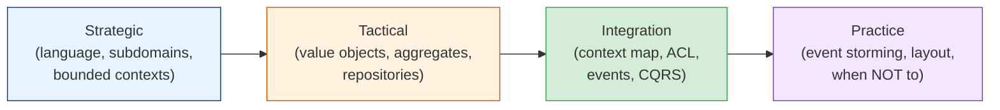

# Domain-Driven Design

Most systems don't fail because the code is bad. They fail because the code models the
business **wrong** — one giant `Product` class with 80 fields, rules copy-pasted into a dozen
services, and a vocabulary that means something different in every meeting. Domain-Driven
Design (DDD) is a set of practices for making the software model match the business model,
drawing boundaries a team can own, and keeping the rules in one findable place. This module
takes you from the whiteboard (strategic design) to the code (tactical design) to the honest
question of when it's not worth it.

## Contents

| # | Topic | File | Level |
|---|-------|------|-------|
| 0 | The map (this file) | *(here)* | L3 · Intermediate |
| 1 | Strategic design: ubiquitous language, subdomains & bounded contexts | [strategic-design.md](./strategic-design.md) | L3 · Intermediate |
| 2 | Tactical design: value objects, entities, aggregates & repositories | [tactical-design.md](./tactical-design.md) | L4 · Advanced |
| 3 | Context mapping & integration: ACLs, domain events, eventual consistency & CQRS | [context-mapping-and-integration.md](./context-mapping-and-integration.md) | L4 · Advanced |
| 4 | DDD in practice: event storming, code layout, pitfalls & when not to use it | [ddd-in-practice.md](./ddd-in-practice.md) | L4 · Advanced |

---

## How to read this module

- **Chapter 1 is the part everyone should read**, even teams that never write an aggregate.
  Ubiquitous language and bounded contexts are cheap and pay for themselves on any system with
  more than one team.
- **Chapter 2** is the toolkit inside a context — the place where "rich domain model" stops
  being a slogan and becomes a `Money` value object and an `Order` aggregate with a `place()`
  method.
- **Chapter 3** is how contexts talk without corrupting each other: the context map, the
  anti-corruption layer, domain events, and CQRS.
- **Chapter 4** is the senior material: how to actually start (event storming), what the repo
  looks like, the pitfalls, and — most importantly — when tactical DDD is the wrong tool.

## Related modules

- [architecture-patterns/code-architecture.md](../architecture-patterns/code-architecture.md) —
  hexagonal/clean architecture is the *shape* DDD code takes; this module is what goes inside.
- [microservices/](../microservices/README.md) — bounded contexts are the best candidates for
  service boundaries; sagas and the outbox pattern are how cross-context workflows finish.
- [messaging-and-streaming/](../messaging-and-streaming/README.md) — domain events leave a
  context over a broker, and arrive at-least-once.
- [databases/data-modeling.md](../databases/data-modeling.md) — the schema side of the same
  problem; DDD is about keeping the model and the schema from being the same thing.

## The one idea

> **The words in the meeting are the words in the code.** When the business says "dispatch a
> shipment", there's a `Shipment.dispatch()` — not a `setStatus(3)`. Every translation between
> what people say and what the code does is a place for a bug to hide. DDD is the discipline of
> removing those translations, and drawing a line wherever the words genuinely change meaning.

Start with [strategic-design.md](./strategic-design.md). **Next >**
