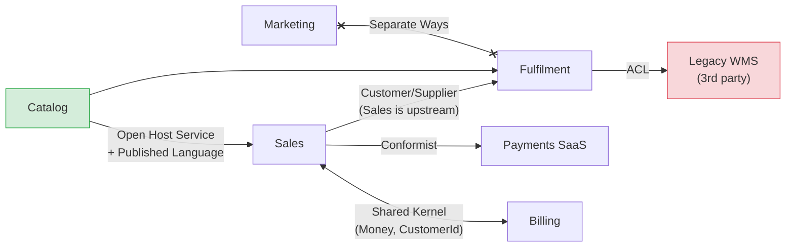
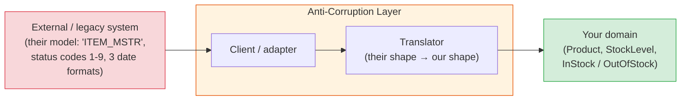
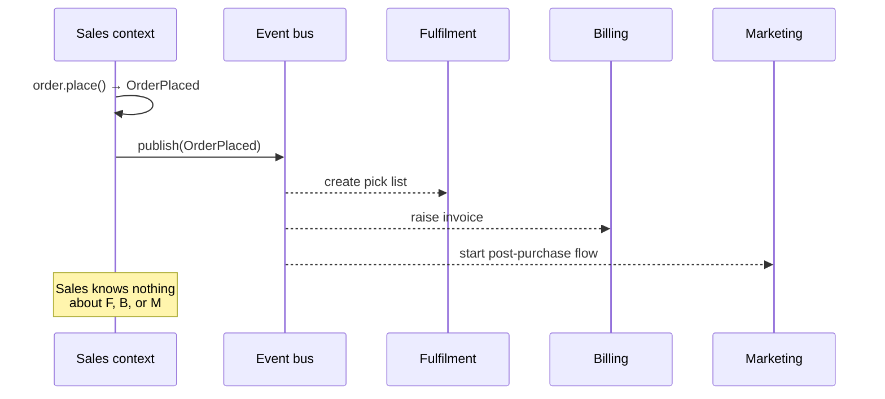
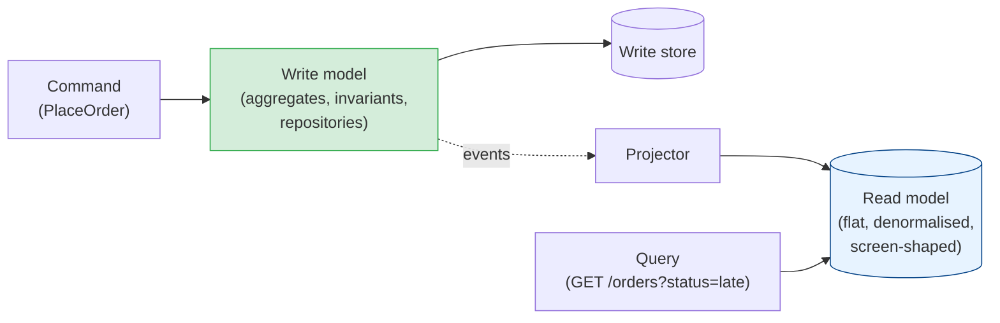

# Context Mapping & Integration: ACLs, Domain Events & CQRS

[< Back](./tactical-design.md) | [Index](./README.md) | [Next: DDD in Practice >](./ddd-in-practice.md)

---

Drawing bounded contexts is the easy half. The moment you have two, they need to exchange
information — and every integration is a chance for one context's model to leak into another
and quietly undo the boundary you just drew. **Context mapping** names the relationships
between contexts so that leak is a decision, not an accident. Domain events and CQRS are the
mechanics that make loose coupling actually work.

## The context map

A context map is a diagram of your bounded contexts and the *kind* of relationship between each
pair. The relationship types have names because each one implies a different power dynamic and
a different amount of coupling.



| Relationship | Who bends? | When you see it |
|--------------|-----------|-----------------|
| **Partnership** | Both — coordinated releases | Two teams with one goal and a tight feedback loop |
| **Shared Kernel** | Both — a small shared model | A handful of types (`Money`, IDs) both contexts co-own; keep it *tiny* |
| **Customer/Supplier** | Downstream negotiates, upstream commits | Upstream has a roadmap; downstream's needs get planned in |
| **Conformist** | Downstream, fully | Upstream won't change (a vendor, a bigger team); you adopt their model as-is |
| **Anti-Corruption Layer (ACL)** | Downstream, via a translation layer | Upstream's model is messy/legacy and you refuse to let it into yours |
| **Open Host Service** | Upstream publishes a stable protocol | One context serves many consumers via a defined API |
| **Published Language** | Neither — a shared, documented schema | Protobuf/Avro/JSON schema everyone agrees on |
| **Separate Ways** | No integration at all | Cheaper to duplicate a bit of data than to couple |

The map isn't about boxes and arrows; it's about **which team absorbs the cost of change**. A
Conformist relationship with a vendor is honest — you *will* rewrite when they change their
API. Pretending it's a Partnership when they won't answer your emails is how integrations rot.

## The anti-corruption layer

The **ACL** is the single most useful pattern in this chapter. It's a translation boundary that
converts an external model into your own before it touches your domain:



```python
class LegacyWarehouseAcl:
    """Everything ugly about the WMS stops here."""

    def __init__(self, client: LegacyWmsClient):
        self._client = client

    def stock_level(self, sku: Sku) -> StockLevel:
        raw = self._client.get_item_master(sku.value)      # {'ITEM_QTY': '00042', 'ST': '3'}
        qty = int(raw["ITEM_QTY"])
        available = raw["ST"] in {"1", "3"}                # legacy codes 1 and 3 = sellable
        return StockLevel(sku=sku, on_hand=qty, sellable=available)
```

The domain never sees `ITEM_QTY` or status code `3`. When the vendor changes their API, one file
changes. When you replace the vendor, one file gets rewritten. Without the ACL, those magic
strings would be in forty places — and *that* is what "corruption" means: an external model
becoming load-bearing inside yours.

Use an ACL whenever the upstream is **legacy, a third party, or owned by a team with different
priorities**. Don't bother when both sides share a Published Language you control — the ACL
would be a no-op translator.

## Domain events: how contexts stay loosely coupled

A **domain event** is an immutable record that something business-meaningful happened, named
in the past tense in the ubiquitous language: `OrderPlaced`, `PaymentCaptured`,
`ShipmentDispatched`. It's the primary way one context tells others what happened *without
knowing who's listening*.



### Domain event vs integration event

They are not the same thing, and conflating them is a classic leak:

| | Domain event | Integration event |
|-|--------------|-------------------|
| **Audience** | Inside one bounded context | Other contexts / systems |
| **Shape** | Rich; can carry domain objects | A stable, versioned, Published-Language contract |
| **Stability** | Free to change with the model | Changing it is a breaking change for consumers |
| **Transport** | In-process | Broker (Kafka, RabbitMQ, SNS) |

An aggregate raises a domain event. An outbound adapter translates it into an integration event
(with only the fields consumers legitimately need) and publishes it. That translation step is
an ACL in the outgoing direction — it stops your internal model becoming everyone's API.

### Publishing reliably: the outbox

The dangerous moment is "save aggregate, then publish event" — if the process dies between the
two, the order exists but nobody hears about it. The fix is the **transactional outbox**: write
the event to an `outbox` table in the *same transaction* as the aggregate, and have a relay
publish from there. This is covered properly in
[microservices/distributed-data-patterns.md](../microservices/distributed-data-patterns.md);
the DDD-specific point is that **the aggregate collects its events and the repository writes
them** — the domain code never touches a broker.

```python
class SqlOrderRepository:
    def save(self, order: Order) -> None:
        with self._db.transaction():
            self._db.upsert("orders", order_to_row(order))
            for event in order.pull_events():            # drains order._events
                self._db.insert("outbox", event_to_row(event))
```

### Eventual consistency — the price of loose coupling

Once contexts integrate via events, Fulfilment finds out about an order *after* Sales
committed it — milliseconds usually, seconds sometimes, hours if a consumer is down. This is
**eventual consistency**, and it's not a defect to engineer away; it's the trade you made when
you chose separate aggregates and separate contexts.

What it demands of you:

- **Idempotent consumers** — the event *will* be delivered twice one day. See
  [messaging-and-streaming/delivery-guarantees.md](../messaging-and-streaming/delivery-guarantees.md).
- **Business-acceptable windows** — ask the domain expert "if the invoice appears 30 seconds
  after the order, does anyone care?" The answer is almost always no. When it's yes, you've
  found something that belongs in the same aggregate.
- **Compensation, not rollback** — if Billing rejects the card after Fulfilment already
  started, you emit `PaymentFailed` and Fulfilment cancels the pick. That's a
  [saga](../microservices/distributed-data-patterns.md), and it's the normal way cross-context
  workflows finish.

## CQRS: separate models for writing and reading

Rich aggregates are great for enforcing rules and terrible for rendering an "orders dashboard"
that joins six of them. **Command Query Responsibility Segregation** says: stop trying to make
one model do both.



- **Commands** go through the domain model: load aggregate → call method → save → events.
- **Queries** bypass it entirely: read a denormalised table, a view, or a search index shaped
  exactly like the screen. No aggregates, no repositories, no business rules — reads don't
  need them.
- The read model is kept up to date by **projecting domain events** (or, more simply, by SQL
  views over the write tables when both live in one database).

CQRS is a dial, not a switch:

| Level | What it looks like | When |
|-------|-------------------|------|
| **0 — none** | One model, one set of tables | Simple CRUD contexts; supporting subdomains |
| **1 — separate code paths** | Commands use aggregates; queries use raw SQL/views on the same DB | Most contexts — cheap and worth it |
| **2 — separate stores** | Events project into a dedicated read DB / search index | Reads and writes have wildly different scale or shape |
| **3 — event sourcing** | The event log *is* the write store; state is replayed | Audit-critical domains; the full pattern deserves its own chapter |

Most teams should live at level 1. Level 2 buys read scalability at the cost of a second
eventually-consistent store to operate. Level 3 is powerful and expensive — reach for it
deliberately, not because the diagrams look elegant.

## The takeaways

1. **Name every context relationship.** Conformist, ACL, Shared Kernel — the label says who
   pays for change. An unnamed integration is a Conformist relationship you haven't admitted.
2. **Put an ACL in front of anything legacy or third-party.** One file absorbs their mess.
3. **Domain events inside; integration events outside.** Translate at the boundary so your
   internal model never becomes someone else's API.
4. **Aggregates collect events; repositories write them to an outbox.** Domain code never
   talks to a broker.
5. **Eventual consistency is the deal you signed.** Idempotent consumers, sagas for
   compensation, and an honest conversation with the business about acceptable delay.
6. **CQRS is a dial.** Separate command and query code paths almost always; separate stores
   only when scale demands it.

---

[< Back](./tactical-design.md) | [Index](./README.md) | [Next: DDD in Practice >](./ddd-in-practice.md)
