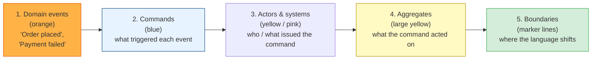
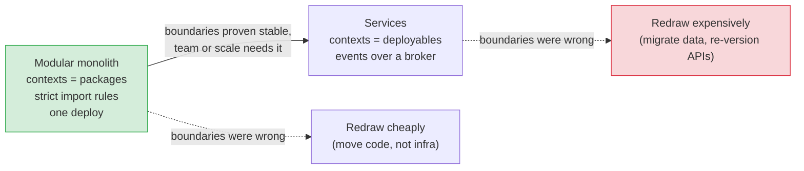

# DDD in Practice: Event Storming, Code Layout & When Not to Use It

[< Back](./context-mapping-and-integration.md) | [Index](./README.md)

---

The previous chapters are the theory. This one is the Monday-morning question: *how do you
actually start, what does the repo look like, and how do you know when DDD is the wrong tool?*
The honest answer to the last one is "more often than the books suggest" — which is exactly why
knowing when to use it is the senior skill.

## Discovering the domain: event storming

You can't model a domain you don't understand, and reading a requirements doc is a slow way to
understand it. **Event storming** is a workshop format that gets domain experts and engineers
in one room (or one Miro board) and builds the model out of *what happens*:



1. **Events first.** Everyone writes past-tense business events on stickies and lays them on a
   timeline. No engineers-only words: "row inserted" is not an event; "Order placed" is.
2. **Hot spots.** Where people argue about what an event means or whether it exists, stick a
   red note. Those arguments *are* the boundaries you're looking for.
3. **Commands and actors.** Work backwards from each event: what action caused it, and who
   took it?
4. **Aggregates.** Group commands that act on the same thing. Each group is a candidate
   aggregate; each cluster of aggregates that share a vocabulary is a candidate bounded context.
5. **Draw the lines.** Where the same word appears with different meanings on the timeline,
   that's a context boundary.

Half a day of this beats weeks of document-driven analysis, mostly because it surfaces the
"well, it depends" moments — the places where two departments have quietly been using one word
for two things.

## Code layout: one bounded context

There is no blessed folder structure, but the *dependency direction* is non-negotiable: the
domain depends on nothing; everything else depends on the domain. A layout that makes that
easy to enforce:

```
orders/                           <- one bounded context (a package or a service)
├── domain/                       <- pure; no framework, no DB, no HTTP
│   ├── model/
│   │   ├── order.py              <- Order aggregate root, OrderLine entity
│   │   ├── money.py              <- value objects
│   │   └── events.py             <- OrderPlaced, OrderCancelled (domain events)
│   ├── services/
│   │   └── pricing.py            <- domain services (stateless, multi-aggregate logic)
│   └── repositories.py          <- OrderRepository *interface* (a port)
│
├── application/                  <- use cases; orchestrates, holds no business rules
│   ├── commands/
│   │   └── place_order.py        <- load aggregate → call method → save → publish
│   └── queries/
│       └── list_late_orders.py   <- raw SQL / read model; bypasses the domain
│
├── infrastructure/               <- adapters; the only place that knows about Postgres/Kafka
│   ├── sql_order_repository.py
│   ├── outbox_relay.py
│   └── legacy_wms_acl.py         <- anti-corruption layer for the warehouse system
│
├── interfaces/                   <- inbound adapters: HTTP, CLI, consumers
│   ├── http/orders_router.py
│   └── consumers/payment_events.py
│
└── GLOSSARY.md                   <- the ubiquitous language, written down
```

Points that matter more than the folder names:

- **`domain/` imports nothing from the other three.** Enforce it mechanically — an
  import-linter rule, an ArchUnit test, a module boundary in your build tool. A rule that lives
  only in a README will be broken by Thursday.
- **`application/` is thin.** A use case is ten lines: get the aggregate, call one method,
  save it, done. If a use case is doing arithmetic on prices, that logic escaped from the
  domain.
- **Queries go around the model.** A `list_late_orders` query returning DTOs from a SQL view
  is not cheating; it's [CQRS level 1](./context-mapping-and-integration.md#cqrs-separate-models-for-writing-and-reading).
- **One context, one database schema** (or at least one namespace). Two contexts sharing
  tables is a shared kernel you didn't declare — and the fastest way to make the modular
  monolith un-splittable later.

## The modular monolith is the default starting point



Bounded contexts give you a clean seam for extracting a service *later*. The first cut of any
boundary is usually somewhat wrong, and moving a package is a refactor while moving a service
is a migration. Prove the boundaries in-process first. The full argument lives in
[microservices/monolith-vs-microservices.md](../microservices/monolith-vs-microservices.md).

## Common pitfalls

| Pitfall | What it looks like | The fix |
|---------|-------------------|---------|
| **DDD-flavoured CRUD** | Classes named `Aggregate` and `Repository` wrapped around getters/setters | Put the rules in the model or admit it's CRUD and simplify |
| **God aggregate** | `Customer` owns orders, addresses, tickets; every save locks everything | Split by invariant; reference by ID |
| **Model = schema** | Entities mirror tables 1:1, ORM annotations in the domain | Map explicitly in the repository; let the model and schema diverge |
| **Framework in the domain** | `@Entity`, `request.user`, a DB session on an aggregate | The domain imports nothing; adapters translate |
| **One language for the whole company** | A 200-page glossary and a `Product` with 80 fields | Multiple contexts, each with a small, precise language |
| **Events as RPC** | `PleaseCreateInvoiceEvent` — a command pretending to be an event | Events are past tense and fact-shaped; commands are separate |
| **Modelling generic subdomains deeply** | A beautiful hand-built auth domain model | Buy it; save the modelling budget for the core |

## When *not* to use DDD

This is the section most DDD material skips. Strategic design — ubiquitous language, subdomain
mapping, context boundaries — is nearly always worth the whiteboard time. **Tactical** DDD —
aggregates, repositories, domain events, the whole apparatus — has a real cost, and it doesn't
pay off when:

- **The domain is simple.** If the business rules fit in a validation function, a rich model is
  ceremony. A CRUD app with a well-named schema is a legitimate architecture. Most supporting
  and all generic subdomains fall here.
- **It's data-centric, not behaviour-centric.** Reporting, ETL, analytics pipelines
  ([data-engineering](../data-engineering/README.md)) are about moving and shaping data;
  aggregates enforcing invariants add nothing.
- **There are no domain experts to talk to.** DDD's engine is the conversation between people
  who know the business and people who write the code. Without that, you're inventing a
  language nobody else speaks.
- **The team doesn't know it and the deadline is real.** Half-applied tactical DDD is worse
  than a clear transaction-script design — you get the indirection without the payoff.
- **The core is somewhere else.** If your competitive edge is an ML model or raw throughput,
  the domain model may be a thin shell around it. Model the edge, not the shell.

> The strongest version of DDD is not "use every pattern in the book". It's **rich models for
> the core, boring code everywhere else, and clear boundaries between them.** The subdomain
> map from [chapter 1](./strategic-design.md) is what tells you which is which.

## Trade-offs, stated plainly

| You gain | You pay |
|----------|---------|
| Business rules in one findable place | More classes, more indirection, more concepts to teach |
| Boundaries that survive team growth | Up-front modelling time, and re-modelling when you got it wrong |
| A shared language with the business | Discipline to keep using it — glossaries rot |
| Clean seams for extracting services | Eventual consistency and its operational baggage |
| Testable domain logic with no infrastructure | A persistence layer that does real mapping work |

## The takeaways

1. **Event storm before you model.** Events on a timeline expose the boundaries and the
   arguments faster than any document.
2. **The domain imports nothing.** Enforce the dependency direction with tooling, not
   intentions.
3. **Start as a modular monolith.** Bounded contexts as packages; extract services when the
   boundaries have stopped moving.
4. **Rich model for the core, CRUD for the rest.** The subdomain map is your budget.
5. **Know when to skip it.** Simple domains, data pipelines, no experts, no time — tactical
   DDD costs more than it returns. Strategic DDD is still worth an afternoon.

---

[< Back](./context-mapping-and-integration.md) | [Index](./README.md)
