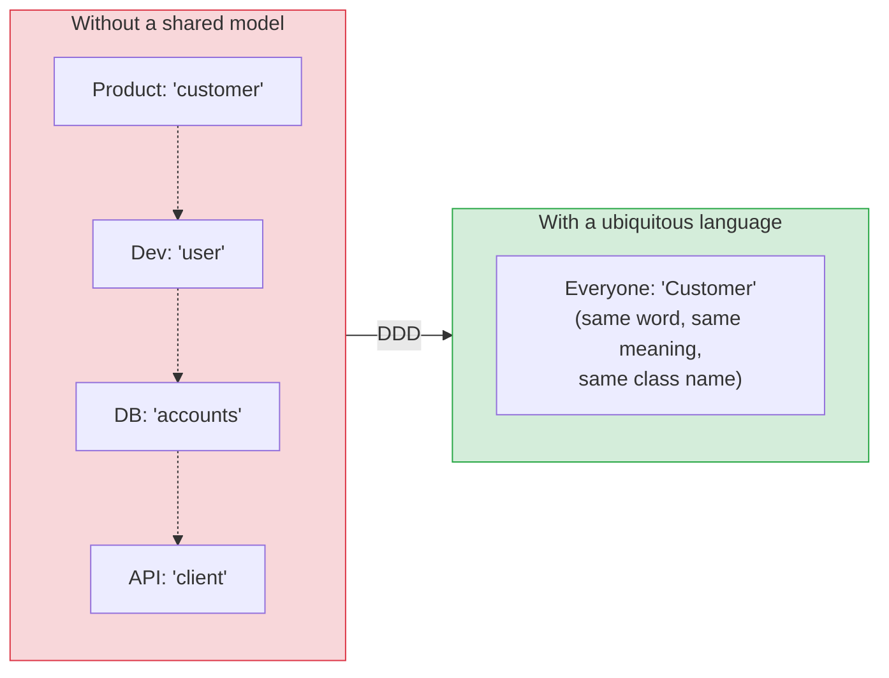
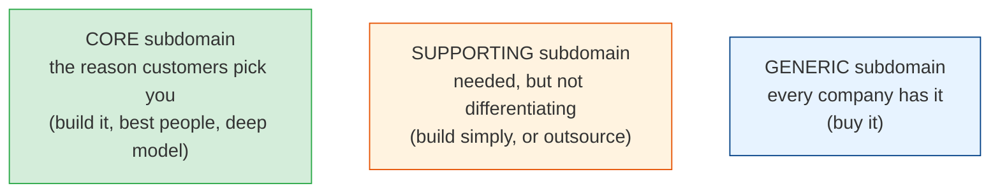
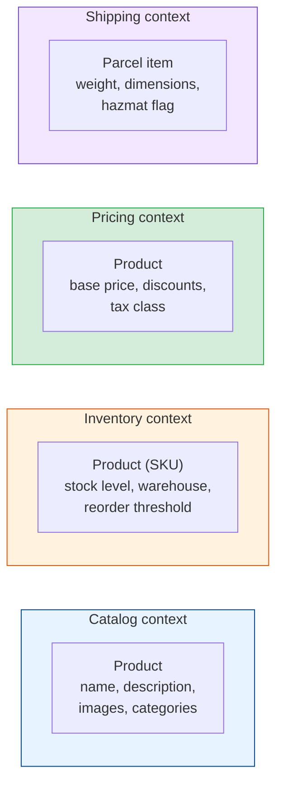
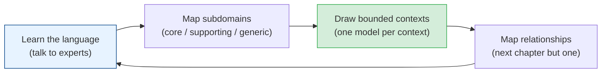

# Strategic Design: Ubiquitous Language, Subdomains & Bounded Contexts

[Index](./README.md) | [Next: Tactical Design >](./tactical-design.md)

---

Most software rot doesn't start in the code. It starts in the **words**. The product manager
says "customer", the billing team says "account", the database says `users`, and the API says
`client_id` — and they all mean slightly different things. Every translation between those
meanings is a place for a bug to hide. Domain-Driven Design (DDD) is, at its core, a discipline
for making the software's model match the business's model — and keeping it that way as both
evolve.

This chapter is the **strategic** half: how to carve a big, messy business into pieces that a
team can actually own. The [next chapter](./tactical-design.md) covers the building blocks
you use *inside* each piece.

## The problem DDD solves

The symptom is a **translation layer in people's heads**. Requirements get lossy on the way to
code; bugs get lossy on the way back to the business. DDD attacks this from three angles:

1. **Ubiquitous language** — one vocabulary, used in conversation *and* in code.
2. **Subdomains** — figuring out which parts of the business actually matter.
3. **Bounded contexts** — drawing explicit lines around where each meaning of a word applies.

## Ubiquitous language

A **ubiquitous language** is the shared vocabulary of the domain experts and the developers for
one part of the business. The rule that makes it work: **the words in conversation are the
words in the code.** If the business says a shipment is "dispatched", the class has a
`dispatch()` method — not `setStatus(3)`, not `markSent()`.

| Signal the language is working | Signal it's broken |
|--------------------------------|--------------------|
| A domain expert can read a test name and nod | Developers keep a private glossary "to translate" |
| Renaming a concept in conversation triggers a code rename | The same term means two things in one module |
| New joiners learn the domain by reading the model | `Manager`, `Helper`, `Data`, `Info` classes everywhere |

Practical habits:

- **Keep a glossary** next to the code (a `GLOSSARY.md` per context is enough). Ambiguous terms
  get an entry; contested terms get a decision.
- **Listen for "well, it depends"** — when an expert says "an Order is... well, it depends who
  you ask", you've found a bounded-context boundary, not a modelling problem.
- **Fight synonyms**. If `Customer`, `Client`, `Account`, and `User` all exist, either they are
  genuinely different concepts (name the difference) or three of them should die.

> The ubiquitous language isn't documentation *about* the code. It *is* the code, read aloud.

## Subdomains: where does the business actually compete?

Not every part of a system deserves the same investment. DDD splits the business into
**subdomains** and asks which ones matter:

| Subdomain type | Example (e-commerce) | Strategy |
|----------------|----------------------|----------|
| **Core** | Pricing & recommendation engine | Your best engineers, rich model, heavy DDD |
| **Supporting** | Order fulfilment workflow | Build, but keep it simple; CRUD is often fine |
| **Generic** | Auth, invoicing, email sending | Buy or adopt a library; never differentiate here |

The classic mistake is spending core-level effort on a generic subdomain (a hand-rolled auth
system, a bespoke PDF invoice renderer) while the actual competitive advantage gets a hurried
MVP. The subdomain map is a **budget**: it tells you where deep modelling pays off and where it
is waste.

> A useful test: *"If this part of the system were twice as good, would customers notice?"* If
> no, it isn't core — no matter how interesting it is to build.

## Bounded contexts: one word, one meaning, one model

A **bounded context** is the boundary inside which a given model — and its ubiquitous
language — applies. Cross the boundary and the same word is allowed to mean something else.

Take "Product" in a retailer:

Without contexts you get one giant `Product` class with 80 fields, half of them null depending
on who's asking, and every team afraid to touch it. With contexts, each team owns a `Product`
that is *small, complete, and correct for their purpose* — and the contexts share only an ID.

### How to find the boundaries

Boundaries follow **language and ownership**, not tables or layers:

- **Linguistic seams** — where a term changes meaning ("Order" in Sales is a quote; in
  Fulfilment it's a pick list; in Finance it's a receivable).
- **Team seams** — where a different team makes the decisions. One context per team is a good
  default; one team owning several contexts is fine; several teams sharing one context is
  where the pain starts (see [Conway's Law](../engineering-leadership/README.md)).
- **Rate-of-change seams** — where one area changes weekly and another is frozen.
- **Consistency seams** — where you genuinely need transactional consistency, keep things
  together; where eventual consistency is acceptable, that's a candidate boundary (this is the
  bridge to [aggregates](./tactical-design.md#aggregates-the-consistency-boundary)).

### Bounded context ≠ microservice

A bounded context is a **model** boundary. A microservice is a **deployment** boundary. They
often line up — a well-drawn context is the best candidate for a service — but:

- A modular monolith can hold many bounded contexts as separate modules with strict import
  rules. That's usually the right first step.
- One context can span several services (a context with a read-side and a write-side deployed
  separately).
- One service that holds two contexts is a code smell — but a common, survivable one.

See [microservices/boundaries-and-communication.md](../microservices/boundaries-and-communication.md)
for the deployment side of this decision.

## Putting it together: the strategic design loop

This isn't a one-off workshop. Businesses change, so the boundaries drift, and the loop repeats
— usually every time something feels "weirdly hard to model".

## The takeaways

1. **Ubiquitous language is the whole point.** Same words in the meeting room and in the class
   names. When the words disagree, the code is already wrong.
2. **Not all subdomains are equal.** Spend deep modelling on the core; buy the generic; keep the
   supporting simple.
3. **A bounded context is where one meaning of a word is valid.** Multiple small `Product`
   models beat one giant one.
4. **Boundaries follow language and team ownership**, not database tables.
5. **Bounded context is a model boundary, not a deployment boundary.** Start with a modular
   monolith; split into services when the context boundaries have proven stable.

---

[Index](./README.md) | [Next: Tactical Design >](./tactical-design.md)
