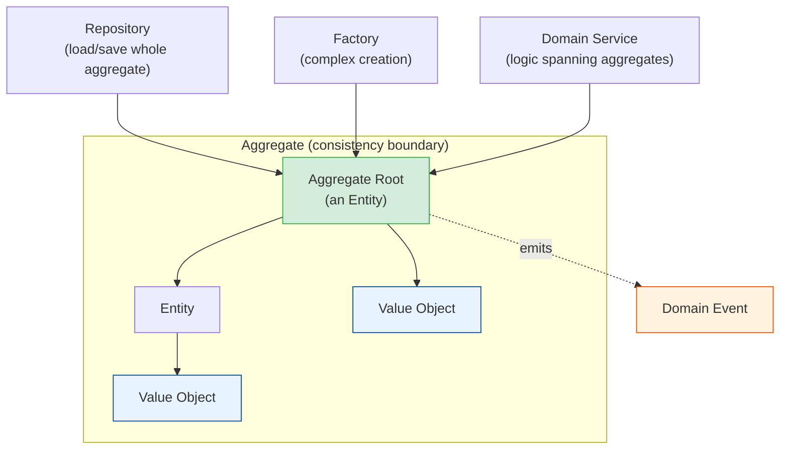
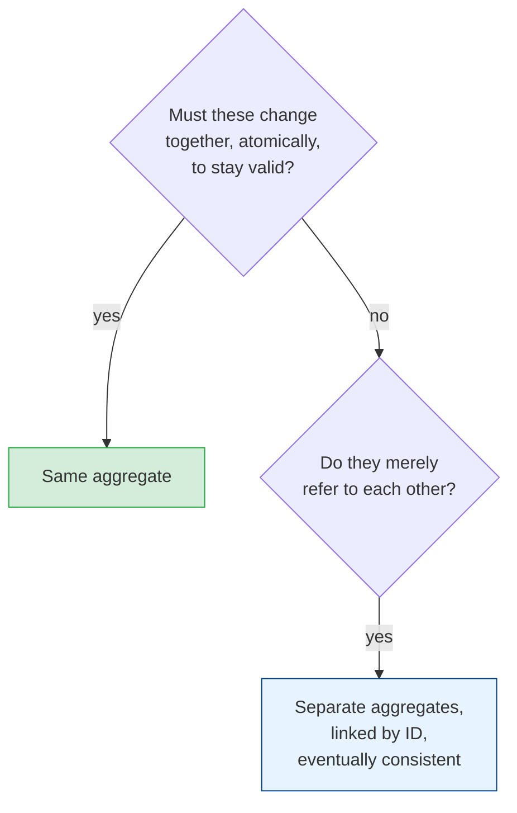

# Tactical Design: Entities, Value Objects, Aggregates & Repositories

[< Back](./strategic-design.md) | [Index](./README.md) | [Next: Context Mapping & Integration >](./context-mapping-and-integration.md)

---

Strategic design tells you *where* a model lives. Tactical design is the toolkit for building
the model itself — a small set of building blocks that, used with discipline, keep business
rules in one place and stop the database schema from becoming your domain model by accident.

## The building blocks at a glance



| Block | Identity? | Mutable? | Job |
|-------|-----------|----------|-----|
| **Value Object** | No — equal if fields equal | No (replace, don't mutate) | Describe something: `Money`, `Address`, `DateRange` |
| **Entity** | Yes — tracked by ID over time | Yes | Something with a lifecycle: `Order`, `Customer` |
| **Aggregate** | Root entity's ID | Through the root only | A cluster of entities/VOs changed as one unit |
| **Repository** | — | — | Load/save aggregates; hides persistence |
| **Domain Service** | — | Stateless | Business logic that doesn't belong to one entity |
| **Factory** | — | — | Build complex aggregates in a valid state |
| **Domain Event** | — | Immutable | Record that something business-meaningful happened |

## Value objects: the workhorse you're under-using

A **value object** has no identity — two `Money(10, "USD")` are the same thing. That makes them
immutable, freely copyable, and the perfect home for validation and small rules.

```python
from dataclasses import dataclass
from decimal import Decimal

@dataclass(frozen=True)
class Money:
    amount: Decimal
    currency: str

    def __post_init__(self):
        if self.amount < 0:
            raise ValueError("Money cannot be negative")
        if len(self.currency) != 3:
            raise ValueError("Currency must be an ISO-4217 code")

    def add(self, other: "Money") -> "Money":
        if other.currency != self.currency:
            raise ValueError("Cannot add different currencies")
        return Money(self.amount + other.amount, self.currency)
```

Why bother, versus a `float` and a `str` on the entity?

- **Validation happens once, at construction.** A `Money` that exists is a valid `Money`. You
  stop re-checking "is the currency code 3 letters" in twelve places.
- **Behaviour lives with the data.** Currency-mismatch rules belong on `Money`, not scattered
  across every service that adds two prices.
- **Primitive obsession dies.** `def ship(order_id: str, address: str)` becomes
  `def ship(order_id: OrderId, address: Address)` — the type system catches swapped arguments.

> Rule of thumb: **if you'd compare it by value, it's a value object.** Reach for them first and
> promote to an entity only when you genuinely need to track *this specific one* over time.

## Entities: identity over time

An **entity** is defined by continuity, not attributes. A `Customer` who changes their name and
address is still the same customer. Entities:

- Have a stable ID assigned at creation (prefer a domain-generated ID — a UUID or ULID — over
  waiting for the database to hand one back; it lets you construct valid objects without a
  round-trip).
- Are equal iff their IDs are equal.
- **Protect their invariants** — the state changes go through methods with domain names
  (`order.add_line(...)`, `order.cancel(reason)`), not through public setters.

## Aggregates: the consistency boundary

This is the concept that does the most work — and is most often misunderstood. An
**aggregate** is a cluster of entities and value objects that must be **consistent together**,
with one entity — the **aggregate root** — acting as the only entry point.

```python
class Order:                       # aggregate root
    def __init__(self, order_id: OrderId, customer_id: CustomerId):
        self.id = order_id
        self.customer_id = customer_id   # reference by ID, not object
        self._lines: list[OrderLine] = []
        self.status = OrderStatus.DRAFT
        self._events: list[DomainEvent] = []

    def add_line(self, sku: Sku, qty: int, unit_price: Money) -> None:
        if self.status is not OrderStatus.DRAFT:
            raise OrderNotEditable(self.id)
        if qty <= 0:
            raise ValueError("Quantity must be positive")
        self._lines.append(OrderLine(sku, qty, unit_price))

    def total(self) -> Money:
        return sum((l.subtotal() for l in self._lines), Money(Decimal(0), "USD"))

    def place(self) -> None:
        if not self._lines:
            raise EmptyOrder(self.id)
        self.status = OrderStatus.PLACED
        self._events.append(OrderPlaced(self.id, self.customer_id, self.total()))
```

The rules that make aggregates work:

1. **All changes go through the root.** Nobody grabs an `OrderLine` from somewhere and edits
   it; they call `order.add_line(...)`. That's the only way the root can enforce "a placed order
   can't be edited".
2. **One aggregate = one transaction.** Loading, changing, and saving an aggregate is atomic.
   If a business rule needs two aggregates to be consistent *in the same instant*, either the
   boundary is wrong or you're asking for something distributed systems can't cheaply give you.
3. **Reference other aggregates by ID**, never by object. `order.customer_id`, not
   `order.customer`. Otherwise one `load()` pulls half the database and every aggregate becomes
   the whole graph.
4. **Keep them small.** The instinct is to make `Customer` own their orders, addresses, payment
   methods, and support tickets. Don't. A large aggregate means lock contention, slow loads, and
   concurrent updates fighting over unrelated fields.

### Sizing an aggregate (the invariant test)



Ask: *"What invariant would break if these two things were updated in separate transactions,
a second apart?"* If the answer is "nothing the business would notice", they're separate
aggregates. Order and its lines? "An order's total must equal the sum of its lines" — same
aggregate. Order and Customer? A customer changing their email while an order is placed breaks
nothing — separate.

### Concurrency: optimistic locking on the root

Because an aggregate is the unit of change, it's also the unit of **concurrency control**. Give
the root a `version` column; on save, `UPDATE ... WHERE id = ? AND version = ?` and fail the
transaction if zero rows changed. Two users editing the same order get a clean conflict instead
of silently overwriting each other — and two users editing *different* orders never contend.
(See [databases/transactions](../databases/README.md) for the isolation-level side.)

## Repositories: collections that happen to be persistent

A **repository** looks like an in-memory collection of aggregates and hides *how* they're
stored:

```python
class OrderRepository(Protocol):
    def get(self, order_id: OrderId) -> Order: ...
    def add(self, order: Order) -> None: ...
    def save(self, order: Order) -> None: ...
```

- **One repository per aggregate root** — not per table, not per entity. There's no
  `OrderLineRepository`; lines come and go with their `Order`.
- The interface lives in the domain; the Postgres/Mongo/in-memory implementation is an adapter
  (this is the *port* from
  [hexagonal architecture](../architecture-patterns/code-architecture.md)).
- A repository returns **fully-formed aggregates**, not partial DTOs. If you need a lightweight
  list for a screen, that's a **query** — go around the domain model and read straight from the
  DB. (This is the seed of CQRS, covered in [the next chapter](./context-mapping-and-integration.md).)

## Domain services & factories

**Domain service** — business logic that needs more than one aggregate, or belongs to none.
"Transfer money between two accounts" touches two `Account` aggregates; it lives in a
`TransferService`, not on either account. Keep them **stateless** and named after a domain
verb. If a service is called `OrderManager` or `OrderHelper`, you've made a junk drawer.

**Factory** — when constructing a valid aggregate is genuinely complicated (many rules, several
value objects, an initial event to record), a `create_order_from_cart(cart, customer)` factory
function keeps the constructor honest. Most aggregates don't need one; use a plain constructor
until it hurts.

## Anaemic vs rich models

The failure mode all of this exists to prevent:

| Anaemic model | Rich model |
|---------------|------------|
| Entities are bags of getters/setters | Entities expose domain operations |
| Rules live in `XxxService` classes | Rules live where the data is |
| `order.status = "PLACED"` anywhere in the codebase | `order.place()` — the only way to get there |
| Invariants re-checked (or forgotten) at each call site | Invariants enforced once, inside the aggregate |

An anaemic model plus a fat service layer isn't DDD with the names changed; it's a
transaction-script architecture wearing DDD's vocabulary. That's fine for a supporting
subdomain — it's the wrong tool for the core.

## The takeaways

1. **Value objects first.** Immutable, self-validating, behaviour-carrying. They remove most
   primitive-obsession bugs before they happen.
2. **Aggregates are consistency boundaries, not object graphs.** One aggregate, one
   transaction. Reference others by ID. Keep them small.
3. **Size aggregates by invariants** — "what breaks if these update a second apart?"
4. **One repository per aggregate root**, returning whole aggregates. Use plain queries for
   read-only screens.
5. **Push logic into the model.** `order.place()` beats `order.status = "PLACED"` every time.

---

[< Back](./strategic-design.md) | [Index](./README.md) | [Next: Context Mapping & Integration >](./context-mapping-and-integration.md)
