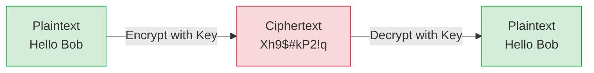

# Encryption Tech Docs

A deep-dive into how encryption works, split into focused topics with code examples.

## Contents

| # | Topic | File |
|---|-------|------|
| 0 | Intro, vocabulary & the big picture | *(this file)* |
| 1 | Symmetric Encryption | [symmetric-encryption.md](./symmetric-encryption.md) |
| 2 | Asymmetric Encryption | [asymmetric-encryption.md](./asymmetric-encryption.md) |
| 3 | Public & Private Keys | [public-private-keys.md](./public-private-keys.md) |
| 4 | Symmetric vs Asymmetric | [symmetric-vs-asymmetric.md](./symmetric-vs-asymmetric.md) |
| 5 | Hybrid Encryption | [hybrid-encryption.md](./hybrid-encryption.md) |
| 6 | Real Algorithms (AES, RSA, ECC, DH) | [algorithms.md](./algorithms.md) |
| 7 | Digital Signatures | [digital-signatures.md](./digital-signatures.md) |

> Code examples use Python with the [`cryptography`](https://cryptography.io) library.
> Install it with:
> ```bash
> uv pip install cryptography --index-url https://pypi.ci.artifacts.walmart.com/artifactory/api/pypi/external-pypi/simple --allow-insecure-host pypi.ci.artifacts.walmart.com
> ```

---

## 1. What is Encryption?

**Encryption** is the process of scrambling readable data (**plaintext**) into an
unreadable form (**ciphertext**) so that only authorized parties, those with the
correct **key**, can turn it back into plaintext (**decryption**).



Encryption gives us three big security guarantees (plus a bonus):

| Guarantee | Meaning |
|-----------|---------|
| **Confidentiality** | Nobody without the key can read the data. |
| **Integrity** | Tampering with the data is detectable. |
| **Authentication** | You can prove *who* sent the data. |
| **Non-repudiation** | The sender can't later deny sending it (via signatures). |

---

## 2. Core Vocabulary

- **Plaintext** - the original readable message.
- **Ciphertext** - the encrypted, scrambled output.
- **Key** - the secret value that drives encryption/decryption.
- **Cipher** - the algorithm (e.g., AES, RSA) doing the work.
- **Key size** - length in bits (e.g., 128, 256, 2048). Bigger = harder to brute force.

---

## Golden Rules

1. **Never invent your own crypto.** Use vetted libraries (libsodium, OpenSSL, `cryptography`).
2. **Protect private keys** like they're the crown jewels.
3. **Prefer AES-256-GCM** for symmetric, **ECC/X25519** for asymmetric.
4. **Use ephemeral key exchange (ECDHE)** for forward secrecy.
5. **Bigger keys = more security** but also more cost, pick sensibly.

Start with [symmetric-encryption.md](./symmetric-encryption.md).
