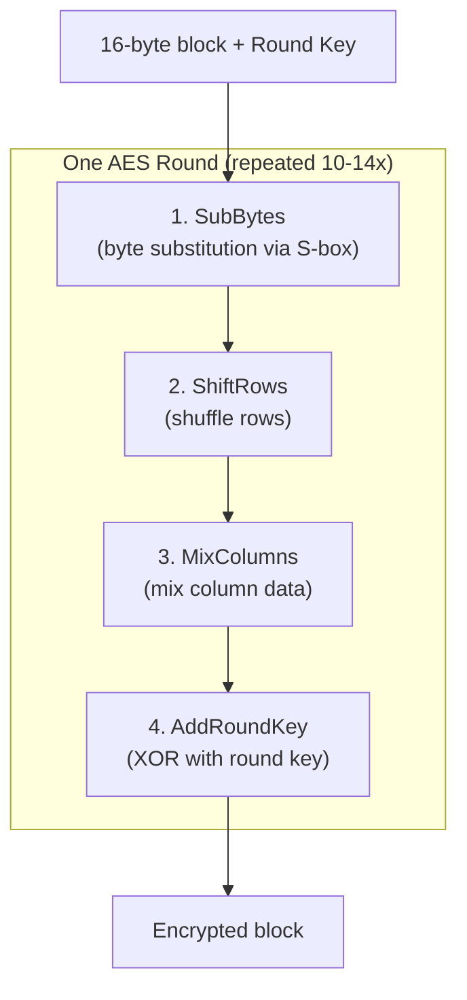
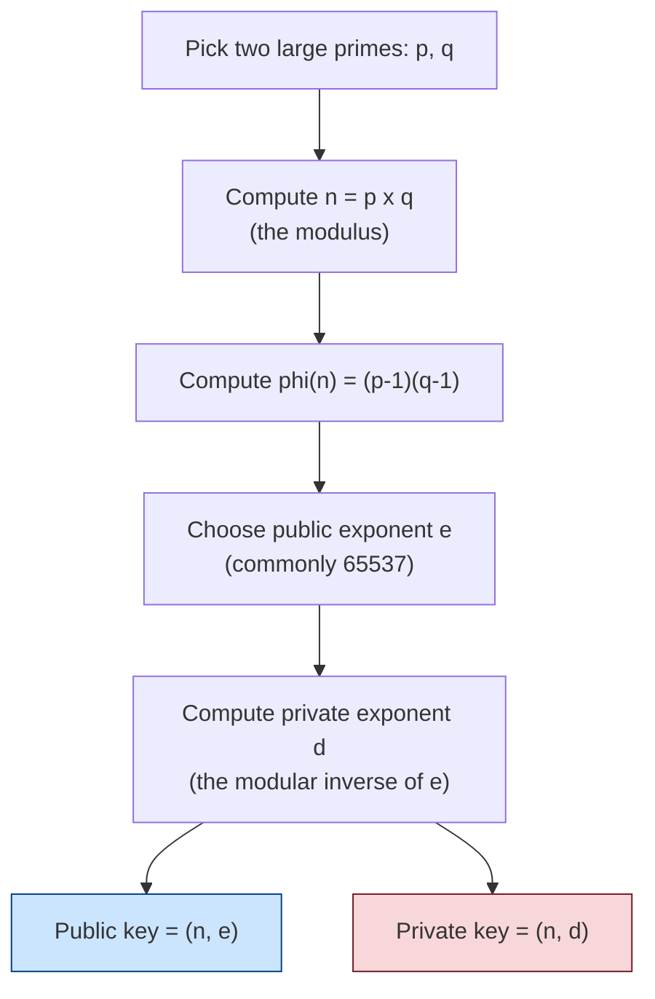
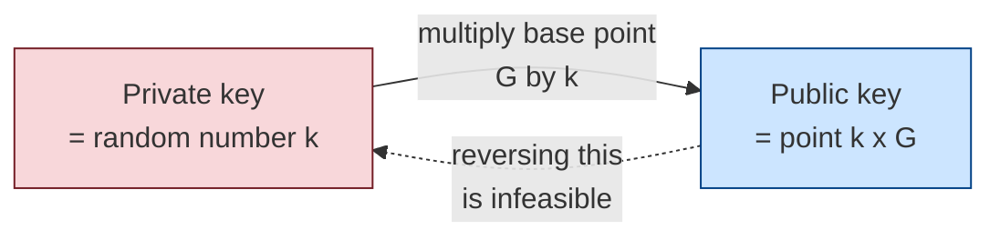
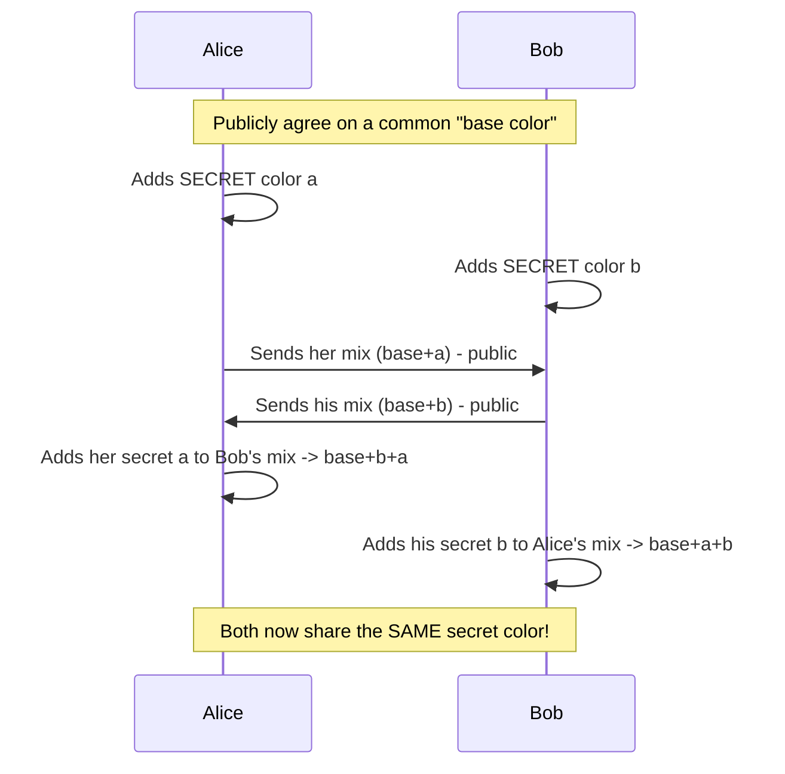

# Real Algorithms Explained

[< Back](./hybrid-encryption.md) | [Index](./README.md) | Next: [Digital Signatures >](./digital-signatures.md)

---

## Contents
- [AES (Symmetric)](#aes--advanced-encryption-standard)
- [RSA (Asymmetric)](#rsa--rivestshamiradleman)
- [ECC / ECDH (Asymmetric)](#ecc--elliptic-curve-cryptography)
- [Diffie-Hellman (Key Exchange)](#diffiehellman-key-exchange)

---

## AES - Advanced Encryption Standard

**Type:** Symmetric | **Key sizes:** 128, 192, 256 bits

AES is a **block cipher**, it encrypts data in fixed 128-bit (16-byte) blocks. It's the
worldwide standard, used everywhere from HTTPS to WhatsApp to your disk encryption.

**How it works (simplified):** AES runs the data through multiple **rounds** (10, 12, or
14 depending on key size). Each round applies four transformations:



- **SubBytes** - swaps each byte using a lookup table (adds confusion).
- **ShiftRows** - rotates rows to spread bytes around (diffusion).
- **MixColumns** - mathematically mixes each column (more diffusion).
- **AddRoundKey** - XORs the block with a key derived from the main key.

**Why it's great:** blazing fast (hardware-accelerated on modern CPUs via AES-NI), and
after 20+ years of scrutiny, there's no practical attack against it. **AES-256 is
considered secure even against future quantum computers** for confidentiality.

> AES needs a **mode of operation** (like GCM or CBC) to encrypt data longer than one
> block. **AES-GCM** is preferred today because it also provides *integrity*.

### Code Example: AES-GCM

```python
import os
from cryptography.hazmat.primitives.ciphers.aead import AESGCM

key = AESGCM.generate_key(bit_length=256)
nonce = os.urandom(12)
ct = AESGCM(key).encrypt(nonce, b"secret data", b"aad")
pt = AESGCM(key).decrypt(nonce, ct, b"aad")
print(pt.decode())  # -> secret data
```

Command-line equivalent:
```bash
# Encrypt a file with AES-256-CBC (prompts for password)
openssl enc -aes-256-cbc -salt -pbkdf2 -in secret.txt -out secret.enc
# Decrypt
openssl enc -d -aes-256-cbc -pbkdf2 -in secret.enc -out secret.txt
```

---

## RSA - Rivest-Shamir-Adleman

**Type:** Asymmetric | **Key sizes:** 2048, 3072, 4096 bits

RSA's security rests on one hard problem: **multiplying two huge primes is easy, but
factoring the result back into those primes is astronomically hard.**



**The math:**
- Encrypt: `ciphertext = plaintext^e mod n` (recipient's public key)
- Decrypt: `plaintext = ciphertext^d mod n` (recipient's private key)

### Code Example: toy RSA from scratch (educational only!)

This shows the raw math. **Never** use this for real, use a library.

```python
from sympy import mod_inverse

# Tiny primes for illustration (real RSA uses 1024-bit+ primes)
p, q = 61, 53
n = p * q                 # 3233 (modulus)
phi = (p - 1) * (q - 1)   # 3120
e = 17                    # public exponent (coprime with phi)
d = mod_inverse(e, phi)   # 2753 (private exponent)

print(f"Public key:  (n={n}, e={e})")
print(f"Private key: (n={n}, d={d})")

message = 65  # must be < n
ciphertext = pow(message, e, n)     # encrypt: m^e mod n
decrypted = pow(ciphertext, d, n)   # decrypt: c^d mod n

print(f"Message:    {message}")
print(f"Ciphertext: {ciphertext}")
print(f"Decrypted:  {decrypted}")
assert decrypted == message
```

**Used for:** exchanging symmetric keys, digital signatures, certificates.
**Quantum note:** RSA is vulnerable to Shor's algorithm on a future large quantum
computer, a big reason post-quantum crypto is being developed.

---

## ECC - Elliptic Curve Cryptography

**Type:** Asymmetric | **Key size:** 256 bits ~ RSA-3072 in strength

ECC provides the *same security as RSA with much smaller keys*, based on the difficulty
of the **elliptic curve discrete logarithm problem**.



| Security level | RSA key size | ECC key size |
|----------------|--------------|--------------|
| ~128-bit | 3072 bits | 256 bits |
| ~256-bit | 15360 bits | 512 bits |

**Why it matters:** smaller keys mean faster, less bandwidth, less power, perfect for
mobile and IoT. Powers **ECDSA** (signatures) and **ECDH** (key exchange). Modern TLS
overwhelmingly prefers ECC (e.g., curve **X25519**).

### Code Example: ECDH key exchange with X25519

```python
from cryptography.hazmat.primitives.asymmetric.x25519 import X25519PrivateKey
from cryptography.hazmat.primitives.kdf.hkdf import HKDF
from cryptography.hazmat.primitives import hashes

# Alice and Bob each generate an EC key pair
alice_priv = X25519PrivateKey.generate()
bob_priv = X25519PrivateKey.generate()

# They exchange PUBLIC keys, then each computes the SAME shared secret
alice_shared = alice_priv.exchange(bob_priv.public_key())
bob_shared = bob_priv.exchange(alice_priv.public_key())
assert alice_shared == bob_shared  # same secret, never transmitted!

# Turn the raw shared secret into a usable symmetric key
key = HKDF(algorithm=hashes.SHA256(), length=32, salt=None, info=b"handshake").derive(alice_shared)
print("Derived shared key (hex):", key.hex())
```

---

## Diffie-Hellman Key Exchange

**Type:** Asymmetric key exchange (not encryption itself)

Diffie-Hellman (DH) lets two parties **derive a shared secret over a public channel**
without ever transmitting the secret itself. The classic "mixing paint" analogy:



Modern TLS uses the **elliptic-curve variant, ECDHE**, where the "E" means
**ephemeral**, a fresh key each session. This gives **Forward Secrecy**: even if a
private key leaks later, past conversations stay safe.

### Code Example: classic DH math

```python
# Public, agreed-upon parameters
p = 23   # a prime modulus (real DH uses 2048-bit+ primes)
g = 5    # a generator

# Private secrets (never shared)
a = 6    # Alice's secret
b = 15   # Bob's secret

# Public values (shared openly)
A = pow(g, a, p)  # Alice sends A = g^a mod p
B = pow(g, b, p)  # Bob sends   B = g^b mod p

# Each computes the shared secret
alice_secret = pow(B, a, p)  # B^a mod p
bob_secret = pow(A, b, p)    # A^b mod p

print(f"Alice computes: {alice_secret}")
print(f"Bob computes:   {bob_secret}")
assert alice_secret == bob_secret  # same shared secret!
```

---

[< Back](./hybrid-encryption.md) | [Index](./README.md) | Next: [Digital Signatures >](./digital-signatures.md)
