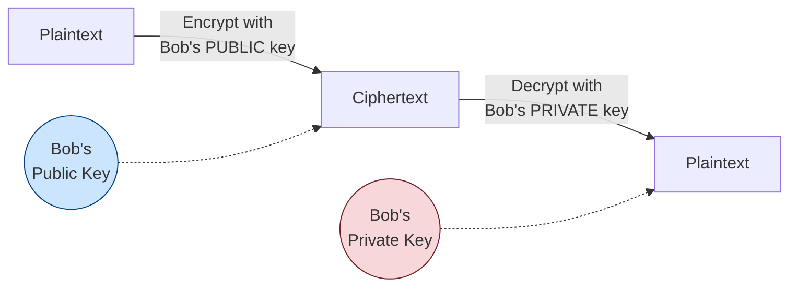

# Asymmetric Encryption

[< Back](./symmetric-encryption.md) | [Index](./README.md) | Next: [Public & Private Keys >](./public-private-keys.md)

---

**Asymmetric encryption** (aka **public-key cryptography**) uses a **pair of keys**:
a **public key** and a **private key**. They're mathematically linked, but you
*cannot* derive the private key from the public key.

The magic rule: **what one key locks, only the other can unlock.**



## Strengths
- **Solves key distribution** - you can freely publish your public key to the world.
- **Enables digital signatures** and identity verification.

## Weaknesses
- **Slow** - much more CPU-intensive than symmetric. Bad for large data.
- Larger key sizes needed for equivalent security (e.g., RSA-2048 vs AES-128).

---

## Code Example: RSA encryption

RSA can only encrypt small amounts of data (smaller than the key size), which is why in
practice it's used to encrypt a symmetric key, not bulk data (see hybrid encryption).

```python
from cryptography.hazmat.primitives.asymmetric import rsa, padding
from cryptography.hazmat.primitives import hashes, serialization

# 1. Bob generates his key PAIR
private_key = rsa.generate_private_key(public_exponent=65537, key_size=2048)
public_key = private_key.public_key()

# 2. Bob shares his PUBLIC key openly (serialized to PEM)
public_pem = public_key.public_bytes(
    encoding=serialization.Encoding.PEM,
    format=serialization.PublicFormat.SubjectPublicKeyInfo,
)
print(public_pem.decode())

# 3. Alice encrypts a secret with BOB'S PUBLIC key
message = b"a short secret (e.g. a symmetric session key)"
ciphertext = public_key.encrypt(
    message,
    padding.OAEP(
        mgf=padding.MGF1(algorithm=hashes.SHA256()),
        algorithm=hashes.SHA256(),
        label=None,
    ),
)
print("Ciphertext (hex):", ciphertext.hex())

# 4. Only Bob, with his PRIVATE key, can decrypt
decrypted = private_key.decrypt(
    ciphertext,
    padding.OAEP(
        mgf=padding.MGF1(algorithm=hashes.SHA256()),
        algorithm=hashes.SHA256(),
        label=None,
    ),
)
print("Decrypted:", decrypted.decode())
assert decrypted == message
```

> Note: We use **OAEP padding**, never the old PKCS#1 v1.5 padding for new code, and
> never "textbook RSA" (no padding), which is insecure.

---

[< Back](./symmetric-encryption.md) | [Index](./README.md) | Next: [Public & Private Keys >](./public-private-keys.md)
