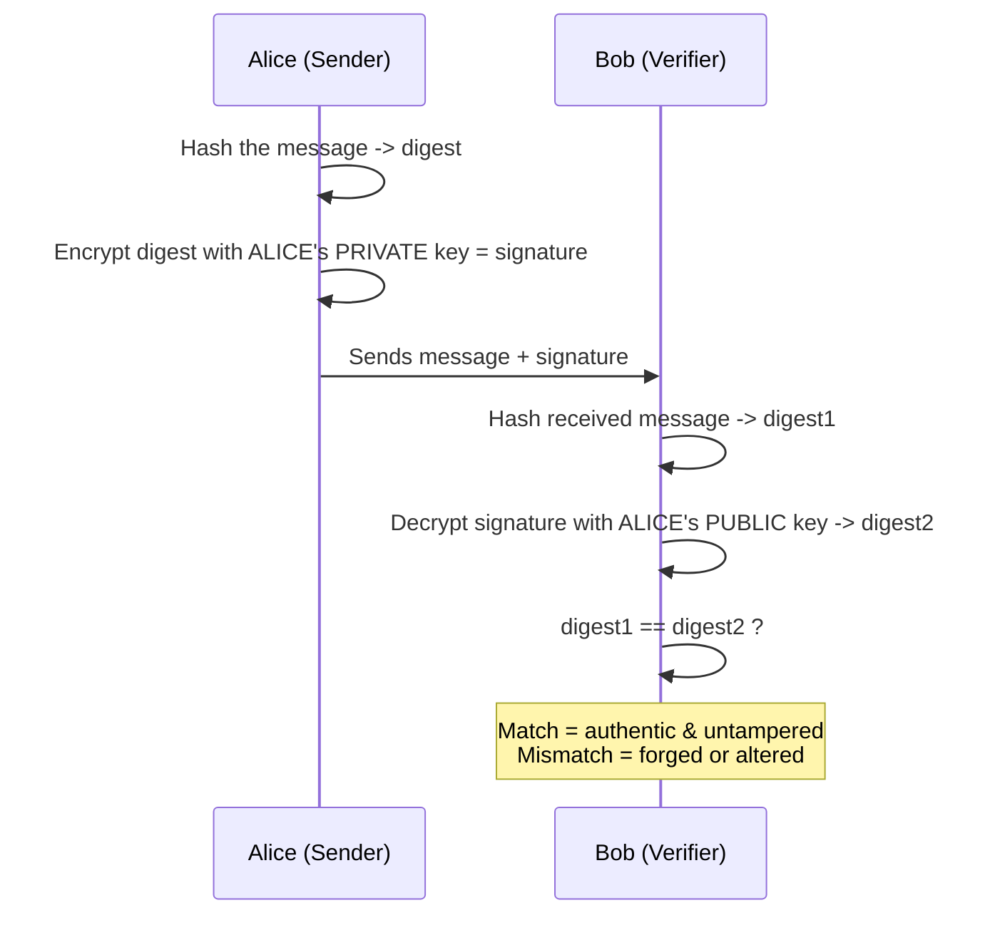

# Digital Signatures

[< Back](./algorithms.md) | [Index](./README.md)

---

Signatures flip asymmetric encryption around to prove **authenticity** and
**integrity** rather than confidentiality.



Because only Alice has her private key, a valid signature proves *she* sent it, and the
hash comparison proves nobody changed it in transit. This is the backbone of **TLS
certificates, software signing, and blockchain transactions.**

> Note the direction: signing uses the **sender's PRIVATE** key; verifying uses the
> **sender's PUBLIC** key. This is the opposite of encryption for confidentiality.

---

## Code Example: RSA signatures

```python
from cryptography.hazmat.primitives.asymmetric import rsa, padding
from cryptography.hazmat.primitives import hashes
from cryptography.exceptions import InvalidSignature

# Alice's key pair
alice_priv = rsa.generate_private_key(public_exponent=65537, key_size=2048)
alice_pub = alice_priv.public_key()

message = b"Transfer $100 to Bob"

# --- SIGN with Alice's PRIVATE key ---
signature = alice_priv.sign(
    message,
    padding.PSS(mgf=padding.MGF1(hashes.SHA256()), salt_length=padding.PSS.MAX_LENGTH),
    hashes.SHA256(),
)

# --- VERIFY with Alice's PUBLIC key ---
def verify(pub, msg, sig):
    try:
        pub.verify(
            sig, msg,
            padding.PSS(mgf=padding.MGF1(hashes.SHA256()), salt_length=padding.PSS.MAX_LENGTH),
            hashes.SHA256(),
        )
        return True
    except InvalidSignature:
        return False

print("Valid signature:", verify(alice_pub, message, signature))          # True
print("Tampered message:", verify(alice_pub, b"Transfer $9000 to Bob", signature))  # False
```

## Code Example: ECDSA signatures (elliptic curve, smaller & faster)

```python
from cryptography.hazmat.primitives.asymmetric import ec
from cryptography.hazmat.primitives import hashes
from cryptography.exceptions import InvalidSignature

priv = ec.generate_private_key(ec.SECP256R1())
pub = priv.public_key()

message = b"signed with an elliptic curve key"
signature = priv.sign(message, ec.ECDSA(hashes.SHA256()))

try:
    pub.verify(signature, message, ec.ECDSA(hashes.SHA256()))
    print("ECDSA signature valid")
except InvalidSignature:
    print("Invalid!")
```

## Command-line equivalent with OpenSSL

```bash
# Sign a file
openssl dgst -sha256 -sign private_key.pem -out message.sig message.txt

# Verify the signature
openssl dgst -sha256 -verify public_key.pem -signature message.sig message.txt
```

---

## Quick Cheat Sheet

| I want to... | Use... |
|--------------|--------|
| Encrypt a big file fast | **Symmetric** (AES-256-GCM) |
| Send a secret without pre-sharing a key | **Asymmetric** (RSA/ECC) or key exchange (ECDHE) |
| Prove I wrote something | **Digital signature** (my private key) |
| Secure a website (HTTPS) | **Hybrid** (asymmetric handshake + symmetric data) |
| Small keys, mobile/IoT | **ECC** |
| Agree on a shared key over public wire | **Diffie-Hellman (ECDHE)** |

---

[< Back](./algorithms.md) | [Index](./README.md)
