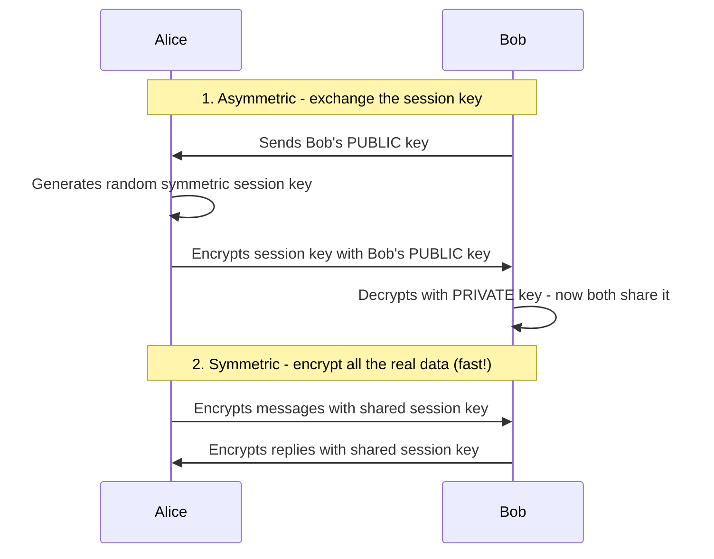

# Hybrid Encryption (Best of Both Worlds)

[< Back](./symmetric-vs-asymmetric.md) | [Index](./README.md) | Next: [Real Algorithms >](./algorithms.md)

---

In the real world (HTTPS/TLS, messaging apps, etc.), we **use both together**. This is
called **hybrid encryption**.

**The strategy:**
1. Use **slow asymmetric** encryption *once* to securely share a small random
   **symmetric session key**.
2. Then use **fast symmetric** encryption for the actual bulk data.



This gives you **the security of asymmetric** + **the speed of symmetric**. It's
exactly how the little padlock in your browser works.

---

## Code Example: full hybrid encrypt/decrypt

```python
import os
from cryptography.hazmat.primitives.asymmetric import rsa, padding
from cryptography.hazmat.primitives.ciphers.aead import AESGCM
from cryptography.hazmat.primitives import hashes

# === Setup: Bob has an RSA key pair ===
bob_private = rsa.generate_private_key(public_exponent=65537, key_size=2048)
bob_public = bob_private.public_key()

oaep = padding.OAEP(mgf=padding.MGF1(hashes.SHA256()), algorithm=hashes.SHA256(), label=None)

# === ALICE ENCRYPTS (sender side) ===
def hybrid_encrypt(recipient_public_key, plaintext: bytes):
    # 1. Random one-time symmetric session key + nonce
    session_key = AESGCM.generate_key(bit_length=256)
    nonce = os.urandom(12)

    # 2. Encrypt the big payload FAST with symmetric AES-GCM
    ciphertext = AESGCM(session_key).encrypt(nonce, plaintext, None)

    # 3. Encrypt the small session key with the recipient's PUBLIC key
    encrypted_key = recipient_public_key.encrypt(session_key, oaep)

    return encrypted_key, nonce, ciphertext

# === BOB DECRYPTS (recipient side) ===
def hybrid_decrypt(recipient_private_key, encrypted_key, nonce, ciphertext):
    # 1. Recover the session key with the PRIVATE key
    session_key = recipient_private_key.decrypt(encrypted_key, oaep)
    # 2. Decrypt the payload with the recovered symmetric key
    return AESGCM(session_key).decrypt(nonce, ciphertext, None)

# --- Run it ---
message = b"This can be MEGABYTES of data - symmetric handles it fast." * 1000
enc_key, nonce, ct = hybrid_encrypt(bob_public, message)
recovered = hybrid_decrypt(bob_private, enc_key, nonce, ct)

assert recovered == message
print(f"Success. Encrypted {len(message)} bytes with hybrid encryption.")
```

This is the pattern behind TLS, PGP/GPG email, and encrypted messaging.

---

[< Back](./symmetric-vs-asymmetric.md) | [Index](./README.md) | Next: [Real Algorithms >](./algorithms.md)
