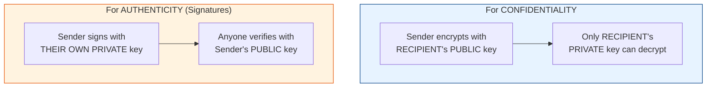

# Public & Private Keys

[< Back](./asymmetric-encryption.md) | [Index](./README.md) | Next: [Symmetric vs Asymmetric >](./symmetric-vs-asymmetric.md)

---

This is the concept people find most confusing, so let's nail it down with a mailbox
analogy.

- **Public key = the mail slot.** Anyone can drop a letter in (encrypt).
- **Private key = the mailbox key.** Only *you* can open it and read (decrypt).

You **share your public key openly**, post it, put it on your website, hand it out.
You **guard your private key with your life**, never share it, ever.

## The two directions of use

Asymmetric keys work in **both directions**, and each direction does a different job:



| Goal | Encrypt/Sign with... | Decrypt/Verify with... |
|------|----------------------|------------------------|
| **Send a secret to Bob** | Bob's **public** key | Bob's **private** key |
| **Prove *I* wrote this** | My **private** key | My **public** key |

> **Key insight:** Encrypting *for privacy* uses the **recipient's** keys.
> Signing *for identity* uses the **sender's** keys. Mixing these up is the #1
> beginner mistake.

---

## Code Example: generating, saving & loading a key pair

```python
from cryptography.hazmat.primitives.asymmetric import rsa
from cryptography.hazmat.primitives import serialization

# Generate the pair
private_key = rsa.generate_private_key(public_exponent=65537, key_size=2048)

# --- Save PRIVATE key to disk, ENCRYPTED with a passphrase ---
private_pem = private_key.private_bytes(
    encoding=serialization.Encoding.PEM,
    format=serialization.PrivateFormat.PKCS8,
    encryption_algorithm=serialization.BestAvailableEncryption(b"my-passphrase"),
)
with open("private_key.pem", "wb") as f:
    f.write(private_pem)

# --- Save PUBLIC key to disk (safe to share) ---
public_pem = private_key.public_key().public_bytes(
    encoding=serialization.Encoding.PEM,
    format=serialization.PublicFormat.SubjectPublicKeyInfo,
)
with open("public_key.pem", "wb") as f:
    f.write(public_pem)

# --- Load them back later ---
with open("private_key.pem", "rb") as f:
    loaded_private = serialization.load_pem_private_key(f.read(), password=b"my-passphrase")

with open("public_key.pem", "rb") as f:
    loaded_public = serialization.load_pem_public_key(f.read())

print("Keys generated, saved, and reloaded successfully.")
```

### Doing the same on the command line with OpenSSL

```bash
# Generate a 2048-bit private key
openssl genrsa -out private_key.pem 2048

# Extract the public key from it
openssl rsa -in private_key.pem -pubout -out public_key.pem
```

---

[< Back](./asymmetric-encryption.md) | [Index](./README.md) | Next: [Symmetric vs Asymmetric >](./symmetric-vs-asymmetric.md)
