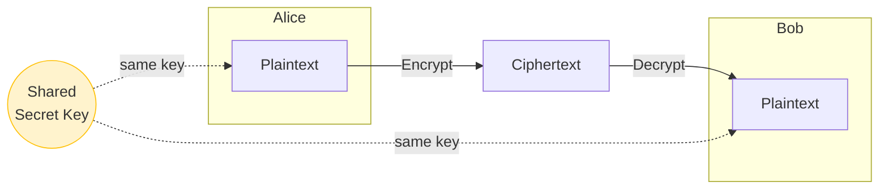

# Symmetric Encryption

[< Back to index](./README.md) | Next: [Asymmetric Encryption >](./asymmetric-encryption.md)

---

In **symmetric encryption**, the **same key** is used to *both* encrypt and decrypt.
Think of it like a physical door lock where the same key locks and unlocks.



## Strengths
- **Fast** - great for encrypting large amounts of data.
- **Low CPU cost** - efficient enough for real-time streaming/disk encryption.

## Weaknesses
- **Key distribution problem** - how do you *safely* get the shared key to the other
  person without an eavesdropper grabbing it? This is the Achilles' heel.
- **Doesn't scale** - for `N` people to all talk privately in pairs, you need
  `N * (N-1) / 2` keys. That's 4,950 keys for just 100 people.

## Popular symmetric algorithms
- **AES** (Advanced Encryption Standard) - today's gold standard.
- **ChaCha20** - fast, especially on mobile/devices without AES hardware.
- **3DES / DES** - legacy, now considered weak. Avoid.

---

## Code Example: AES-256-GCM

`AES-GCM` is *authenticated* encryption, it encrypts AND detects tampering. The `nonce`
is a number used once per key; never reuse a nonce with the same key.

```python
import os
from cryptography.hazmat.primitives.ciphers.aead import AESGCM

# 1. Generate a random 256-bit (32-byte) key. This is the SHARED secret.
key = AESGCM.generate_key(bit_length=256)
aesgcm = AESGCM(key)

# 2. A nonce must be unique per message. 12 bytes is standard for GCM.
nonce = os.urandom(12)

plaintext = b"Hello Bob, this is a secret message."
associated_data = b"header-not-encrypted-but-authenticated"

# 3. Encrypt (returns ciphertext + auth tag appended)
ciphertext = aesgcm.encrypt(nonce, plaintext, associated_data)
print("Ciphertext (hex):", ciphertext.hex())

# 4. Decrypt with the SAME key + nonce
decrypted = aesgcm.decrypt(nonce, ciphertext, associated_data)
print("Decrypted:", decrypted.decode())

assert decrypted == plaintext
# If anyone tampers with ciphertext or associated_data,
# .decrypt() raises cryptography.exceptions.InvalidTag
```

### Deriving a key from a password (don't use passwords directly!)

Never use a raw password as a key. Run it through a slow **key derivation function**
like PBKDF2, scrypt, or Argon2 with a random salt.

```python
import os
from cryptography.hazmat.primitives import hashes
from cryptography.hazmat.primitives.kdf.pbkdf2 import PBKDF2HMAC

password = b"correct-horse-battery-staple"
salt = os.urandom(16)  # store this alongside the ciphertext

kdf = PBKDF2HMAC(
    algorithm=hashes.SHA256(),
    length=32,           # 256-bit key
    salt=salt,
    iterations=600_000,  # higher = slower = harder to brute force
)
key = kdf.derive(password)
print("Derived key (hex):", key.hex())
```

---

[< Back to index](./README.md) | Next: [Asymmetric Encryption >](./asymmetric-encryption.md)
