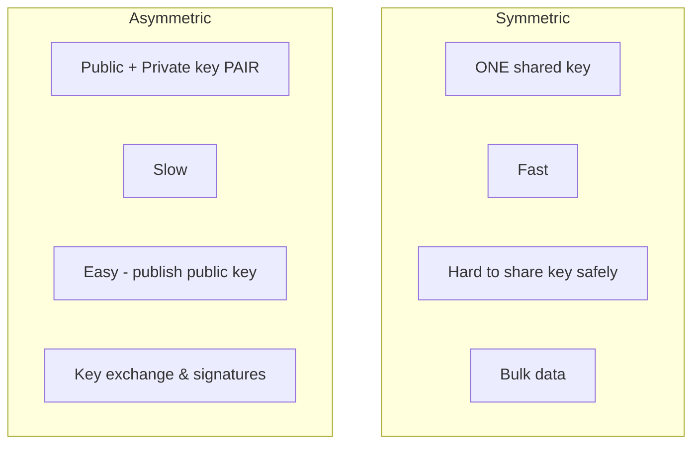

# Symmetric vs Asymmetric

[< Back](./public-private-keys.md) | [Index](./README.md) | Next: [Hybrid Encryption >](./hybrid-encryption.md)

---



| Feature | Symmetric | Asymmetric |
|---------|-----------|------------|
| **Keys used** | 1 shared secret | 2 (public + private) |
| **Speed** | Very fast | Slow (100x-1000x slower) |
| **Key sharing** | Hard (the core problem) | Easy (public key is public) |
| **Scalability** | Poor (N^2 keys) | Great |
| **Typical key size** | 128 / 256 bits | 2048 / 4096 bits (RSA), 256 bits (ECC) |
| **Best for** | Encrypting lots of data | Exchanging keys, signing |
| **Examples** | AES, ChaCha20 | RSA, ECC, Diffie-Hellman |

---

## Code Example: measuring the speed difference

Run this to *feel* why we don't use asymmetric crypto for bulk data.

```python
import os, time
from cryptography.hazmat.primitives.ciphers.aead import AESGCM
from cryptography.hazmat.primitives.asymmetric import rsa, padding
from cryptography.hazmat.primitives import hashes

data = os.urandom(190)  # RSA-2048+OAEP-SHA256 max is ~190 bytes, so keep it small

# --- Symmetric: AES-GCM ---
key = AESGCM.generate_key(bit_length=256)
aesgcm = AESGCM(key)
nonce = os.urandom(12)

start = time.perf_counter()
for _ in range(10_000):
    aesgcm.encrypt(nonce, data, None)
sym_time = time.perf_counter() - start

# --- Asymmetric: RSA ---
priv = rsa.generate_private_key(public_exponent=65537, key_size=2048)
pub = priv.public_key()
pad = padding.OAEP(mgf=padding.MGF1(hashes.SHA256()), algorithm=hashes.SHA256(), label=None)

start = time.perf_counter()
for _ in range(10_000):
    pub.encrypt(data, pad)
asym_time = time.perf_counter() - start

print(f"Symmetric (AES-GCM): {sym_time:.3f}s for 10k ops")
print(f"Asymmetric (RSA):    {asym_time:.3f}s for 10k ops")
print(f"RSA is ~{asym_time / sym_time:.0f}x slower")
```

You'll typically see RSA is dozens to hundreds of times slower, exactly why the real
world uses **hybrid encryption** (next topic).

---

[< Back](./public-private-keys.md) | [Index](./README.md) | Next: [Hybrid Encryption >](./hybrid-encryption.md)
