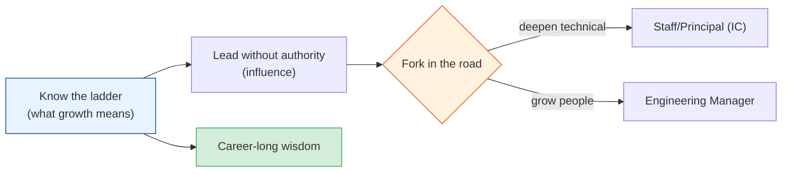

# Engineering Leadership & Career Growth

The final module — and the one no bootcamp teaches. As you grow from writing code to shaping
systems to shaping *teams*, the job changes completely. Technical skill stops being the
bottleneck; judgment, communication, and leverage take over. This is the hard-won,
decade-plus wisdom about growing as an engineer and stepping into leadership — the stuff senior
folks wish someone had told them at year two.

## Contents

| # | Topic | File | Level |
|---|-------|------|-------|
| 0 | The map (this file) | *(here)* | Senior+ |
| 1 | The engineering career ladder (junior → staff → EM) | [career-ladder.md](./career-ladder.md) | Senior+ |
| 2 | Technical leadership without authority | [technical-leadership.md](./technical-leadership.md) | Senior+ |
| 3 | The engineering manager transition | [engineering-manager.md](./engineering-manager.md) | EM |
| 4 | Wisdom, pragmatism & the mistakes to avoid | [wisdom-and-pitfalls.md](./wisdom-and-pitfalls.md) | All |

---

## How to read this module

- **Everyone should read chapters 1 and 4.** The ladder tells you what "growing" actually means
  (it's not "more code"), and the wisdom chapter is the collected scar tissue of a long career.
- **Chapter 2** is for anyone leading technical work — which happens well before any title
  change. Influence without authority is the core senior skill.
- **Chapter 3** is for those considering (or newly in) engineering management — a *different
  job*, not a promotion from coding.

## The one truth

> **Seniority is not about writing more code — it's about creating more *leverage*.** A junior
> makes themselves productive. A senior makes the *team* productive. A staff engineer makes the
> *org* productive. A manager makes *other people* successful. The higher you go, the less your
> impact comes from your own keyboard.

Start with [career-ladder.md](./career-ladder.md). **Next >**
