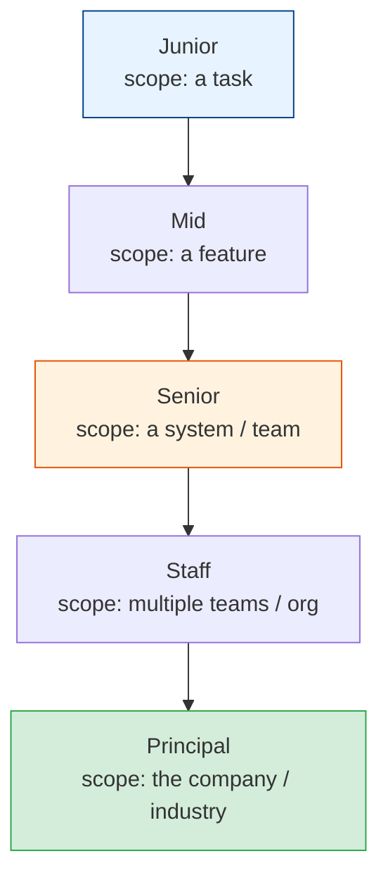
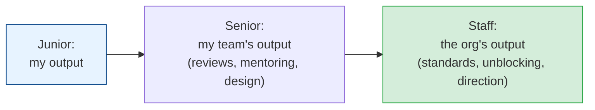
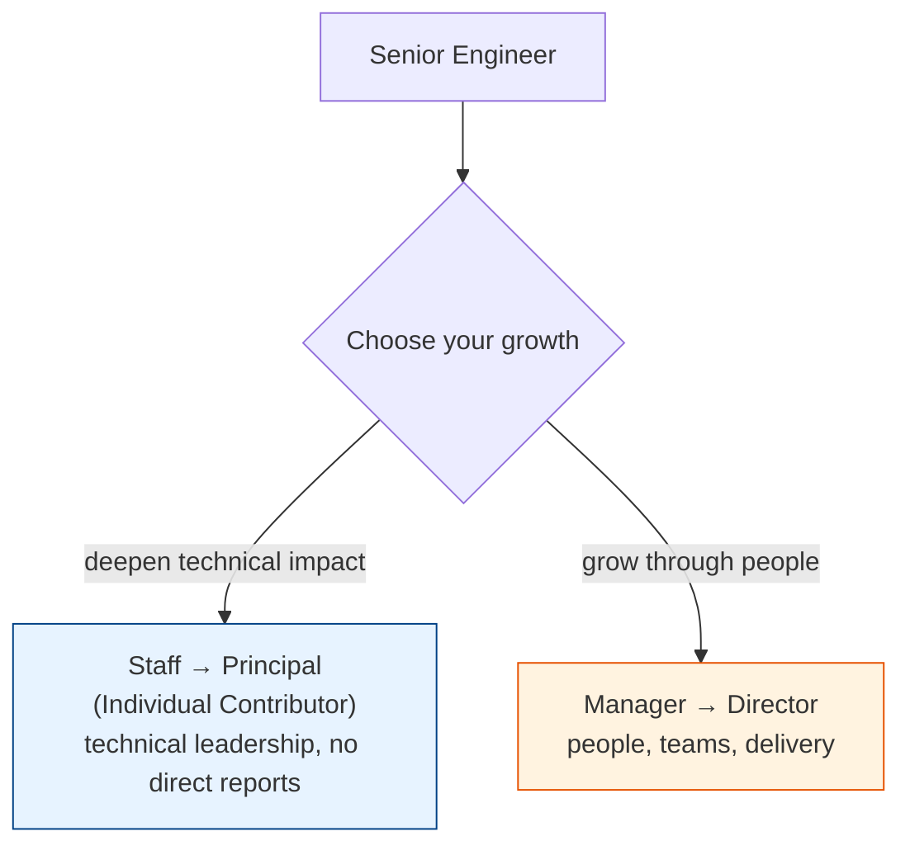

# The Engineering Career Ladder

[Index](./README.md) | [Next: Technical Leadership >](./technical-leadership.md)

---

Most engineers think the career is "get better at coding." It isn't. Each level is a *different
job* with a different definition of impact. Understanding the ladder tells you what "growth"
actually requires — and it's rarely more lines of code.

## The scope of impact widens at each level

| Level | Impact scope | What you're really being paid for | Needs help with |
|-------|-------------|-----------------------------------|-----------------|
| **Junior** | A well-defined task | Completing tasks correctly with guidance | Scoping, unknowns |
| **Mid** | A feature / component | Owning delivery of a chunk independently | Ambiguity, trade-offs |
| **Senior** | A system / their team | Solving ambiguous problems, lifting the team | Cross-team, strategy |
| **Staff** | Multiple teams | Solving org-wide technical problems, multiplying others | (drives their own) |
| **Principal** | Company / industry | Setting technical direction at the largest scale | (defines it) |

## What actually changes as you climb

### 1. From "how" to "what" to "why"
- **Junior:** told *what* to do, figures out *how*.
- **Senior:** figures out *what* to build from a vague *why*.
- **Staff+:** figures out *which problems are even worth solving* — and which to *not* solve.

### 2. From certainty to ambiguity
Junior work is well-defined ("implement this endpoint"). Senior+ work is deliberately vague
("our checkout conversion is dropping — figure it out"). **Comfort with ambiguity is the single
biggest gate between mid and senior.** The higher you go, the blurrier the problems.

### 3. From individual output to leverage

A senior who writes brilliant code but makes everyone around them slower is a *net negative* at
scale. The senior skill is **multiplying others**: a great design doc, a well-run review, a
mentored junior, or a shared tool creates more value than your personal commits ever could.

### 4. From answers to judgment
Junior engineers want *the right answer*. Senior engineers know **"it depends"** and can
navigate the trade-offs (see
[system design trade-offs](../system-design-fundamentals/tradeoffs.md)). Nobody hands you
the answer key anymore; *you're* the one others come to for judgment.

## The staff+ fork: IC vs management

At the senior/staff level the ladder **forks** into two parallel tracks of equal value:

- **IC track (Staff/Principal)** — grow technical impact *without* managing people. You lead
  through architecture, cross-team influence, and technical direction. (See
  [technical leadership](./technical-leadership.md).)
- **Management track** — grow impact *through* people: hiring, developing, and multiplying a
  team. (See [the EM transition](./engineering-manager.md).)

> **Management is not a promotion from senior engineer — it's a career change** into a different
> job. The two tracks are equal; pick based on what energizes you, not on which one "sounds more
> senior." Many great engineers are miserable managers, and vice versa.

## The staff-engineer archetypes (Will Larson)

Staff engineers tend to fit one of a few shapes — useful to know which you are:

- **Tech Lead** — guides a team's technical direction (most common).
- **Architect** — owns the design of a critical area across teams.
- **Solver** — parachutes into the gnarliest problems and cracks them.
- **Right Hand** — extends a senior leader's reach across an org.

## How promotions actually work (the uncomfortable truth)

> You are usually promoted for **already operating at the next level**, not for being promised
> it if you work hard. To reach senior, do senior-scoped work *now* — take the ambiguous
> problem, lift the team, own the outcome. Titles ratify reality; they rarely create it.

Practical implications:
1. **Seek scope, not tasks.** Volunteer for the ambiguous, cross-cutting problems nobody owns.
2. **Make your impact visible** — not bragging, but ensuring your leverage (mentoring, designs,
   unblocking) is *seen*. Invisible impact rarely gets rewarded.
3. **Find sponsors, not just mentors.** A mentor advises you; a **sponsor** advocates for you in
   the rooms you're not in. Sponsorship moves careers.

## The takeaways

1. **Each level is a different job**, defined by a wider scope of impact — not by coding speed.
2. **Comfort with ambiguity** is the gate to senior; **leverage** (multiplying others) is the
   gate to staff+.
3. **The ladder forks** into IC (Staff/Principal) and management — equal, different, choose by
   what energizes you.
4. **Management is a career change, not a promotion.**
5. **You're promoted for already doing the work.** Seek scope, make impact visible, find
   sponsors.

---

[Index](./README.md) | [Next: Technical Leadership >](./technical-leadership.md)
