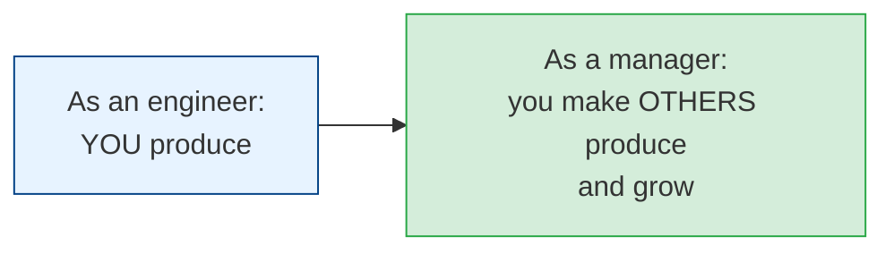
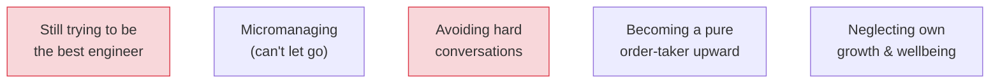

# The Engineering Manager Transition

[< Back](./technical-leadership.md) | [Index](./README.md) | [Next: Wisdom & Pitfalls >](./wisdom-and-pitfalls.md)

---

The most misunderstood move in tech: "getting promoted" to manager. It's not a promotion — it's
a **career change** into a different job with a different skill set, a different definition of
success, and a different daily reality. Many brilliant engineers make the switch and are
miserable (or bad at it) because nobody told them the truth. Here's the truth.

## Your job just fundamentally changed

- **Your output is now your team's output.** Not your commits — *their* success is your success.
- **Your product is now the team itself.** A healthy, growing, effective team is what you build.
- **You will code much less, or not at all.** If you need to write code to feel valuable, this
  job will hurt. Your value is now measured in the team's outcomes.

> The single hardest adjustment: **your sense of daily accomplishment disappears.** As an
> engineer you shipped code and felt done. As a manager you can have a full day of
> conversations and go home unsure you *did* anything. The impact is real but delayed and
> indirect. Make peace with this or you'll be miserable.

## What managers actually do

| Responsibility | What it means |
|----------------|---------------|
| **People / 1:1s** | Regular 1:1s, career growth, feedback, unblocking, wellbeing |
| **Team health** | Hiring, onboarding, morale, psychological safety, resolving conflict |
| **Delivery** | Prioritization, planning, removing obstacles, shipping the right things |
| **Communication** | Translating up (to leadership) and down (context to the team) |
| **Performance** | Recognizing great work, addressing under-performance, the hard conversations |
| **Shielding** | Absorbing organizational chaos so the team can focus |

## The core practices (get these right)

### 1:1s are sacred
The most important recurring meeting a manager has. Rules:
- **Never skip them** (cancelling says "you don't matter"). Reschedule if you must.
- **It's *their* meeting, not your status update.** Ask, then listen. Status can happen elsewhere.
- **Build real trust** — talk career, blockers, frustrations, growth, not just tickets.
- **Watch for the quiet signals** of burnout, disengagement, or conflict before they explode.

### Feedback: continuous, specific, kind
- **Give it early and often** — never save it all for a review. Surprises at review time are a
  management failure.
- **Praise in public, correct in private.**
- **Be specific and actionable** — "great job" and "be better" are both useless.
- **Radical candor:** care personally *and* challenge directly. Neither alone works — silent
  niceness is cruelty in slow motion.

### Delegate — and let go
You can't (and shouldn't) do it all. Delegate real, meaningful work, then **actually let go** —
don't micromanage. People grow by owning things and sometimes failing safely. If you delegate
then hover, you've taught them nothing and exhausted yourself.

### Hire well and slowly
Every hire reshapes the team. A bad hire costs far more than an empty seat. Hire for trajectory
and collaboration, not just current skill. And **protect the culture** — one toxic brilliant
hire can wreck a whole team's health (the "no brilliant jerks" rule).

## The mistakes new managers make

1. **Clinging to being the top coder.** You'll resent the team for "your" work and neglect
   actual management. Let the identity go.
2. **Micromanaging.** Born of anxiety; kills trust, autonomy, and growth. Set direction, then
   trust people.
3. **Avoiding hard conversations.** Under-performance you don't address festers and demoralizes
   everyone who *is* pulling weight. The kindest thing is often the direct conversation, early.
4. **Being a messenger, not a shield.** Passing every ounce of org pressure straight to the team
   makes you a stress conduit. Filter, contextualize, absorb, advocate upward.
5. **Neglecting yourself.** Management is emotionally draining and lonely. Find peer support
   (other managers), a mentor, and boundaries — or you'll burn out quietly.

## Can you go back? (Yes.)

> Trying management and returning to IC is **not** a failure — it's valuable data about what
> energizes you, and you come back a *better* engineer for understanding the other side. The
> "pendulum" between IC and management is a legitimate, healthy career shape. The tragedy is
> staying in a role that drains you out of fear it'll look like failure.

## The mindset shift that makes a good manager

- **Your ego moves from "I solved it" to "they solved it, and I helped."** Take pride in *their*
  wins. Give away the credit; absorb the blame.
- **Success is delayed and indirect** — you're planting trees whose shade you may not sit in.
- **You serve the team, not the other way around** (servant leadership). Your job is to make
  *them* successful, remove *their* obstacles, grow *their* careers.

## The takeaways

1. **Management is a different job, not a promotion.** Your product is the team; your output is
   theirs.
2. **1:1s are sacred; feedback is continuous, specific, and kind** (care + challenge).
3. **Delegate and truly let go.** Hire slowly, protect the culture, no brilliant jerks.
4. **Have the hard conversations early** — avoidance is the expensive option.
5. **Shield your team, grow yourself, and know you can go back to IC** — that's wisdom, not
   failure.

---

[< Back](./technical-leadership.md) | [Index](./README.md) | [Next: Wisdom & Pitfalls >](./wisdom-and-pitfalls.md)
