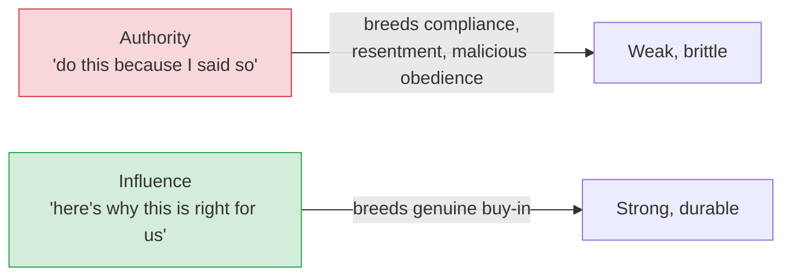

# Technical Leadership Without Authority

[< Back](./career-ladder.md) | [Index](./README.md) | [Next: The EM Transition >](./engineering-manager.md)

---

Here's the paradox of senior and staff engineering: you're expected to *lead* — set direction,
align teams, drive big decisions — but you have **no authority** to order anyone to do anything.
You can't fire people or set their goals. Everything runs on **influence**. Learning to lead
without power is *the* defining skill of the senior IC track.

## Influence beats authority (even for managers)

Even managers who *have* authority quickly learn that ordering people around produces
grudging compliance, not great work. Real alignment comes from people *understanding and
agreeing*. So the influence skills below serve you at every level.

## How to actually influence

### 1. Build trust and credibility first
Influence is currency, and you earn it. You get credibility by:
- **Being right often** (good judgment, demonstrated over time).
- **Doing the unglamorous work** — fixing the flaky test, writing the doc, taking the on-call.
- **Being reliable** — you do what you say. People follow those they can count on.
- **Being generous** — you make *others* look good and give credit away freely.

> Trust is slow to build and fast to burn. It's the foundation everything else stands on. No
> trust, no influence, no matter your title.

### 2. Understand before you push
Before advocating a change, deeply understand the *current* reality — why things are the way
they are (there's usually a good reason you're missing). "This code is terrible" from someone
who doesn't know the history earns you nothing. Curiosity and respect open doors that criticism
slams shut.

### 3. Communicate for your audience
The senior superpower is **translating between altitudes:**
- To **executives:** business impact, risk, cost, timelines. Not implementation details.
- To **peers:** trade-offs, design, technical reasoning.
- To **juniors:** context, the "why," and space to learn.

> The best technical idea, poorly communicated, *loses* to a mediocre idea explained clearly.
> Writing and speaking well is not a soft skill — it's a core engineering skill, and it's the
> one that compounds most over a career.

### 4. Bring data and options, not just opinions
"I think X is better" is weak. "Here are three options, with trade-offs, and here's the one I
recommend and *why*, given our constraints" is leadership. Do the homework; make the decision
easy for others to say yes to. (Pair this with [ADRs](../architecture-patterns/adrs-and-decisions.md).)

### 5. Disagree and commit
You won't win every debate. When a reasonable decision goes against you, **argue your case
fully, then commit fully** — support it as if it were your own. Sulking or quietly sabotaging
destroys the trust you spent years building. This one behavior marks the difference between a
senior engineer and a talented liability.

## Leading technical work

### Drive alignment, don't dictate
Get people in a room (or a doc), surface the trade-offs, let the team co-own the decision.
People support what they help create. A design *you* imposed is fragile; a design the team
shaped is durable — they'll defend and maintain it because it's *theirs*.

### Make decisions reversible when you can
Amazon's "one-way vs two-way doors": for **reversible** decisions, decide fast and adjust
later — don't burn weeks debating. For **irreversible** ones (data model, core tech choice),
slow down and get it right. Knowing which is which saves enormous time and prevents both
recklessness and paralysis.

### Mentor and multiply
Your job is to make the team better, not to be the hero who solves everything:
- **Teach people to fish.** Answering a question is fine; teaching them how to find the answer
  scales.
- **Delegate the interesting work**, not just the scraps. That's how others grow (and how you
  free yourself for higher-leverage work).
- **Review to teach, not to gatekeep.** A good code review explains the *why* and lifts the
  author's skill, it doesn't just block.
- **Resist being the bottleneck / hero.** If everything routes through you, you've built a
  single point of failure — of the human kind. That caps the *team*, not just you.

## The traps that sink technical leaders

1. **The hero / bottleneck** — being indispensable feels great and is a *failure*. It caps the
   team and burns you out. Great leaders make themselves *unnecessary*.
2. **Ivory-tower architecture** — designing from on high without writing code or hearing the
   team. Stay grounded in reality; the best architects still get their hands dirty.
3. **Winning every argument** — being "right" while alienating everyone loses the war. Being
   effective beats being right.
4. **Neglecting communication** — brilliant work nobody understands or knows about has near-zero
   impact. Over-communicate.
5. **Hoarding knowledge or credit** — makes you feel important short-term, destroys trust and
   team growth long-term.

## The takeaways

1. **Influence, not authority, is how senior work gets done** — and you earn it through trust,
   reliability, and generosity.
2. **Understand before you push; communicate for your audience; bring options and data.**
3. **Disagree and commit** — argue fully, then support fully.
4. **Drive alignment (co-ownership), decide reversible things fast, and multiply the team.**
5. **Avoid the hero trap.** Your goal is a team that's great *without* you being in the middle
   of everything.

---

[< Back](./career-ladder.md) | [Index](./README.md) | [Next: The EM Transition >](./engineering-manager.md)
