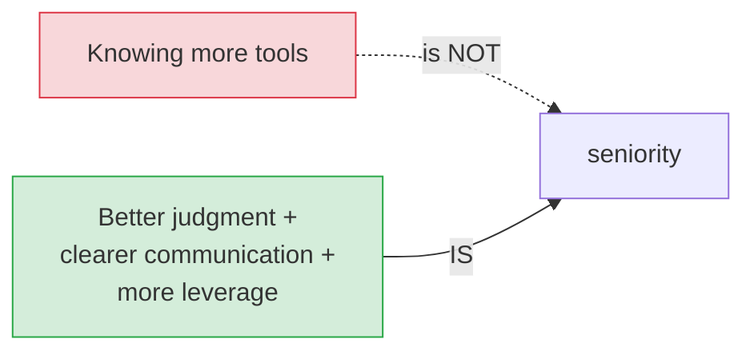

# Wisdom, Pragmatism & the Mistakes to Avoid

[< Back](./engineering-manager.md) | [Index](./README.md)

---

The capstone. This is the collected wisdom that usually takes a decade (and a few scars) to
earn — distilled into one place. It applies whether you're writing your first pull request or
running a department. Read it now, then re-read it every year or two; different lines will land
as you grow.

## On code and building

1. **The best code is no code.** Every line is a liability you must maintain, test, secure, and
   eventually delete. The most senior PRs are often net-negative. Solve the problem with less.

2. **Simple beats clever, always.** Clever code feels great to write and miserable to debug at 3
   a.m. six months later. Write for the tired, confused human who reads it next — probably you.
   (The Zen of Python: "Simple is better than complex.")

3. **Make it work, make it right, make it fast — in that order.** Don't optimize before it
   works. Don't polish before you know it's the right thing. Premature optimization wastes
   effort on problems you don't have yet.

4. **Delete code fearlessly.** Dead code, unused features, "might need it later" — kill it.
   Version control remembers; your codebase shouldn't be a graveyard. Less code, fewer bugs.

5. **Boring technology wins.** Postgres, a queue, and a cache solve most problems. Every exotic
   tool is an on-call burden, a hiring constraint, and a 3-a.m. mystery. Spend your few
   "innovation tokens" where they truly matter.

6. **Consistency beats individual perfection.** A codebase where everything follows one decent
   pattern beats one with five "better" but conflicting styles. Match the surrounding code.

## On systems and scale

7. **Everything fails; design for it.** Disks, networks, regions, dependencies, and people. You
   don't prevent failure — you contain the blast radius and recover fast. (See
   [failure handling](../distributed-systems/failure-handling.md).)

8. **Idempotency is a superpower.** In any system with retries (all of them), make operations
   safe to run twice. It quietly eliminates a whole category of the worst bugs.

9. **Data outlives code.** You'll rewrite services many times; the schema and data linger for a
   decade. Model carefully, migrate safely (expand/contract), never do a destructive migration
   without a rollback plan.

10. **Premature scaling is as bad as premature optimization.** Design for ~10x current load,
    not 10,000x. You'll learn more and requirements will change before you get there. YAGNI.

11. **Observability is not optional.** You can't fix what you can't see. Metrics, logs, and
    traces are part of the design, not a phase-two nicety. If it's not measured, it's broken and
    you don't know yet.

12. **Cost is a real constraint.** "Just add servers" has a bill that funds or starves your
    team. At scale, efficiency *is* architecture.

## On decisions and judgment

13. **"It depends" is the correct answer — then explain what it depends on.** There's no best
    architecture, only the best fit for *these* constraints. Naming the constraints out loud is
    the whole skill. (See [trade-offs](../system-design-fundamentals/tradeoffs.md).)

14. **Optimize for reversibility.** Decide reversible things fast; slow down only for the
    one-way doors. Most decisions are more reversible than they feel — bias toward action.

15. **Write down the *why*.** Context is the most perishable resource in engineering. An ADR
    today saves hours of "why did we do this?" later. (See
    [ADRs](../architecture-patterns/adrs-and-decisions.md).)

16. **Perfect is the enemy of shipped.** A working 80% solution in production beats a perfect
    design in a doc. Iterate with real feedback from real users.

17. **Understand the problem before the solution.** Most bad systems are elegant answers to the
    wrong question. Time spent understanding the actual problem is never wasted.

## On people and career

18. **Communication is a core engineering skill, not a soft one.** The best idea, poorly
    explained, loses. Writing and speaking clearly compounds more than any framework you'll
    learn.

19. **Leverage over output.** Your career grows when you make *others* productive — through
    designs, reviews, mentoring, and tools — not by typing faster. The hero who solves
    everything caps the team.

20. **Trust is your real currency.** Slow to build, fast to burn. Be reliable, generous with
    credit, and honest — including "I don't know" and "I was wrong." It's the foundation of all
    influence.

21. **Disagree and commit.** Argue your case fully; once a reasonable decision is made, support
    it fully. Sulking or sabotaging destroys years of trust in a day.

22. **Strong opinions, loosely held.** Have a clear point of view, but update it eagerly when
    the evidence changes. Certainty that survives contrary data is just ego.

23. **Be kind; the industry is small.** The junior you mentor becomes a senior at the company
    you'll want to join. The person you burn will remember. Reputation is a decades-long game.

## On being pragmatic

24. **YAGNI, KISS, DRY — in tension, on purpose.** Don't build for imagined futures (YAGNI),
    keep it simple (KISS), but don't repeat yourself (DRY) — *and* don't over-DRY into the wrong
    abstraction. Senior judgment is knowing which wins right now.

25. **The dose makes the poison.** Every good principle taken to an extreme becomes harmful.
    Total DRY makes rigid code. Total microservices make a distributed mess. Total test coverage
    wastes time on trivia. Moderation and context, always.

26. **Learn the fundamentals; tools are temporary.** Frameworks, languages, and clouds churn
    every few years. Networking, data structures, concurrency, distributed systems, and clear
    thinking are forever. Invest in what lasts.

27. **You will be wrong, often.** Every experienced engineer has shipped bugs, made bad calls,
    and caused outages. The difference is they learned, stayed humble, and didn't hide it.
    Blameless learning applies to yourself too.

## The meta-lesson

> Ten years of experience should be ten years of *learning*, not one year repeated ten times.
> The engineers who grow are the ones who stay curious, court feedback, reflect on their
> mistakes, and keep questioning what they think they know. The ones who stall are the ones who
> stopped learning after they got comfortable.
>
> Seniority isn't a pile of memorized facts — it's **judgment** (choosing well amid trade-offs),
> **communication** (making others understand and act), and **leverage** (multiplying the people
> around you). Everything in these docs is a tool. Wisdom is knowing which tool, when, and why —
> and having the humility to change your mind when you're wrong.

---

[< Back](./engineering-manager.md) | [Index](./README.md)
