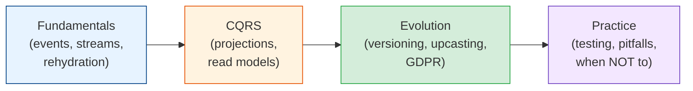

# Event Sourcing & CQRS

Most databases remember where things ended up and forget how they got there. An `UPDATE`
overwrites the old value, and the only record of the change is whatever someone remembered to
log. Event sourcing stores the changes themselves, as an append-only list of business facts
(`OrderPlaced`, `PaymentCaptured`, `OrderShipped`), and calculates current state from them.
CQRS is its almost-mandatory partner: since a pile of events can't answer list queries, you
build separate read models shaped for each screen. This module covers how both work, the
schema problems that come from keeping events forever, and the much shorter list of systems
where the whole approach is worth it.

## Contents

| # | Topic | File | Level |
|---|-------|------|-------|
| 0 | The map (this file) | *(here)* | L3 · Intermediate |
| 1 | Event sourcing fundamentals: events, streams, rehydration, concurrency & snapshots | [event-sourcing-fundamentals.md](./event-sourcing-fundamentals.md) | L3 · Intermediate |
| 2 | CQRS & projections: read models, rebuilds, stale reads & process managers | [cqrs-and-projections.md](./cqrs-and-projections.md) | L4 · Advanced |
| 3 | Event schema evolution: tolerant readers, upcasting, registries & erasing PII | [event-schema-evolution.md](./event-schema-evolution.md) | L4 · Advanced |
| 4 | Event sourcing in practice: testing, first projects, pitfalls & when not to use it | [event-sourcing-in-practice.md](./event-sourcing-in-practice.md) | L4 · Advanced |

---

## How to read this module

- **Chapter 1** is the mechanics. Read it even if you never plan to event-source anything,
  because the ideas (append-only facts, expected-version concurrency) turn up in ledgers, Kafka,
  and database write-ahead logs.
- **Chapter 2** is where the system becomes usable: projections turn events into tables you can
  query, and you learn to live with the read side lagging behind.
- **Chapter 3** is the part that surprises teams in their second year. Events live forever, so
  every schema change has to keep old events readable, and "delete this user's data" needs a
  plan.
- **Chapter 4** is the judgment material. Testing, how to start small, the common mistakes,
  and a frank table of where event sourcing fits and where it doesn't.

## Prerequisites

This module assumes you've read
[domain-driven-design/tactical-design.md](../domain-driven-design/tactical-design.md). Event
sourcing stores one stream per aggregate, so if aggregates are fuzzy, the streams will be too.

## Related modules

- [domain-driven-design/](../domain-driven-design/README.md): aggregates, domain events, and a
  first look at CQRS without event sourcing.
- [microservices/distributed-data-patterns.md](../microservices/distributed-data-patterns.md):
  sagas and the outbox pattern, which pair with process managers and integration events.
- [messaging-and-streaming/](../messaging-and-streaming/README.md): how events travel between
  services once they leave the event store, and why delivery is at-least-once.
- [data-engineering/](../data-engineering/README.md): change data capture, the cheaper option
  when all you want is a change history of an existing database.
- [distributed-systems/time-and-idempotency.md](../distributed-systems/time-and-idempotency.md):
  idempotent handlers, which every projection needs.

## The one idea

> **Store what happened. Calculate what is.** The current state is a cache of the event
> history, and any cache can be thrown away and rebuilt. Once that clicks, new reports,
> bug fixes in read models, and "what did this look like last Tuesday?" stop being projects
> and become replays.

Start with [event-sourcing-fundamentals.md](./event-sourcing-fundamentals.md). **Next >**
