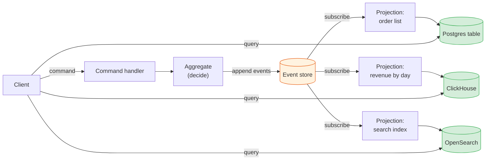
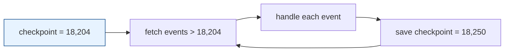
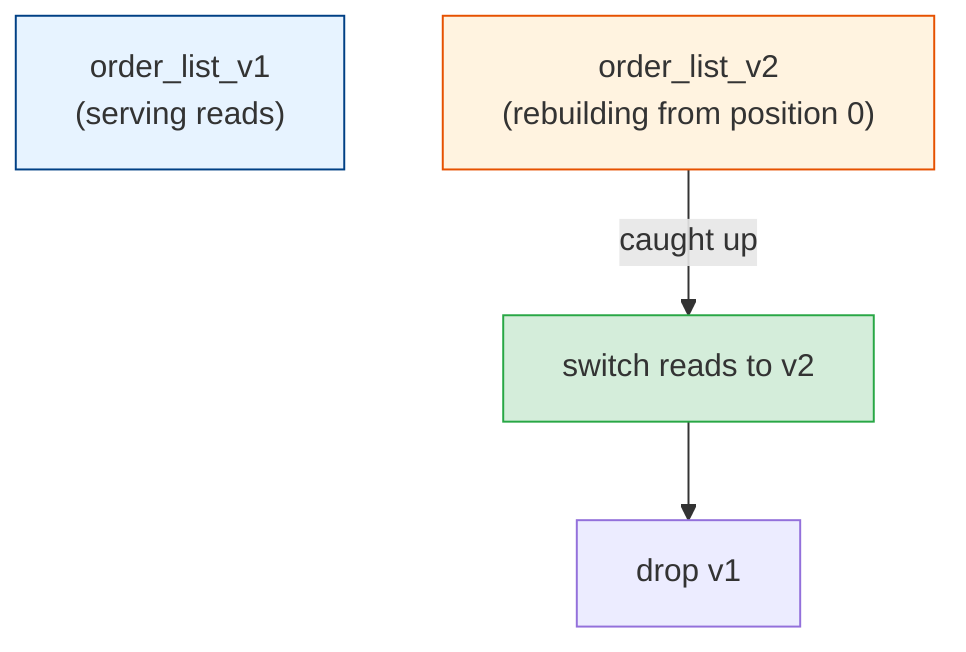
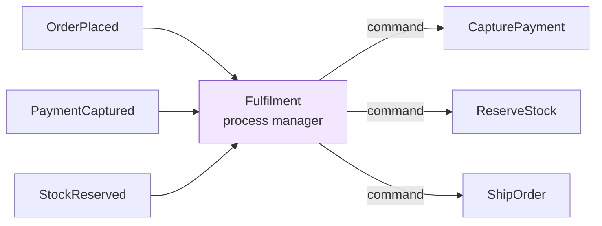

# CQRS & Projections: Building Read Models from Events

[< Back](./event-sourcing-fundamentals.md) | [Index](./README.md) | [Next: Event Schema Evolution >](./event-schema-evolution.md)

---

The [previous chapter](./event-sourcing-fundamentals.md) left a hole. An event store is great
at "give me everything that happened to order 7f3a" and useless at "show me all unshipped
orders over 500 EUR for customers in Germany". You can't `WHERE` your way through a pile of
JSON events.

CQRS fills that hole. You keep the event store for writes, and you build separate read models
shaped for each query.

## CQRS in one picture

Command Query Responsibility Segregation means the code path that changes data and the code
path that reads data use different models. Greg Young named it around 2010, building on
Bertrand Meyer's older idea of command-query separation at the method level.



The write side is small and strict. It loads one aggregate, checks rules, appends events. It
never answers list queries.

The read side is a set of disposable, denormalised tables, each built for one screen or one
API. They hold no business rules. If one breaks, you delete it and rebuild it from the events.

> CQRS doesn't require event sourcing, and the
> [DDD module](../domain-driven-design/context-mapping-and-integration.md#cqrs-separate-models-for-writing-and-reading)
> covers it without. But event sourcing almost requires CQRS, because the event store can't
> serve queries on its own.

## Projections

A projection is a function that consumes events in order and updates a read model. It's the
same fold as rehydration, but over all streams and into a database table instead of an
in-memory object.

```python
class OrderListProjection:
    def handle(self, event, tx):
        match event.type:
            case "OrderPlaced":
                tx.execute(
                    "INSERT INTO order_list (order_id, customer_id, total, status, placed_at) "
                    "VALUES (%s, %s, %s, 'placed', %s) ON CONFLICT (order_id) DO NOTHING",
                    (event.stream_id, event.data["customer_id"], event.data["total"], event.occurred_at),
                )
            case "OrderShipped":
                tx.execute("UPDATE order_list SET status = 'shipped' WHERE order_id = %s", (event.stream_id,))
            case "OrderCancelled":
                tx.execute("UPDATE order_list SET status = 'cancelled' WHERE order_id = %s", (event.stream_id,))
```

The projection runner around it does three things:

1. Reads its checkpoint, the last global position it processed.
2. Fetches events after that position and calls `handle` for each.
3. Saves the new checkpoint.



### Exactly-once is a lie you can approximate

The runner can crash after updating the read model but before saving the checkpoint. On
restart it reprocesses those events. Two ways to survive that:

- **Same transaction.** If the read model and the checkpoint live in the same database, update
  both in one transaction. Then the checkpoint and data can never disagree. This is the best
  option when you can get it.
- **Idempotent handlers.** If the read model lives elsewhere (OpenSearch, Redis), make every
  handler safe to run twice. `INSERT ... ON CONFLICT DO NOTHING`, `SET status = 'shipped'`
  rather than `SET count = count + 1`, or store the last applied event position per row and
  skip anything older.

This is the same at-least-once reality covered in
[messaging-and-streaming/delivery-guarantees.md](../messaging-and-streaming/delivery-guarantees.md) and
[distributed-systems/time-and-idempotency.md](../distributed-systems/time-and-idempotency.md).

### Rebuilding a projection

Rebuilding is the payoff of the whole approach. Product wants a new "orders per warehouse per
hour" dashboard? Write a new projection, start it at position 0, and let it chew through
history. It catches up, then keeps up.

The same move fixes bugs. If a projection had a bug for three weeks, fix the handler, drop the
table, and replay. No data migration script, no "fix-up job".

The safe way to rebuild something users are reading from is blue/green:



Watch the replay time. A projection that takes nine hours to rebuild is a projection you'll be
scared to change. Measure replay speed early, and batch the writes (one transaction per 500
events, not per event) once history gets large.

## Eventual consistency and the stale read

The read side lags behind the write side, usually by milliseconds and sometimes by seconds
when a projection is busy. The classic bug report: "I created an order and it's not in my
list."

| Technique | How it works | Cost |
|-----------|--------------|------|
| Return the result from the command | The command response includes the new state, so the UI shows it without querying | Only helps the user who made the change |
| Wait for the position | The command returns the global position of its last event; the query waits until the projection's checkpoint passes it (with a timeout) | Adds latency to that one read |
| Optimistic UI | The client adds the item locally and reconciles later | Client complexity |
| Read from the write side | For "show me my one order", rehydrate the aggregate directly | Only works for single-aggregate lookups |
| Accept it | Most dashboards are fine a second behind | Nothing, if the product agrees |

The "wait for the position" approach is the most general and the least known:

```python
def place_order(cmd):
    position = order_service.handle(cmd)          # returns global position of last appended event
    return {"orderId": cmd.order_id, "position": position}

def list_orders(customer_id, min_position=None):
    if min_position:
        projections.wait_until("order_list", min_position, timeout_ms=2000)
    return db.query("SELECT * FROM order_list WHERE customer_id = %s", (customer_id,))
```

Talk to the product owner before choosing. Many "we need strong consistency" requirements turn
into "the user who clicked the button needs to see their own change", which is a much easier
problem.

## Read model design

Read models are where you get to be lazy about normalisation:

- **One read model per screen or API is fine.** Duplicated data across read models is the
  point, not a smell.
- **Store what the UI shows, pre-computed.** If the list shows "3 items, 47.50 EUR", store
  `item_count` and `total_display`, don't join and sum at query time.
- **Pick the right database per projection.** Full-text search goes to
  [OpenSearch](../search-systems/README.md), time-series aggregates go to a columnar store,
  the simple lists stay in Postgres.
- **Never let the write side read a projection to make a decision.** The projection might be
  stale. If a rule needs data, that data belongs inside the aggregate, or the rule needs to
  tolerate staleness explicitly (see set validation below).

### The set-validation problem

"Email addresses must be unique across all users" is the question everyone hits first. Each
user is its own aggregate, so no single aggregate can see every email. Options, from simplest:

1. **A uniqueness table on the write side.** Insert into `user_emails (email PRIMARY KEY)` in
   the same transaction as the append. Pragmatic, and fine when the event store is Postgres.
2. **A reservation aggregate.** An `EmailReservation` stream per normalised address; claiming
   it uses the expected-version check.
3. **Check the projection and compensate.** Check the read model (might be stale), accept the
   tiny race, and detect duplicates afterwards with a process that emails support. Fine when
   duplicates are rare and cheap to fix.

## Process managers: reacting to events with commands

Some event handlers don't update a read model. They make something happen next: when
`PaymentCaptured`, send `ReserveStock`. That's a process manager (closely related to the
[saga](../microservices/distributed-data-patterns.md#sagas-distributed-transactions-without-the-lock)).



Two warnings. Process managers must be idempotent, because they'll see events twice. And they
must not fire on replay: rebuilding a read model should never re-send 40,000 "your order has
shipped" emails. Keep side-effecting handlers on their own checkpoint, and never reset it to
zero.

## The takeaways

1. **Event sourcing needs CQRS.** The event store handles writes and single-aggregate reads;
   projections handle everything else.
2. **Projections are disposable.** Fix a bug or add a report by replaying events into a new
   table. Rebuild blue/green and keep replay time measured.
3. **Handle at-least-once delivery.** Update data and checkpoint in one transaction, or make
   handlers idempotent.
4. **Stale reads are a product question.** "Wait for position" and "return the result from the
   command" solve most of them.
5. **Separate side effects from read models.** Process managers send commands and emails; they
   must never run again on a rebuild.

---

[< Back](./event-sourcing-fundamentals.md) | [Index](./README.md) | [Next: Event Schema Evolution >](./event-schema-evolution.md)
