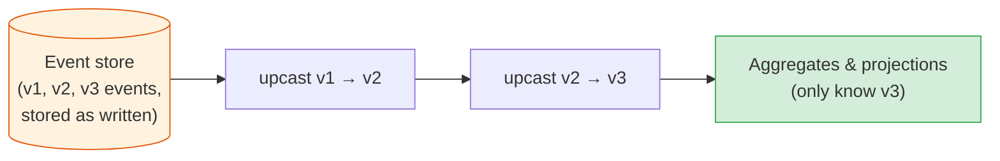
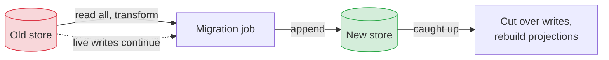

# Event Schema Evolution: Versioning, Upcasting & Deleting Data

[< Back](./cqrs-and-projections.md) | [Index](./README.md) | [Next: Event Sourcing in Practice >](./event-sourcing-in-practice.md)

---

In a CRUD system, a schema change is a migration. You run it, the old shape is gone, and the
code only ever sees the new shape. In an event-sourced system the old events never go away.
An `OrderPlaced` written in 2022 will still be read by the code you deploy in 2029. Your code
has to understand every shape an event has ever had.

This is the part of event sourcing that tutorials skip and production teams spend the most
time on.

## Why you can't just migrate the events

The tempting fix is "rewrite the old events into the new shape". Sometimes that's right (see
[copy-and-transform](#copy-and-transform-the-last-resort) below), but as a default it breaks
the things you adopted event sourcing for:

- Events are a record of what happened. Rewriting them rewrites history, and an auditor will
  ask why the 2022 record changed in 2026.
- Other systems already consumed the old events. They can't be rewritten.
- A bug in the migration corrupts the source of truth itself, not a derived table.

So the default is to leave stored events alone and change how you read them.

## Kinds of change, from easy to hard

| Change | Example | Strategy |
|--------|---------|----------|
| Add an optional field | `OrderPlaced` gains `channel` | Readers default it when missing. No version bump |
| Rename a field | `qty` becomes `quantity` | Upcaster, or accept both names in the reader |
| Change a field's type or meaning | `price` from float to `{amount, currency}` | New event version plus upcaster |
| Split an event | `CustomerUpdated` becomes `CustomerRenamed` and `CustomerRelocated` | Upcaster that returns several events |
| Change what a fact means | "shipped" used to mean "label printed", now means "left the warehouse" | New event type. Old events keep their old meaning |
| Remove an event type | `LoyaltyPointsAwarded` after the loyalty program ends | Keep the type readable; stop emitting it |

Rule of thumb: if old consumers can safely ignore the change, it's additive and cheap. If they
would misread it, you need a new version or a new type.

## Weak schema: be tolerant by default

The cheapest strategy is to write readers that tolerate missing and extra fields:

```python
def apply_order_placed(state, data):
    state.total = Money(data["total"]["amount"], data["total"]["currency"])
    state.channel = data.get("channel", "web")          # added in 2024; older events were all web
    state.gift_wrap = data.get("gift_wrap", False)
```

This covers most real changes. The discipline it needs:

- **Never reuse a field name for a different meaning.** If `status` meant one thing in 2023
  and another in 2025, readers can't tell which one they're looking at.
- **Pick the default from history, not convenience.** "Older events were all `web`" has to be
  true. Ask someone who was there.
- **Ignore unknown fields** instead of failing on them, so an older consumer survives a newer
  producer.

## Upcasting: translate on read

When a change is too big for defaults, add an upcaster. An upcaster is a function that turns
an old version of an event into the next version. It sits between the event store and
everything else, so aggregates and projections only ever see the latest shape.



```python
UPCASTERS = {
    ("ItemAddedToOrder", 1): lambda d: (2, {**d, "quantity": d.pop("qty")}),
    ("ItemAddedToOrder", 2): lambda d: (3, {
        **{k: v for k, v in d.items() if k != "price"},
        "unitPrice": {"amount": str(d["price"]), "currency": "EUR"},   # v2 shop was EUR-only
    }),
}

def upcast(event):
    while (event.type, event.schema_version) in UPCASTERS:
        new_version, new_data = UPCASTERS[(event.type, event.schema_version)](dict(event.data))
        event = event.with_data(new_data, schema_version=new_version)
    return event
```

Upcasters chain, so each one only knows about one step. Write a test for every upcaster with a
real stored example of the old shape, copied from production, not hand-written.

Store the schema version in the event metadata from day one, even if it's `1` for everything.
Retrofitting a version field onto millions of unversioned events is miserable.

## Versioning events that leave the service

Events that other teams consume (integration events) need stricter rules than internal ones,
because you can't deploy their upcasters for them:

- **Keep internal and published events separate.** Your aggregate's `ItemAddedToOrder` is an
  internal detail. What you publish to other contexts is a deliberately designed
  `OrderConfirmed` contract. The
  [DDD module](../domain-driven-design/context-mapping-and-integration.md#domain-event-vs-integration-event)
  covers this split.
- **Use a schema registry** (Confluent Schema Registry, AWS Glue Schema Registry, or Apicurio)
  with Avro or Protobuf for published events, and turn on compatibility checks in CI.
- **Breaking change means a new topic or a new type**, published alongside the old one until
  every consumer has moved. Same expand/contract idea as
  [API versioning](../api-design/versioning-and-evolution.md).

## Copy-and-transform: the last resort

Sometimes the history really is unusable as stored: an early design put five aggregates in one
stream, or events contain a field that was a security mistake. Then you copy the store into a
new one, transforming as you go, and switch over.



Keep the old store read-only and archived afterwards. If the migration had a bug, it's your
only way back.

## Deleting personal data in an append-only log

GDPR's right to erasure and an immutable event log pull in opposite directions. "Never delete
events" meets "delete everything about this person within 30 days". Three approaches:

| Approach | How | Trade-off |
|----------|-----|-----------|
| Keep PII out of events | Events hold `customerId`; names, emails, and addresses live in a normal mutable table | Simple and the best default. Replays can't reconstruct what the address was at the time |
| Crypto-shredding | Encrypt PII fields with a per-person key held in a key store; delete the key to erase | Events stay intact; the PII becomes unreadable. Needs key management and care with backups |
| Rewrite the stream | Copy-and-transform with the PII removed | Heavy, and against the spirit of the log. Reserve for legal orders |

Crypto-shredding in practice:

```json
{
  "type": "CustomerRegistered",
  "data": {
    "customerId": "c-9912",
    "email": { "enc": "AES-GCM", "keyId": "pii-c-9912", "ciphertext": "q7Hc...=" },
    "country": "DE"
  }
}
```

Delete the `pii-c-9912` key and every copy of that email, in the store, in backups, in Kafka
topics, becomes noise. Your readers must handle "key not found" by showing `[erased]` rather
than crashing. Remember the projections too: they hold decrypted copies, so erasure also has to
rebuild or patch every read model that contains the PII. The
[encryption module](../encryption/README.md) covers the AES-GCM side.

## The takeaways

1. **Old events live forever, so every reader must handle every old shape.** Plan for it on
   day one: put a schema version in the metadata.
2. **Tolerant readers handle most changes.** Add optional fields with defaults taken from real
   history, ignore unknown fields, never reuse a field name.
3. **Upcast on read for bigger changes.** Chained, one-step upcasters, each tested against a
   real old event.
4. **Published events are contracts.** Keep them separate from internal events, put them in a
   schema registry, and check compatibility in CI.
5. **Keep PII out of events, or crypto-shred it.** Rewriting history is the last resort.

---

[< Back](./cqrs-and-projections.md) | [Index](./README.md) | [Next: Event Sourcing in Practice >](./event-sourcing-in-practice.md)
