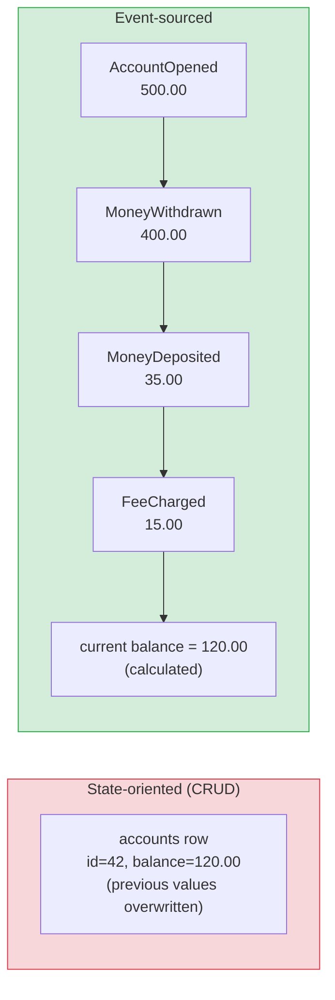
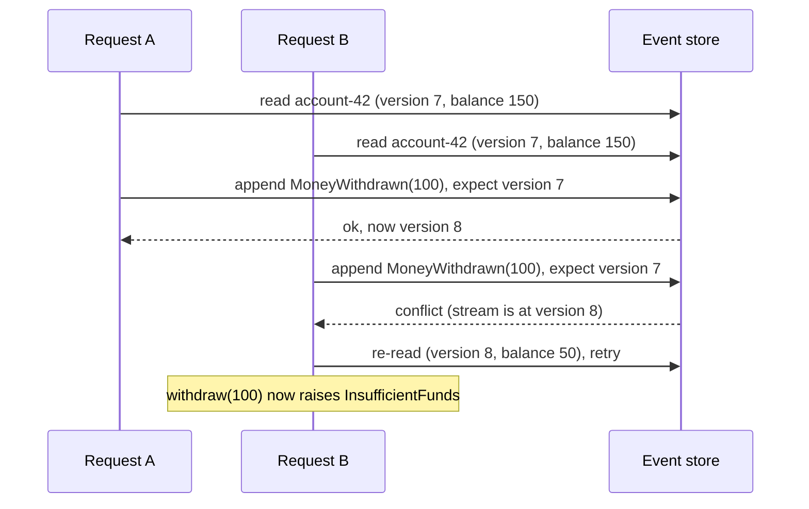
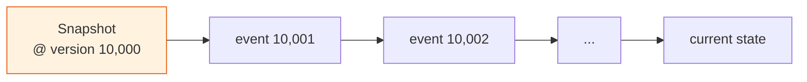

# Event Sourcing Fundamentals: Events as the Source of Truth

[Index](./README.md) | [Next: CQRS & Projections >](./cqrs-and-projections.md)

---

A normal database row stores where things ended up. An `accounts` row says the balance is
`120.00`. It doesn't say the account opened with 500, paid rent, got a refund, and was charged
a fee twice by mistake. That history is gone the moment the `UPDATE` commits, unless someone
remembered to write it to an audit table as well, and kept that table in sync forever.

Event sourcing flips this. You store the history, and the current state is something you
calculate from it.

## State-oriented vs event-sourced storage



| | State-oriented | Event-sourced |
|---|----------------|---------------|
| What you store | The latest value of each field | Every change, as an immutable event |
| Write operation | `UPDATE` in place | `INSERT` (append only) |
| "How did it get like this?" | Check the audit log, if one exists | Read the stream |
| "What was it on 3 March?" | Usually impossible | Replay events up to 3 March |
| Schema change | Migrate the table | Old events stay; you change how you read them |
| Querying "all accounts under 100" | `WHERE balance < 100` | Needs a read model ([next chapter](./cqrs-and-projections.md)) |

That last row is the price. You trade easy queries for a full history, and the rest of this
module is about paying that price without going broke.

## What an event is

An event is a fact about something that already happened in the domain. Three rules follow
from that:

1. **Past tense.** `OrderPlaced`, `PaymentCaptured`, `ShipmentDispatched`. Not `PlaceOrder`
   (that's a command, a request that can still be refused).
2. **Immutable.** You never edit or delete an event. If a fact was wrong, you append a new
   event that corrects it (`ChargeRefunded`), the same way an accountant posts a reversing
   entry instead of erasing a line in the ledger.
3. **Business language.** `AddressCorrected` and `CustomerRelocated` might both change the
   same `address` field, but they mean different things to the business. A generic
   `AddressUpdated` throws that meaning away. This is the
   [ubiquitous language](../domain-driven-design/strategic-design.md#ubiquitous-language)
   applied to storage.

A typical stored event:

```json
{
  "streamId": "order-7f3a",
  "version": 3,
  "type": "ItemAddedToOrder",
  "occurredAt": "2026-10-01T09:14:22Z",
  "data": { "sku": "MUG-BLUE", "quantity": 2, "unitPrice": { "amount": "12.50", "currency": "EUR" } },
  "metadata": { "causationId": "cmd-91c2", "correlationId": "checkout-55e0", "userId": "u-118" }
}
```

`metadata` holds things that aren't part of the business fact but that you'll want during a
3am investigation: which command caused this event, which user, which request.

## Streams and the event store

Events are grouped into streams, usually one stream per
[aggregate](../domain-driven-design/tactical-design.md#aggregates-the-consistency-boundary)
instance: `order-7f3a`, `account-42`. The event store is the database that holds them. Its
contract is small:

- **Append** events to a stream, with an expected version.
- **Read** a stream from the start (or from a version).
- **Subscribe** to everything appended after a given global position.

You can build one on Postgres with a single table:

```sql
CREATE TABLE events (
    global_position BIGSERIAL PRIMARY KEY,
    stream_id       TEXT        NOT NULL,
    version         INT         NOT NULL,
    type            TEXT        NOT NULL,
    data            JSONB       NOT NULL,
    metadata        JSONB       NOT NULL,
    occurred_at     TIMESTAMPTZ NOT NULL DEFAULT now(),
    UNIQUE (stream_id, version)
);
```

That `UNIQUE (stream_id, version)` constraint carries most of the weight, as the next section
shows. Purpose-built stores (EventStoreDB, now renamed KurrentDB; Marten on Postgres for .NET;
Axon Server for Java) add subscriptions, projections, and tooling. A Postgres table is a
reasonable place to start and a lot of teams never leave it.

> Kafka is not an event store. It's great for distributing events, but you can't append to
> one entity's stream with an expected version, and reading one aggregate's history means
> scanning a partition. Store events in a store; publish them to Kafka.

## Rehydration: getting current state back

To handle a command, you need the aggregate's current state. You get it by reading its stream
and folding each event into an empty object:

```python
class Account:
    def __init__(self):
        self.balance = Decimal("0")
        self.closed = False
        self.version = 0

    def apply(self, event):
        match event.type:
            case "AccountOpened":   self.balance = event.data["initial_deposit"]
            case "MoneyDeposited":  self.balance += event.data["amount"]
            case "MoneyWithdrawn":  self.balance -= event.data["amount"]
            case "AccountClosed":   self.closed = True
        self.version = event.version

def load(store, account_id):
    account = Account()
    for event in store.read_stream(f"account-{account_id}"):
        account.apply(event)
    return account
```

Two rules keep this sane:

- **`apply` never fails and never has side effects.** It runs on every load, forever. It must
  not validate, send emails, or call APIs. All of that happened when the event was first
  decided. `apply` only moves state forward.
- **Decide, then apply.** Command handling has two steps. The command method checks the rules
  against current state and returns new events. Then those events get applied and appended.

```python
    def withdraw(self, amount):
        if self.closed:
            raise AccountClosedError()
        if amount > self.balance:
            raise InsufficientFunds(self.balance, amount)
        return [Event("MoneyWithdrawn", {"amount": amount})]
```

This split also makes testing pleasant, which [chapter 4](./event-sourcing-in-practice.md#testing-given-when-then)
comes back to.

## Optimistic concurrency: the expected version

Two requests load `account-42` at version 7, both decide to withdraw 100 from a balance of
150, and both try to append. Without a guard, the account goes to -50.



Every append says "I decided this based on version N". If the stream has moved on, the store
rejects it, and the caller reloads and tries again. With the Postgres table above, the
`UNIQUE (stream_id, version)` constraint does this for free: the second insert of version 8
fails.

This is why aggregate size matters even more in an event-sourced system. A huge aggregate with
lots of concurrent writers will spend its life retrying.

## Snapshots: when streams get long

Replaying 40 events on every load costs nothing. Replaying 400,000 does. A snapshot is a cached
copy of state at some version, so loading becomes "read latest snapshot, then replay the events
after it".



Snapshot rules of thumb:

- **Don't add them until you measure a problem.** Most aggregates live short lives (an order
  might have 15 events in total). Snapshots are a cache and bring cache bugs with them.
- **Snapshots are disposable.** The events are the truth. If you change the state class, throw
  the snapshots away and rebuild them; never migrate them.
- **A stream that keeps growing is often a modelling smell.** An `account` stream with ten
  years of transactions may really be a series of `statement-period` streams, each closed at
  month end with an opening balance carried forward. That's the
  [closing the books](./event-sourcing-in-practice.md#long-lived-streams) pattern.

## What you actually get

People reach for event sourcing for the audit log, but that's the smallest benefit:

| Benefit | What it looks like in practice |
|---------|--------------------------------|
| Complete audit trail | Compliance asks "who changed this limit and why?" and the answer is one stream read |
| Temporal queries | "What did this customer's cart look like when they got the error?" |
| New read models from old data | Product asks for a report nobody planned. You build a projection and replay three years of events into it |
| Debugging | Copy a production stream into a test and replay the exact sequence that broke |
| Natural integration | Other systems subscribe to the event stream instead of polling your tables |

And what it costs: a steeper learning curve, eventual consistency between writes and reads,
event schema evolution forever, and a much harder story for "delete this person's data". The
[last chapter](./event-sourcing-in-practice.md) is honest about when that bill is worth paying.

## The takeaways

1. **Store what happened, derive what is.** Events are append-only facts; current state is a
   fold over them.
2. **Events are past tense, immutable, and named in business language.** Correct mistakes with
   new events, never edits.
3. **One stream per aggregate, appended with an expected version.** That version check is your
   concurrency control. A unique constraint on `(stream_id, version)` is enough.
4. **`apply` is pure.** All validation and side effects happen when deciding, not when
   replaying.
5. **Snapshots are an optimisation, not a design.** Add them when you measure slow loads, and
   treat them as disposable.

---

[Index](./README.md) | [Next: CQRS & Projections >](./cqrs-and-projections.md)
