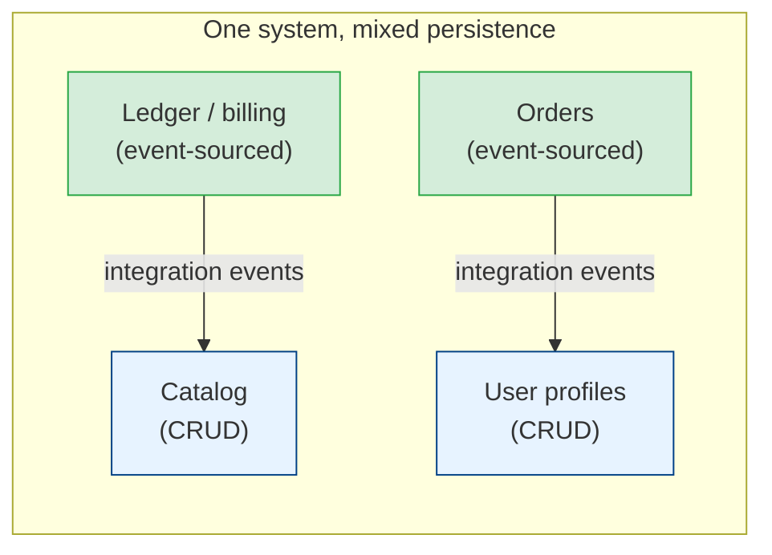

# Event Sourcing in Practice: Testing, Pitfalls & When Not to Use It

[< Back](./event-schema-evolution.md) | [Index](./README.md)

---

The first three chapters covered how event sourcing works. This one covers what happens when
a team actually runs it: how to test it, which mistakes show up in the first year, how to
start without betting the company on it, and when to say no.

## Testing: given, when, then

Event-sourced aggregates are the easiest domain code you'll ever test, because the inputs and
outputs are plain data. Every test reads the same way:

- **Given** these past events,
- **when** this command arrives,
- **then** expect these new events (or this error).

```python
def test_cannot_withdraw_more_than_balance():
    given = [
        AccountOpened(account_id="a-1", initial_deposit=Decimal("100")),
        MoneyWithdrawn(amount=Decimal("30")),
    ]
    account = Account.from_history(given)

    with pytest.raises(InsufficientFunds):
        account.withdraw(Decimal("80"))

def test_withdrawal_within_balance_emits_event():
    account = Account.from_history([AccountOpened(account_id="a-1", initial_deposit=Decimal("100"))])

    assert account.withdraw(Decimal("40")) == [MoneyWithdrawn(amount=Decimal("40"))]
```

No database, no mocks, no fixtures that build half the world. A domain expert can read the
test names and the event lists and tell you whether the rule is right.

Projections get the same treatment: given these events, expect this row. And upcasters get a
test per version step using real stored payloads, as
[chapter 3](./event-schema-evolution.md#upcasting-translate-on-read) said.

One more test pays for itself: a nightly job that replays a copy of production events through
the current code and checks it doesn't throw. It catches the "we changed `apply` and now 2023
events crash" bug before a deploy does.

## A realistic first project

Don't start by event sourcing the whole system. Pick one bounded context where history
actually matters to the business, and leave the rest as CRUD.



A good order of work:

1. **Model the events first, on a whiteboard.** An
   [event storming](../domain-driven-design/ddd-in-practice.md) session produces exactly the
   list of past-tense facts you'll store. If the business can't name the events, the domain
   isn't a fit.
2. **Use Postgres as the event store.** One table, the unique constraint from
   [chapter 1](./event-sourcing-fundamentals.md#streams-and-the-event-store), and a polling
   projection runner. Move to a dedicated store when you can name the feature you need from it.
3. **Build one projection per screen.** Measure the full-replay time from the first week.
4. **Publish integration events through an
   [outbox](../microservices/distributed-data-patterns.md#the-transactional-outbox-pattern-the-fix)**,
   or let the event store's subscription be the outbox, so publishing can't drift from storing.

Frameworks to look at, if you'd rather not write the plumbing: Marten (.NET on Postgres),
Axon (Java), EventStoreDB/KurrentDB clients (most languages), Equinox (.NET), and Commanded
(Elixir). Read the framework's take on projections and versioning before picking it; that's
where they differ most.

## Pitfalls that show up in year one

### CRUD events

`OrderUpdated { "status": "shipped", "address": {...}, "items": [...] }` is a database row
wearing an event costume. You've paid for event sourcing and kept none of the meaning. If your
event names end in `Created`, `Updated`, and `Deleted`, the model is probably CRUD and should be
stored as CRUD.

### Business logic in projections

A projection that decides "if the total is over 1,000, mark the order as VIP" now holds a
business rule that the write side doesn't know about. Rebuild the projection after changing
that rule and history silently changes. Decisions belong in the aggregate, recorded as events
(`OrderFlaggedAsVip`). Projections only copy and reshape.

### Using the event store as a message bus

Twenty services subscribe directly to your internal event streams. Now every internal rename is
a breaking change for teams you've never met. Publish deliberate integration events instead and
keep internal events private, the same rule as
[chapter 3](./event-schema-evolution.md#versioning-events-that-leave-the-service).

### Long-lived streams

An account with fifteen years of transactions, a chat room with two million messages, a
device sending readings every second. These streams grow forever, loads get slower, and
snapshots only hide the problem.

The fix is in the model. Most long-lived things have natural periods: a statement month, a
shift, a billing cycle. End the period with a closing event (`StatementClosed { balance }`) and
start a new stream that opens with the carried-forward balance. Accountants call this closing
the books, and they've done it for centuries for the same reason.

### Side effects on replay

Covered in [chapter 2](./cqrs-and-projections.md#process-managers-reacting-to-events-with-commands),
and worth repeating because the incident is so memorable: someone resets a checkpoint to zero
and 40,000 customers get a "your order has shipped" email for orders from 2023. Handlers that
talk to the outside world keep their own checkpoint and never replay.

### Forgetting the read side has an operational cost

Every projection is a small service: it has lag, it can stall on a poison event, and it needs
monitoring. Alert on projection lag (current global position minus checkpoint) the same way you
alert on consumer lag in Kafka. See
[observability-and-reliability](../observability-and-reliability/README.md).

## When not to use event sourcing

Event sourcing is a big commitment. It touches storage, testing, querying, data protection, and
how every new engineer has to think. It earns that cost in some domains and wastes it in others.

| Good fit | Poor fit |
|----------|----------|
| Ledgers, payments, billing, wallets | Content management, product catalogs |
| Order and fulfilment workflows with many states | Settings pages and user profiles |
| Domains where auditors ask "who changed this and why" | Domains where nobody ever asks about the past |
| Business logic that changes often and needs re-evaluation over history | Simple validation over a form |
| Collaborative domains where intent matters (`SeatReserved` vs `SeatReleased`) | Reporting databases (those are projections already) |
| Teams who've done DDD and know their aggregates | A team new to both DDD and event sourcing, on a deadline |

Some tells that a team picked it for the wrong reasons:

- **"We need an audit log."** An audit table written in the same transaction, or
  [change data capture](../data-engineering/streaming-at-scale.md) on the existing database, gives you that
  for a fraction of the cost.
- **"We want to publish events to other services."** The
  [outbox pattern](../microservices/distributed-data-patterns.md#the-dual-write-problem-and-the-outbox-pattern)
  does that on top of a normal schema.
- **"It's how microservices are supposed to work."** It isn't. Most well-run microservices
  store state in a plain database.

> Ask one question before you start: *"Will the business ever want to ask a question about
> the past that we can't answer today?"* If the honest answer is no, store state, and keep
> event sourcing for the context where the answer is yes.

## The takeaways

1. **Test with given, when, then.** Past events in, new events out. No database, readable by
   domain experts. Add a nightly replay of production events.
2. **Start with one context on Postgres.** Event-source where history matters; keep CRUD
   elsewhere in the same system.
3. **Watch for the year-one pitfalls.** CRUD-shaped events, rules in projections, internal
   events leaking to other teams, unbounded streams, side effects on replay.
4. **Close the books on long-lived streams.** Model periods with closing and opening events.
5. **Most systems don't need it.** If an audit table, CDC, or an outbox solves the actual
   problem, use that.

---

[< Back](./event-schema-evolution.md) | [Index](./README.md)
