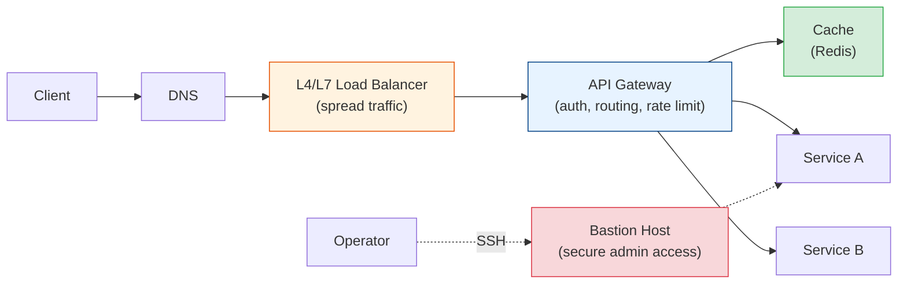

# Infrastructure & Traffic Management Tech Docs

Everything that sits **between the client and your services** — load balancers, gateways,
bastions, rate limiting, and caches — and how to reason about them together.

## Contents

| # | Topic | File | Level |
|---|-------|------|-------|
| 0 | The request path (big picture) | *(this file)* | L1 · Beginner |
| 1 | L4 Load Balancers (NAT vs Proxy mode, algorithms) | [l4-load-balancer.md](./l4-load-balancer.md) | L2 · Novice |
| 2 | Bastion vs Load Balancer vs API Gateway | [bastion-vs-lb-vs-gateway.md](./bastion-vs-lb-vs-gateway.md) | L2 · Novice |
| 3 | Rate Limiting & Throttling (hard/soft, jitter) | [rate-limiting.md](./rate-limiting.md) | L2 · Novice |
| 4 | API Gateway (deep dive) | [api-gateway.md](./api-gateway.md) | L3 · Intermediate |
| 5 | Caching & Redis Cluster | [caching-redis.md](./caching-redis.md) | L3 · Intermediate |

---

## The Request Path (Big Picture)

A production request rarely hits your app directly. It flows through layers, each with a
distinct job:

- **Load balancer** — spreads *traffic* across many identical backends (availability + scale).
- **API gateway** — the smart *front door* for APIs: auth, routing, rate limiting, transforms.
- **Bastion** — a hardened *admin* entry point for humans (SSH), not for app traffic.
- **Cache** — keeps hot data close so you don't hammer the database.
- **Rate limiting** — protects everything downstream from being overwhelmed.

These are often confused. This module explains each and — crucially — **how they differ**.

Start with [l4-load-balancer.md](./l4-load-balancer.md).
