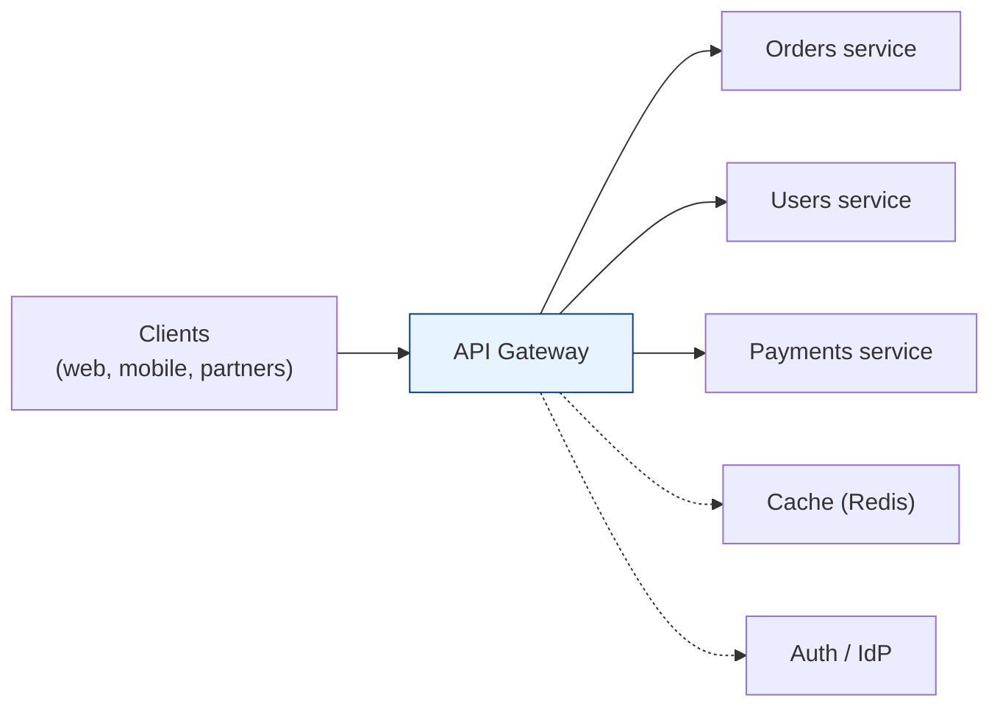
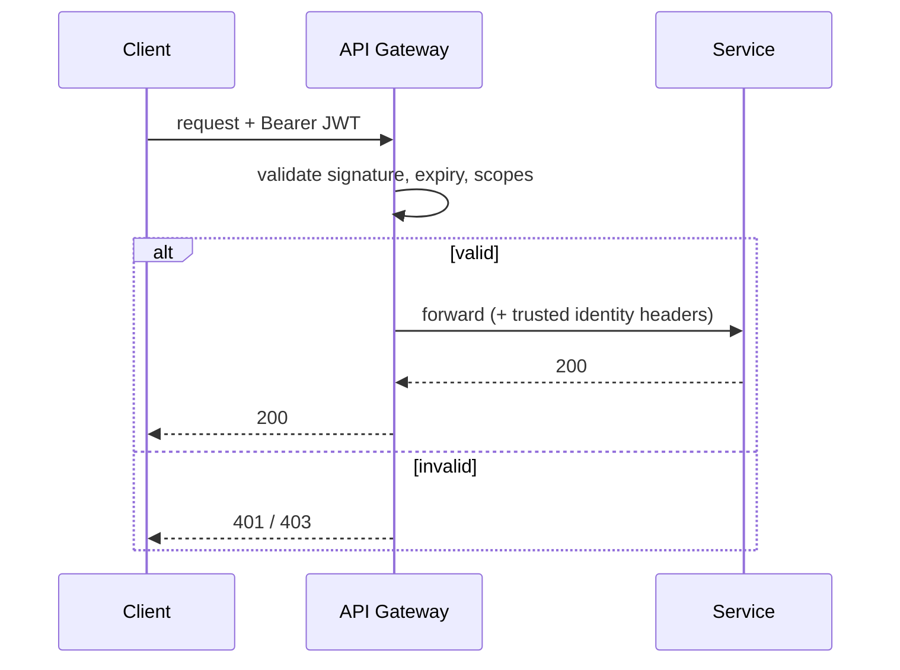
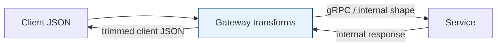
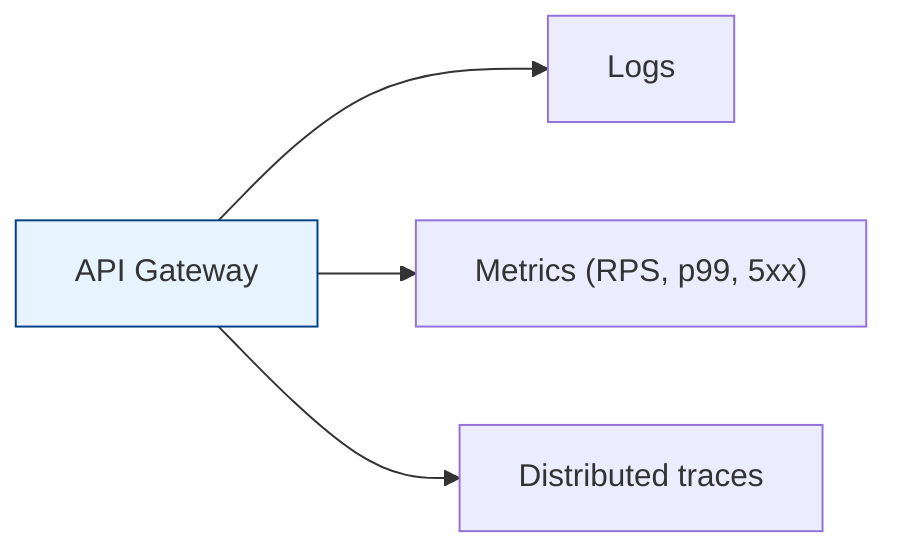
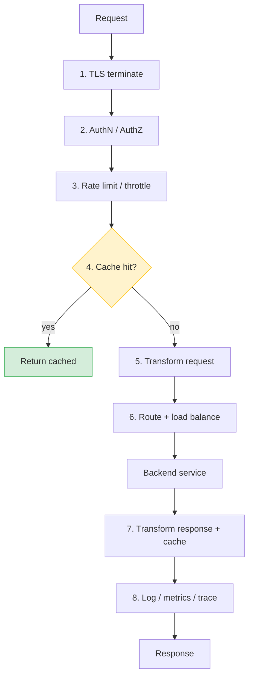

# API Gateway (Deep Dive)

[< Back](./rate-limiting.md) | [Index](./README.md) | Next: [Caching & Redis Cluster >](./caching-redis.md)

---

## What is an API Gateway?

An **API Gateway** is the **single entry point ("front door") for all API clients**. Instead
of each microservice re-implementing auth, rate limiting, TLS, logging, etc., the gateway
handles these **cross-cutting concerns** in one place and forwards clean requests to the
right backend service.



It's essentially a **very smart L7 reverse proxy** with API-specific superpowers. Popular
implementations: Kong, Apigee, AWS API Gateway, Envoy/Gloo, Tyk, NGINX, Spring Cloud Gateway.

Below are its core responsibilities.

---

## 1. Routing

Map an incoming request to the correct backend based on **path, host, method, headers, or
API version**.

```
GET  /api/v1/orders/123     ->  orders-service
POST /api/v1/payments       ->  payments-service
GET  /api/v2/users/me       ->  users-service-v2
Host: partner.acme.com/*    ->  partner-gateway
```

- **Path/host/version routing**, canary/blue-green (send 5% to v2), and **backends-for-
  frontends** (different routes for mobile vs web).
- Often paired with **service discovery** so routes resolve to live instances.

## 2. Authentication & Authorization

The gateway verifies **who** the caller is (authn) and **what** they may do (authz) — so
each service doesn't have to.

| Mechanism | Use |
|-----------|-----|
| **API keys** | simple app/partner identification & quotas |
| **JWT / OAuth2 / OIDC** | user & service tokens; gateway validates signature, scopes, expiry |
| **mTLS** | service-to-service identity |
| **HMAC signatures** | webhook/partner request integrity |



The gateway typically strips the raw token and injects **trusted identity headers**
(`X-User-Id`, scopes) so downstream services trust the gateway's verdict.

## 3. Rate Limiting & Throttling

Enforce per-client/tenant/endpoint quotas centrally (token bucket etc.), returning `429`
over the cap. See the dedicated [rate-limiting.md](./rate-limiting.md). Counters usually
live in **Redis** so limits are consistent across gateway replicas.

## 4. Request & Response Transformation

Adapt between what clients send and what services expect — without changing either side.

- **Request:** add/remove/rename headers, rewrite paths, inject identity, validate schema,
  convert protocols (REST → gRPC), aggregate multiple backend calls into one response.
- **Response:** filter fields, reshape JSON, add CORS headers, compress (gzip/brotli),
  unify error formats.



## 5. Caching

Cache responses for cacheable, read-heavy endpoints so repeat requests skip the backend
entirely — cutting latency and load. Honor `Cache-Control`/`ETag`, key by
path+query+relevant headers, and set sensible TTLs (with **jitter** to avoid stampedes).
See [caching-redis.md](./caching-redis.md).

## 6. Load Balancing

The gateway spreads requests across healthy instances of each backend (round robin, least
connections, etc.), does **health checks**, retries, timeouts, and **circuit breaking** to
avoid hammering a failing service. (It plays the L7 LB role — see
[l4-load-balancer.md](./l4-load-balancer.md) for algorithms.)

## 7. SSL/TLS & Security

- **TLS termination** — decrypt HTTPS at the edge so backends can be simpler (often re-
  encrypt to backends = mTLS for zero-trust).
- **Central cert management** — one place to rotate/renew certificates.
- **WAF / input validation** — block SQLi, XSS, oversized payloads; enforce CORS; add
  security headers (HSTS, CSP).
- **Secrets isolation** — backends never expose raw credentials to the internet.

## 8. Observability

Because everything flows through it, the gateway is the perfect place to emit:

- **Logs** — structured access logs of every request/response.
- **Metrics** — RPS, latency percentiles (p50/p95/p99), error rates, per-route/per-client
  breakdowns.
- **Tracing** — inject/propagate trace IDs (W3C `traceparent`) for distributed tracing
  across services.



---

## Putting it all together (request lifecycle)



## Gateway vs plain load balancer (don't conflate)

A load balancer spreads traffic; an API gateway does that **plus** auth, rate limiting,
transformation, caching, and observability at the API level. See
[bastion-vs-lb-vs-gateway.md](./bastion-vs-lb-vs-gateway.md).

## Watch out for

- **Single point of failure** — run the gateway **highly available** (multiple replicas
  behind an L4 LB). It's on the critical path for everything.
- **Latency budget** — each feature adds a little; keep it lean.
- **Don't put business logic in it** — it handles cross-cutting concerns, not domain rules.

---

[< Back](./rate-limiting.md) | [Index](./README.md) | Next: [Caching & Redis Cluster >](./caching-redis.md)
