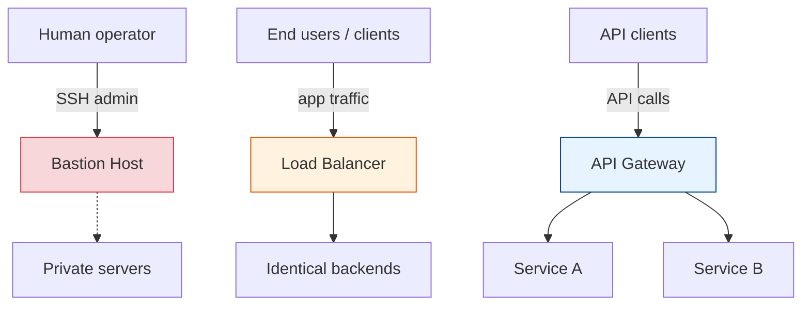
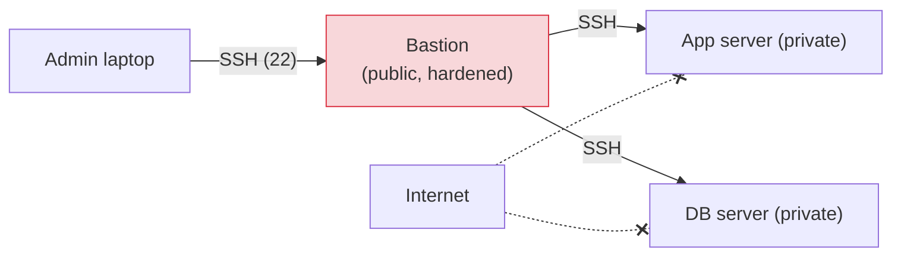
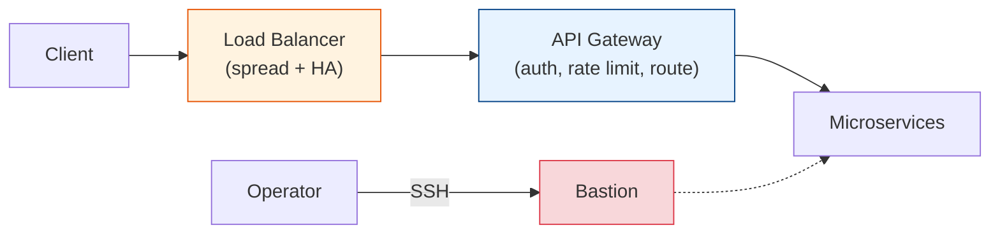

# Bastion vs Load Balancer vs API Gateway

[< Back](./l4-load-balancer.md) | [Index](./README.md) | Next: [Rate Limiting & Throttling >](./rate-limiting.md)

---

These three all "sit in front of things," which is why they get muddled. But they serve
**completely different audiences and purposes.**



---

## Bastion Host (jump box)

A **bastion** (a.k.a. jump host / jump box) is a **hardened server that is the single,
audited entry point for human administrators** to reach machines in a private network. You
SSH into the bastion, then hop to internal servers that have **no public exposure**.



- **Audience:** humans (ops/engineers), for **management/administration** — NOT app traffic.
- **Purpose:** shrink the attack surface to *one* fortified box; centralize logging, MFA,
  and auditing of who accessed what.
- **Hardening:** minimal software, key-only SSH (no passwords), MFA, tight firewall,
  detailed audit logs, often ephemeral/short-lived.
- Backends live in private subnets and only accept SSH **from the bastion's IP**.
- **Modern alternatives:** SSM Session Manager, Teleport, Tailscale/IAP — "zero-trust"
  approaches that remove the always-on public box.

```bash
# Jump through the bastion in one command (ProxyJump)
ssh -J admin@bastion.example.com deploy@10.0.1.15
```

---

## Load Balancer (recap)

Distributes **application traffic** across **many identical backend servers** for scale and
availability. Doesn't (usually) authenticate business users or transform payloads — it just
spreads load and routes away from unhealthy nodes. See
[l4-load-balancer.md](./l4-load-balancer.md).

- **Audience:** end users / clients (the actual app traffic).
- **Purpose:** horizontal scale + high availability + health-based failover.
- **Smarts:** L4 = connection-level; L7 = can route by path/host, terminate TLS.

---

## API Gateway (recap)

The **smart front door for APIs**. It's an L7 component that does auth, routing, rate
limiting, request/response transformation, caching, and observability — often in front of a
microservices fleet. See [api-gateway.md](./api-gateway.md).

- **Audience:** API clients (apps, partners, mobile).
- **Purpose:** centralize cross-cutting API concerns so services don't each reinvent them.
- **Smarts:** deep application-layer logic (much more than a plain LB).

---

## The key differences at a glance

| Dimension | Bastion Host | Load Balancer | API Gateway |
|-----------|--------------|---------------|-------------|
| **Primary audience** | Human admins | End users (traffic) | API clients |
| **Traffic type** | SSH / admin sessions | Any (L4) or HTTP (L7) | API calls (HTTP/gRPC) |
| **Main job** | Secure admin access | Distribute load, HA | Manage & secure APIs |
| **Auth** | SSH keys + MFA (operators) | Usually none (or TLS) | API keys, JWT, OAuth (clients) |
| **Routing logic** | Manual hop | By connection or path/host | By path, version, header, method |
| **Transforms payload?** | No | No (L4) / minimal (L7) | Yes (req/res transform) |
| **Rate limiting** | No | Basic (conn limits) | Yes, rich per-client policies |
| **Layer** | Admin plane | L4/L7 data plane | L7 data plane |
| **In the data path for app traffic?** | No | Yes | Yes |

## How they work together

They're **complementary**, not alternatives. A typical stack:



- The **LB** takes the firehose of client traffic and spreads it (and provides HA for the
  gateways themselves).
- The **API gateway** applies smart API policy and routes to the right service.
- The **bastion** is a *separate, out-of-band* path for humans to administer the boxes — it
  never touches production request traffic.

> **One-liner:** Bastion = secure door for **people**. Load balancer = spreads **traffic**.
> API gateway = smart policy front-door for **APIs**. Different jobs, often all three at once.

---

[< Back](./l4-load-balancer.md) | [Index](./README.md) | Next: [Rate Limiting & Throttling >](./rate-limiting.md)
