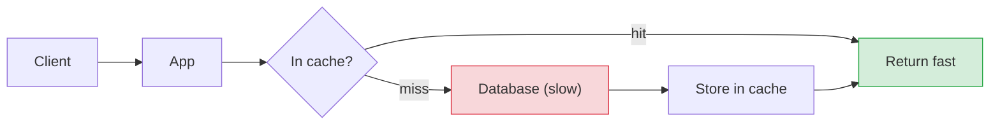
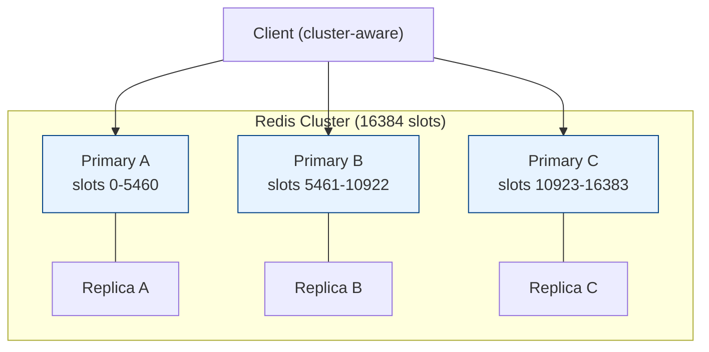

# Caching & Redis Cluster

[< Back](./api-gateway.md) | [Index](./README.md)

---

## Why cache?

A **cache** stores the result of expensive work (a DB query, a computation, an API call)
in fast storage so future requests are served **without redoing the work**. Result: lower
**latency**, less **load** on the database, and higher **throughput**.



## Where caches live (layers)

| Layer | Example | Scope |
|-------|---------|-------|
| **Client / browser** | HTTP cache, `Cache-Control` | per user |
| **CDN / edge** | Cloudflare, CloudFront | global, static/assets |
| **Gateway / reverse proxy** | nginx, API gateway cache | shared responses |
| **Application** | in-process (local map) | per instance, tiny & fast |
| **Distributed** | **Redis**, Memcached | shared across all app instances |
| **Database** | query/buffer cache | inside the DB |

---

## Caching strategies (patterns)

| Pattern | How | Notes |
|---------|-----|-------|
| **Cache-aside (lazy)** | app checks cache, on miss loads DB & populates | most common; cache only what's used |
| **Read-through** | cache library loads from DB on miss | app just asks the cache |
| **Write-through** | write to cache + DB synchronously | cache always fresh; slower writes |
| **Write-behind** | write to cache, flush to DB async | fast writes; risk on crash |
| **Write-around** | write straight to DB, skip cache | good for write-heavy, rarely-read data |

**Cache-aside** in code:

```python
import json, random, redis
r = redis.Redis(host="localhost", port=6379)

def get_user(user_id):
    key = f"user:{user_id}"
    cached = r.get(key)
    if cached:
        return json.loads(cached)                 # HIT
    user = db_fetch_user(user_id)                 # MISS -> load DB
    r.set(key, json.dumps(user), ex=300 + random.randint(0, 60))  # TTL + jitter
    return user
```

---

## Cache invalidation & the classic failures

> "There are only two hard things in computer science: cache invalidation and naming things."

| Problem | What happens | Fix |
|---------|--------------|-----|
| **Stale data** | cache serves outdated value | TTLs, explicit invalidation on write |
| **Cache stampede** | many keys expire at once -> DB flood | **TTL jitter**, request coalescing, locks |
| **Thundering herd** | on miss, many concurrent loads for same key | single-flight / mutex per key |
| **Cache penetration** | requests for keys that don't exist bypass cache | cache "null", bloom filters |
| **Hot key** | one key gets all the traffic | replicate/shard it, local cache in front |

Eviction when memory fills: **LRU** (least recently used), **LFU** (least frequently used),
or TTL-based. Redis supports several `maxmemory-policy` options (e.g., `allkeys-lru`).

---

## Redis in a nutshell

**Redis** is an in-memory data-structure store (strings, hashes, lists, sets, sorted sets,
streams) — blazing fast, used as a cache, session store, rate-limit counter, queue, and
pub/sub. Single-threaded command execution keeps operations atomic.

```bash
redis-cli SET user:1 '{"name":"Alice"}' EX 300   # value with 300s TTL
redis-cli GET user:1
redis-cli INCR api:key42:count                    # atomic counter (rate limiting!)
redis-cli TTL user:1
```

---

## Scaling Redis: replication, Sentinel, Cluster

### 1. Replication (read scaling + HA basics)
A **primary** takes writes; **replicas** copy its data and serve reads.

### 2. Sentinel (automatic failover)
**Redis Sentinel** monitors the primary and **promotes a replica** if it dies — HA without
sharding.

### 3. Cluster (horizontal scale-out — sharding)
**Redis Cluster** splits the keyspace across multiple primaries so you scale **memory and
throughput** beyond one machine. It uses **16384 hash slots**; each key maps to a slot via
`CRC16(key) % 16384`, and each primary owns a range of slots.



- **Client is cluster-aware:** it computes the slot and talks to the owning node; if it hits
  the wrong node it gets a `MOVED`/`ASK` redirect and updates its slot map.
- **Each primary has replicas** — if a primary fails, a replica is promoted automatically.
- **Resharding** moves slots between nodes; adding a node reshuffles only *some* slots
  (consistent-hashing-like benefit).
- **Multi-key ops** must land in the same slot — use **hash tags** `{...}` so related keys
  co-locate: `user:{42}:profile` and `user:{42}:cart` hash by `42` → same slot.

### Example: spin up and use a cluster

```bash
# Create a 3-primary + 3-replica cluster from 6 running redis nodes
redis-cli --cluster create \
  127.0.0.1:7000 127.0.0.1:7001 127.0.0.1:7002 \
  127.0.0.1:7003 127.0.0.1:7004 127.0.0.1:7005 \
  --cluster-replicas 1

redis-cli --cluster check 127.0.0.1:7000     # inspect slot distribution
```

```python
# Python client (redis-py cluster mode)
from redis.cluster import RedisCluster

rc = RedisCluster(host="127.0.0.1", port=7000, decode_responses=True)
rc.set("user:{42}:profile", "Alice")   # hash tag {42} pins the slot
rc.set("user:{42}:cart", "2 items")    # same slot -> multi-key ops OK
print(rc.get("user:{42}:profile"))
print(rc.cluster_slots())              # see which node owns which slots
```

### Which scaling model?

| Need | Use |
|------|-----|
| More read throughput, simple HA | **Replication (+ Sentinel)** |
| Automatic failover only | **Sentinel** |
| Data/throughput bigger than one node | **Cluster (sharding)** |
| Managed & effortless | ElastiCache / MemoryStore / Redis Enterprise |

---

## Caching golden rules

1. **Cache the hot, read-heavy, expensive stuff** — not everything.
2. **Always set a TTL** (with **jitter**) — unbounded caches rot and stampede.
3. **Plan invalidation up front** — it's the hard part.
4. **Cache is not the source of truth** — it must be safe to lose (rebuildable from DB).
5. **Measure hit ratio** — a low hit rate means your keys/TTLs are wrong.

---

[< Back](./api-gateway.md) | [Index](./README.md)
