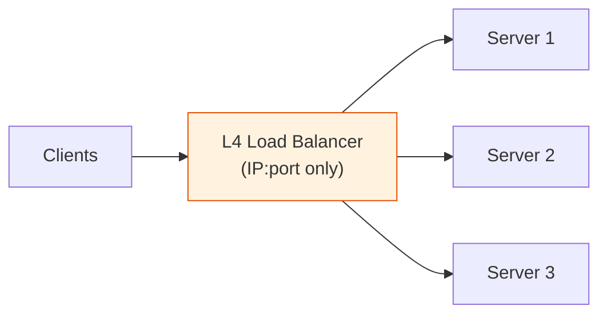
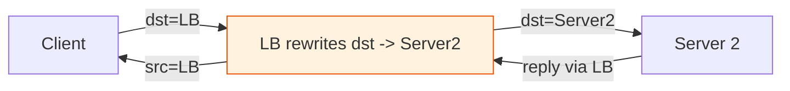
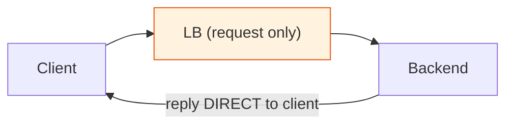
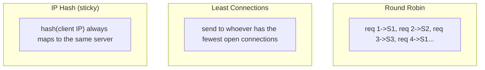

# L4 Load Balancers — NAT mode, Proxy mode & Algorithms

[Index](./README.md) | Next: [Bastion vs LB vs Gateway >](./bastion-vs-lb-vs-gateway.md)

---

## L4 vs L7 (where does it operate?)

A **load balancer (LB)** distributes incoming traffic across multiple backend servers so no
single one is overwhelmed — giving you **scalability, high availability, and health-based
failover.**

| Layer | Sees | Decides on | Examples |
|-------|------|-----------|----------|
| **L4 (transport)** | IP + TCP/UDP ports | connection-level (fast, protocol-agnostic) | AWS NLB, IPVS, HAProxy (tcp mode) |
| **L7 (application)** | full HTTP (URL, headers, cookies) | content-level (routing by path/host) | AWS ALB, nginx, Envoy |

This doc focuses on **L4**: it forwards **packets/connections** without understanding HTTP.
It's extremely fast and works for *any* TCP/UDP protocol (databases, MQTT, game servers),
but it can't route by URL or read cookies.

---

## The two L4 modes: NAT vs Proxy (Direct Routing)

The big L4 design question is **how the return traffic flows**. Two dominant modes:

### 1. NAT mode (Destination NAT)

The LB rewrites the **destination IP** of incoming packets to a chosen backend, and the
**return traffic must flow back through the LB** so it can rewrite the source IP back to
the LB's address (otherwise the client would get a reply from an IP it never contacted).

- **Both directions go through the LB** → the LB sees all traffic (can be a bottleneck).
- Backends can be in a private subnet; their default gateway is (or routes via) the LB.
- Simple, works everywhere, natural place to also do SNAT.
- Downside: **return bandwidth all funnels through the LB.**

### 2. Proxy mode (full proxy / terminated connection)

The LB **terminates the client connection** and opens a **separate connection** to the
backend. Two independent TCP sessions; the LB copies bytes between them.

- LB is fully in the path both ways (like NAT) but at the **connection** level, so it can do
  TLS termination, connection pooling, buffering, and health-aware retries.
- Backend sees the **LB's IP** as the client (use PROXY protocol or `X-Forwarded-For` at L7
  to recover the real client IP).
- Most modern L4/L7 LBs (Envoy, nginx, ALB/NLB w/ target groups) are full proxies.

### Bonus: DR / Direct Server Return (DSR)

For completeness — an L4 optimization where the LB forwards the request but the **backend
replies directly to the client**, bypassing the LB on the return path. Great for
high-throughput, asymmetric traffic (e.g., video), but trickier to set up.

### Mode comparison

| Mode | Return path | LB is bottleneck? | Backend sees | Best for |
|------|-------------|-------------------|--------------|----------|
| **NAT** | Through LB | Yes (both ways) | client IP (if SNAT off) | simple setups, private backends |
| **Proxy** | Through LB | Yes (both ways) | LB IP | TLS termination, HTTP smarts, retries |
| **DSR** | Direct to client | No (request-only) | real client IP | huge outbound throughput |

---

## Load Balancing Algorithms

How does the LB *choose* which backend gets the next request?

| Algorithm | How it picks | Use when |
|-----------|--------------|----------|
| **Round Robin** | next server in rotation | backends roughly equal, stateless |
| **Weighted Round Robin** | rotation biased by capacity weights | mixed-size backends (big & small boxes) |
| **Least Connections** | server with fewest active conns | long-lived/variable-duration requests (WebSocket, DB) |
| **Weighted Least Connections** | least conns, adjusted by weight | uneven capacity + long connections |
| **Least Response Time** | fastest-responding server | latency-sensitive; needs health probing |
| **IP Hash / Source Hash** | hash(client IP) -> server | **stickiness** without cookies (same client -> same server) |
| **Consistent Hashing** | hash ring, minimal reshuffle on change | caches/sharded backends; add/remove node cheaply |
| **Random (+ Power of Two Choices)** | random, or pick best of 2 random | simple, surprisingly good at scale |

### Choosing an algorithm — quick guide

- **Stateless, uniform backends** → **Round Robin** (or Random+P2C). Simplest, great default.
- **Different-sized servers** → **Weighted Round Robin**.
- **Long or uneven request durations** (WebSockets, streaming, DB pools) → **Least Connections**.
  Round robin can pile long requests onto one box; least-conn self-balances.
- **Need session stickiness** but can't use cookies (L4!) → **IP Hash / Source Hash**.
- **Sharded caches / distributed stores** → **Consistent Hashing** (adding a node only
  moves ~1/N of keys, not everything).
- **Latency-critical** → **Least Response Time** with active health checks.

### Health checks & stickiness (don't skip these)

- **Health checks** — the LB probes each backend (TCP connect, or L7 `GET /healthz`) and
  **removes unhealthy nodes** from rotation automatically. This is the whole point of HA.
- **Session persistence (stickiness)** — route a given client consistently to one backend
  (via IP hash at L4, or cookies at L7). Needed for in-memory session state — though it's
  better to externalize sessions (Redis) and stay stateless.

---

## When to use L4 vs L7

**Use L4 when:**
- You need raw speed and low latency.
- The protocol isn't HTTP (databases, MQTT brokers, SMTP, game servers, gRPC streams).
- You want simple connection-level distribution and TLS pass-through.

**Use L7 when:**
- You need to route by **URL path / hostname / header** (e.g., `/api` → service A, `/img` → B).
- You want TLS termination, HTTP caching, header rewrites, cookie stickiness, or a WAF.
- You're building an **API gateway** (which is essentially a smart L7 LB — see
  [api-gateway.md](./api-gateway.md)).

> Common real-world combo: an **L4 NLB at the edge** (fast, handles millions of conns) in
> front of an **L7 layer (ALB/Envoy/nginx)** that does the HTTP-aware routing.

---

[Index](./README.md) | Next: [Bastion vs LB vs Gateway >](./bastion-vs-lb-vs-gateway.md)
