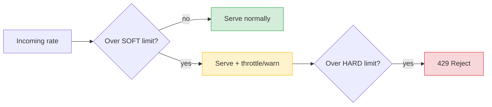
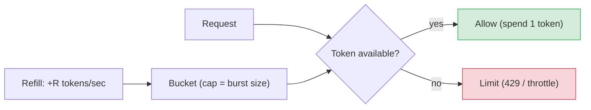
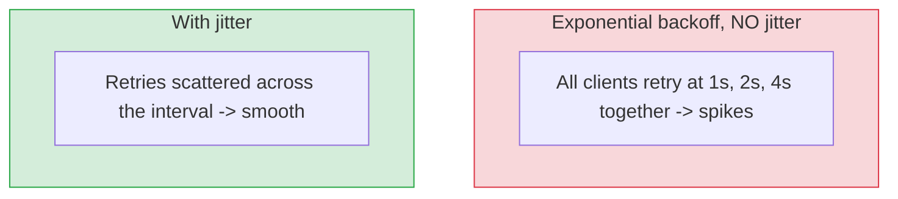

# Rate Limiting & Throttling (hard/soft, jitter)

[< Back](./bastion-vs-lb-vs-gateway.md) | [Index](./README.md) | Next: [API Gateway >](./api-gateway.md)

---

## Why limit at all?

Without limits, one buggy client, a traffic spike, or an abuser can **exhaust your
resources** and take everyone down. **Rate limiting** and **throttling** protect capacity,
ensure fair sharing, control cost, and blunt DoS/abuse.

- **Rate limiting** — enforce a **hard cap**: "max N requests per window." Over the cap →
  **reject** (usually `429 Too Many Requests`).
- **Throttling** — **slow down / shape** traffic to a sustainable rate rather than flatly
  rejecting: queue, delay, or degrade.

They overlap in casual usage; the useful distinction is **reject vs. slow-down**.

---

## Hard vs Soft limits

| | **Hard limit** | **Soft limit** |
|-|----------------|----------------|
| **Behavior** | Strictly reject over the cap | Allow temporary overflow / warn |
| **Response** | `429`, request dropped | Served but flagged, or briefly queued |
| **Use** | Protect a fragile resource, enforce billing tiers | Smooth bursts, grace for good clients |
| **Example** | "1000 req/min, period." | "Target 1000/min; tolerate short bursts to 1200, then throttle." |

A common pattern: a **soft limit** triggers warnings/backpressure and buys time; the **hard
limit** is the absolute ceiling that guarantees you never exceed capacity.



---

## The core algorithms

| Algorithm | Idea | Bursts? | Notes |
|-----------|------|---------|-------|
| **Fixed Window** | count per clock window (e.g., per minute) | spiky at edges | simple; "double burst" at window boundary |
| **Sliding Window** | rolling window count | smoother | more accurate, a bit more state |
| **Token Bucket** | tokens refill at rate R, each req costs 1 | allows bursts up to bucket size | most popular; burst-friendly |
| **Leaky Bucket** | requests drain at a fixed rate (a queue) | smooths bursts out | steady output rate, good for shaping |

### Token bucket (the workhorse)

Tokens are added at a steady rate up to a max (the bucket size). Each request consumes a
token; if the bucket is empty, the request is limited. This permits **short bursts** (spend
saved tokens) while enforcing a **long-run average**.



```python
import time

class TokenBucket:
    def __init__(self, rate, capacity):
        self.rate = rate            # tokens per second
        self.capacity = capacity    # max burst
        self.tokens = capacity
        self.last = time.monotonic()

    def allow(self, cost=1):
        now = time.monotonic()
        # refill based on elapsed time
        self.tokens = min(self.capacity, self.tokens + (now - self.last) * self.rate)
        self.last = now
        if self.tokens >= cost:
            self.tokens -= cost
            return True             # allowed
        return False                # rate limited

bucket = TokenBucket(rate=10, capacity=20)   # 10/s sustained, burst 20
print(bucket.allow())
```

---

## Where to apply it (dimensions)

Rate-limit **per key** so one client's abuse doesn't punish others:

- Per **API key / user / tenant** (fairness, billing tiers)
- Per **IP** (blunt anti-abuse; careful with shared NATs)
- Per **endpoint** (protect an expensive route specifically)
- **Global** (protect a shared downstream like a database)

At scale, keep counters in a shared store (**Redis**) so limits are consistent across all
gateway/LB instances. Return helpful headers:

```
HTTP/1.1 429 Too Many Requests
Retry-After: 5
X-RateLimit-Limit: 1000
X-RateLimit-Remaining: 0
X-RateLimit-Reset: 1720000000
```

---

## Jitter — the anti-stampede spice

**Jitter** is **deliberate randomness added to timing** to prevent many clients from acting
in perfect sync. Without it, systems synchronize and create **thundering-herd** spikes.

Two classic uses:

### 1. Retry backoff with jitter

When a request is rate-limited or fails, clients **back off exponentially** — but if they
*all* wait exactly 1s, 2s, 4s, they retry **in lockstep** and re-hammer the server at the
same instants. Adding jitter spreads the retries out.



```python
import random, time

def backoff_with_jitter(attempt, base=0.1, cap=10.0):
    # "full jitter": sleep a random amount in [0, min(cap, base * 2**attempt)]
    exp = min(cap, base * (2 ** attempt))
    return random.uniform(0, exp)

for attempt in range(5):
    delay = backoff_with_jitter(attempt)
    print(f"attempt {attempt}: sleeping {delay:.2f}s")
    time.sleep(delay)
```

### 2. Jitter on scheduled work / cache expiry

- **Cache TTL jitter** — add a random spread to TTLs so a million keys don't all expire at
  once (**cache stampede**). E.g., `ttl = 300 + random(0..60)` seconds.
- **Cron/heartbeat jitter** — stagger periodic jobs across fleet so they don't all fire at
  `:00`.

> **Rule:** any time "everyone does X at the same moment" could hurt, sprinkle **jitter**.

---

## Rate limiting vs throttling vs load shedding

| Term | What it does |
|------|--------------|
| **Rate limiting** | Enforce a request cap; reject over it (429) |
| **Throttling** | Slow/shape traffic to a sustainable rate |
| **Load shedding** | Under overload, *drop lower-priority* work to protect the core |
| **Backpressure** | Signal upstream to slow down (e.g., queue full) |

Use all together: rate-limit abusers, throttle bursts, shed low-priority load when
saturated, and apply jittered backoff on the client side.

---

[< Back](./bastion-vs-lb-vs-gateway.md) | [Index](./README.md) | Next: [API Gateway >](./api-gateway.md)
