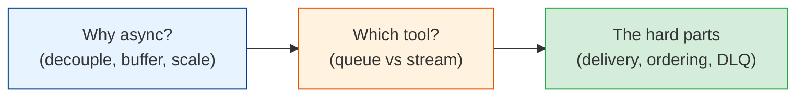

# Messaging & Streaming

Synchronous request/response gets you far, but every system eventually needs to do work
**later**, **decouple** producers from consumers, or **absorb bursts** without falling over.
That's what queues, brokers, and streams are for. This module covers async communication — the
backbone of resilient, scalable systems.

## Contents

| # | Topic | File | Level |
|---|-------|------|-------|
| 0 | The map (this file) | *(here)* | L3 · Intermediate |
| 1 | Sync vs async & the messaging patterns | [sync-vs-async.md](./sync-vs-async.md) | L1 · Beginner |
| 2 | Message queues vs event streams (Kafka vs RabbitMQ) | [queues-vs-streams.md](./queues-vs-streams.md) | L3 · Intermediate |
| 3 | Delivery guarantees, ordering & the hard parts | [delivery-guarantees.md](./delivery-guarantees.md) | L4 · Advanced |

---

## How to read this module

- **Start with chapter 1** to understand *why* async exists and the core patterns
  (point-to-point vs pub/sub, request/reply).
- **Chapter 2** is the decision you'll actually make: queue vs stream, RabbitMQ vs Kafka.
- **Chapter 3** is the senior material — delivery guarantees, ordering, dead-letter queues,
  and the failure modes that bite in production.

## Related modules

This builds directly on [distributed-systems](../distributed-systems/README.md) (delivery
guarantees, idempotency) and pairs with [mqtt](../mqtt/README.md) (a pub/sub protocol for IoT).

## The one idea

> **A queue turns a spike into a stream.** Instead of forcing your system to handle 10,000
> simultaneous requests, a buffer lets it process them at a sustainable rate — trading a little
> latency for a lot of resilience.

Start with [sync-vs-async.md](./sync-vs-async.md). **Next >**
