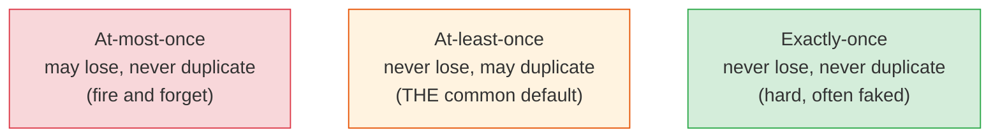
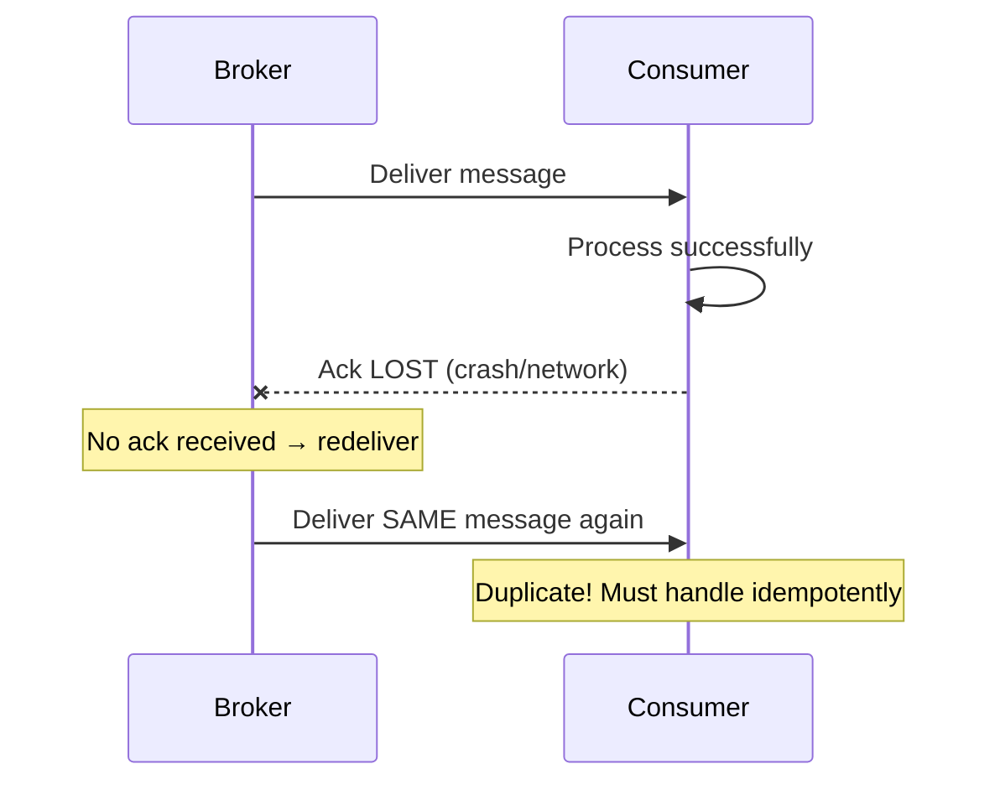
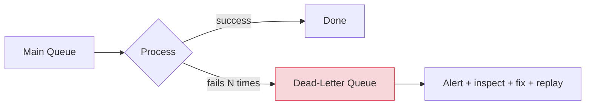

# Delivery Guarantees, Ordering & the Hard Parts

[< Back](./queues-vs-streams.md) | [Index](./README.md)

---

Anyone can push a message onto a queue. The senior skill is knowing what happens when things
go wrong — messages lost, duplicated, reordered, or poisoning your consumer. This is where
messaging systems earn their keep or ruin your weekend.

## Delivery guarantees (the three choices)

| Guarantee | Loses messages? | Duplicates? | When to use |
|-----------|-----------------|-------------|-------------|
| **At-most-once** | Possible | Never | Metrics, telemetry where a lost point is fine |
| **At-least-once** | Never | Possible | The default for most systems — **consume idempotently** |
| **Exactly-once** | Never | Never | The dream; genuinely hard end-to-end |

**The reality:** most systems run **at-least-once**, because guaranteeing no loss requires acks
and retries, and retries create duplicates. So the golden rule:

> **Assume you will receive duplicates. Make your consumers idempotent.** (See
> [distributed-systems idempotency](../distributed-systems/time-and-idempotency.md).)
> "At-least-once delivery + idempotent processing" *is* how real systems achieve
> exactly-once-*effect* without the impossible-in-practice exactly-once-*delivery*.

### How duplicates happen (the ack race)

## Ordering (harder than it looks)

Global ordering across a distributed, parallel system is expensive. The trade-off:

- **Strict global order** requires a single consumer / single partition → **kills throughput**.
- **Partial order** (per key) is the practical answer: route related messages to the same
  partition/queue so they stay ordered *relative to each other*, while unrelated messages run
  in parallel.

> **Key by your ordering unit.** Need per-user ordering? Partition by user ID. Per-order?
> Partition by order ID. You get ordering where it matters and parallelism everywhere else. Do
> **not** demand global ordering unless the business truly requires it — it's a throughput
> death sentence.

Also: **out-of-order + retries** means a later event can arrive before an earlier one after a
redelivery. Consumers should tolerate this (e.g., ignore an "update" for a version older than
what they've seen).

## Dead-letter queues (DLQ): where bad messages go to think

Some messages can **never** be processed (malformed, references deleted data, triggers a bug).
Without a plan, a **poison message** gets retried forever, blocking the queue and burning CPU.

- After N failed attempts, move the message to a **DLQ** instead of retrying forever.
- Alert on DLQ depth — a growing DLQ means something's broken.
- Inspect, fix the root cause, then **replay** from the DLQ.
- **Always have a DLQ.** A queue without one will eventually get jammed by a single poison
  message and take the whole pipeline down.

## Backpressure & consumer lag

If producers outpace consumers, the queue grows unbounded — eventually running out of memory or
disk. Watch these:

- **Consumer lag** (Kafka) — how far behind consumers are. Rising lag = you're falling behind;
  scale consumers or speed up processing.
- **Queue depth** (RabbitMQ/SQS) — same signal. Alert on it.
- **Backpressure** — signal producers to slow down, or shed load, before the queue explodes.

## Other production gotchas

1. **Visibility timeout / redelivery window** — while a consumer processes a message, it's
   hidden. If processing takes longer than the timeout, the broker redelivers it (→ duplicate,
   possibly concurrent processing). Set the timeout above your real p99 processing time.
2. **Message size limits** — brokers cap message size (SQS 256 KB, Kafka configurable). For big
   payloads, store the blob in S3 and put a **pointer** in the message (claim-check pattern).
3. **Ordering vs retries conflict** — retrying message #5 while #6 already processed breaks
   order. Accept it, or use per-key single-flight.
4. **Schema evolution** — producers and consumers deploy independently. Use a **schema
   registry** (Avro/Protobuf) and evolve schemas backward-compatibly, or a bad message breaks
   every consumer.
5. **Exactly-once claims** — Kafka offers "exactly-once semantics" *within Kafka* (transactions
   + idempotent producer). End-to-end across external systems, you still need idempotent
   consumers. Don't over-trust the label.

## The takeaways

1. **Design for at-least-once. Make consumers idempotent.** This one habit prevents the
   majority of messaging bugs.
2. **Key by your ordering unit** for per-entity ordering + parallelism. Avoid global ordering.
3. **Always have a DLQ** with alerting and a replay path. Poison messages are inevitable.
4. **Monitor lag / queue depth** — it's your early warning that consumers can't keep up.
5. **Set visibility timeouts above real processing time**, or you'll silently double-process.

---

[< Back](./queues-vs-streams.md) | [Index](./README.md)
