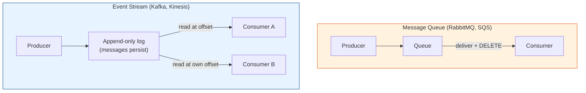

# Message Queues vs Event Streams (Kafka vs RabbitMQ)

[< Back](./sync-vs-async.md) | [Index](./README.md) | [Next: Delivery Guarantees >](./delivery-guarantees.md)

---

"We need a queue" is where most people stop. But there are two *fundamentally different* tools
here, and picking the wrong one causes years of pain. Understand the distinction.

## The core difference: consume-and-delete vs a log

- **Message queue** — a message is delivered to a consumer and then **removed**. It's a
  to-do list: once a task is done, it's gone. Think "work distribution."
- **Event stream / log** — messages are **appended to a durable, replayable log** and stay
  (for a retention period). Many consumers read independently at their own position (offset),
  and can **re-read** from any point. Think "a source of truth you can replay."

## Message queues (RabbitMQ, ActiveMQ, SQS)

A **broker** routes messages from producers to consumers. Messages are typically deleted after
acknowledgment.

- **Strengths:** flexible routing (exchanges, topics, bindings), per-message ack/retry,
  priorities, mature and simple mental model. Great for **task/work queues** and complex
  routing.
- **Model:** competing consumers pull tasks; once acked, the message is gone.
- **Best for:** background jobs, task distribution, RPC-style work, request/reply, anything
  where a message is a *command to do one thing once*.

## Event streams (Kafka, Pulsar, Kinesis)

A distributed, partitioned, **append-only commit log**. Producers append; consumers track their
own **offset** and can replay history.

- **Strengths:** massive throughput, durable retention, replayability, multiple independent
  consumer groups reading the same data, strict ordering within a partition.
- **Model:** the log is the source of truth; consumers read at their own pace and position.
- **Best for:** event sourcing, stream processing/analytics, feeding many downstream systems
  from one event flow, high-throughput pipelines, audit logs, anything where you want to
  **replay** or have **many** consumers of the same events.

### Kafka's key concepts (worth knowing cold)

| Concept | Meaning |
|---------|---------|
| **Topic** | A named stream of messages |
| **Partition** | A topic is split into partitions for parallelism; ordering is guaranteed *within* a partition, not across |
| **Offset** | A consumer's position in a partition; consumers commit offsets to track progress |
| **Consumer group** | A set of consumers sharing the work of a topic; each partition goes to one consumer in the group |
| **Retention** | How long messages persist (time or size based) — this is what enables replay |
| **Partition key** | Determines which partition a message lands in; same key → same partition → ordered |

> **The partition trade-off:** more partitions = more parallelism and throughput, but ordering
> is only guaranteed *within* a partition. If you need per-user ordering, key by user ID so all
> of one user's events land in the same partition. Global ordering across a whole topic means
> one partition — which caps throughput.

## The comparison table

| Dimension | Message Queue (RabbitMQ) | Event Stream (Kafka) |
|-----------|--------------------------|----------------------|
| **Message lifetime** | Deleted after consumption | Retained (replayable) |
| **Consumers** | Compete for messages | Read independently, at own offset |
| **Re-read history?** | No (it's gone) | Yes (replay from any offset) |
| **Throughput** | High | Very high (millions/sec) |
| **Routing** | Rich (exchanges, bindings) | Simple (topic + partition) |
| **Ordering** | Per-queue | Per-partition |
| **Best for** | Task queues, RPC, complex routing | Event pipelines, analytics, event sourcing |
| **Mental model** | To-do list | Replayable ledger |

## How to choose

Ask: **"Is this a task to be done once, or an event that many systems might care about (now or
later)?"**

- **Task to do once, then forget** → **message queue** (RabbitMQ, SQS). "Send this email."
- **Event that multiple systems consume, or that you might replay/reprocess** → **event
  stream** (Kafka, Kinesis). "Order was placed" → billing, shipping, analytics, and a future
  ML pipeline all read it.

> Kafka is often over-adopted as a "queue" because it's fashionable, then teams fight its
> operational weight for a simple task queue. Conversely, people cram event-sourcing use cases
> into RabbitMQ and lose replayability. **Match the tool to the shape of your problem**, not to
> the conference talk you just watched.

## Cloud-managed options (usually the right call)

| Need | Managed service |
|------|-----------------|
| Simple queue | AWS SQS, Google Cloud Tasks |
| Pub/sub fan-out | AWS SNS, Google Pub/Sub |
| Event streaming | AWS Kinesis, Confluent Cloud (Kafka), Google Pub/Sub |

Running Kafka or RabbitMQ yourself is a real operational commitment (brokers, ZooKeeper/KRaft,
partitions, rebalancing). Prefer managed unless you have a strong reason and the ops muscle.

---

[< Back](./sync-vs-async.md) | [Index](./README.md) | [Next: Delivery Guarantees >](./delivery-guarantees.md)
