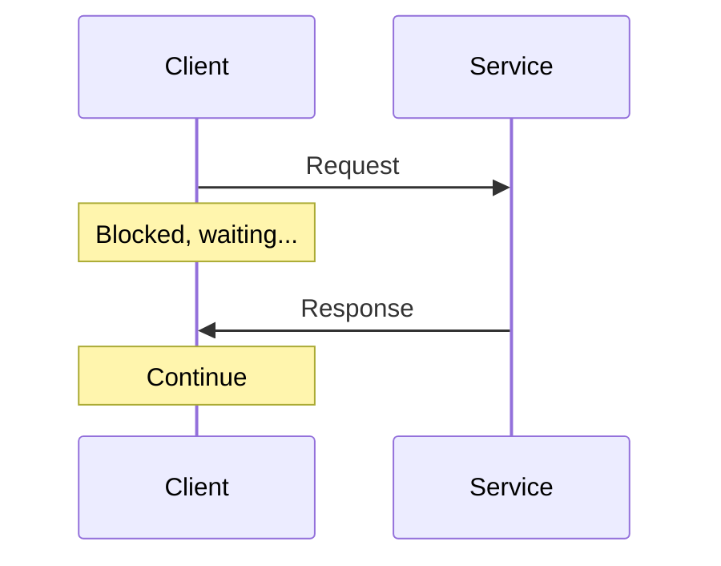
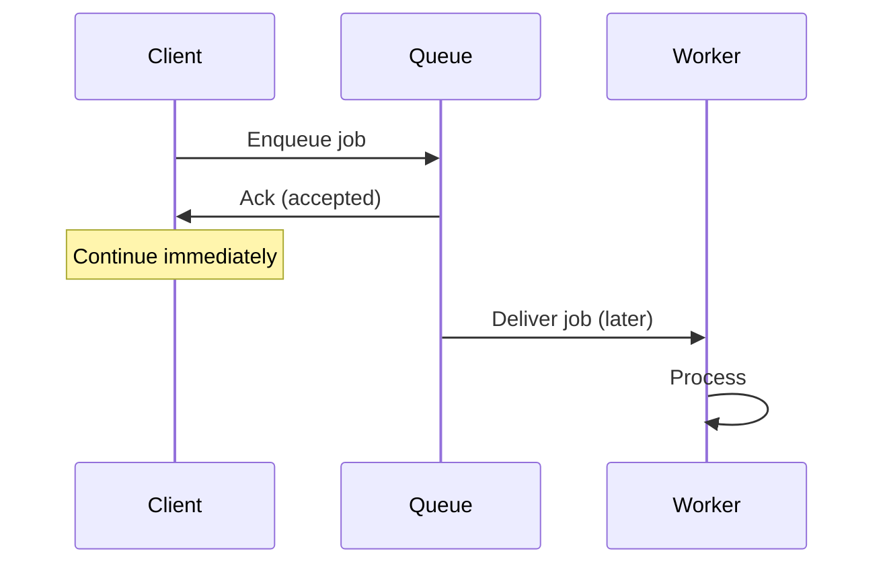
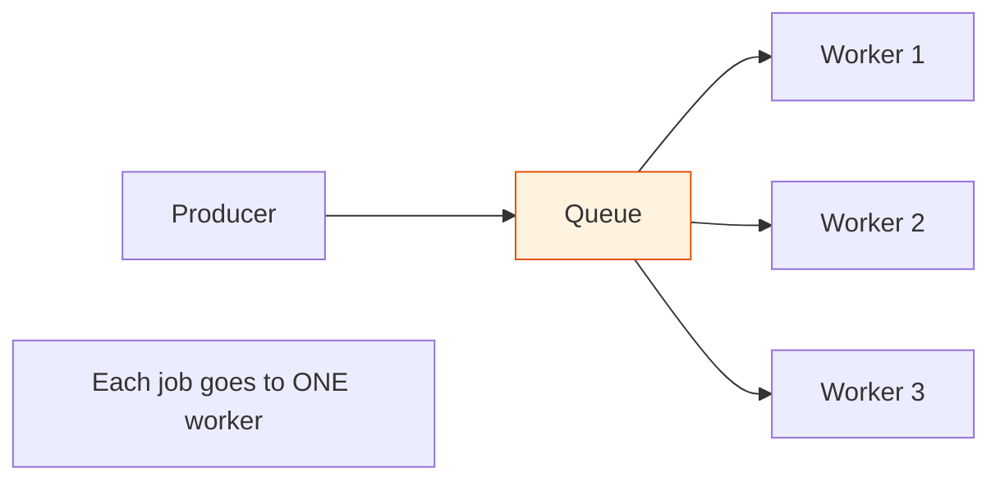
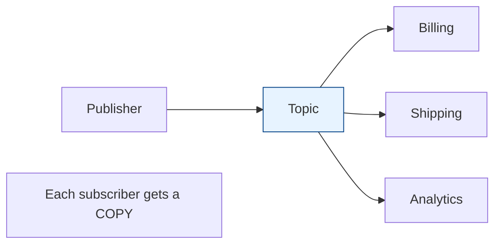

# Sync vs Async & Messaging Patterns

[Index](./README.md) | [Next: Queues vs Streams >](./queues-vs-streams.md)

---

The first architectural fork: does the caller **wait** for the result, or hand off work and
move on? Getting this choice right shapes your system's latency, resilience, and complexity.

## Synchronous: wait for the answer

The caller sends a request and **blocks** until it gets a response. Simple, immediate, easy to
reason about.

- **Pro:** simple, immediate result, easy error handling and debugging.
- **Con:** the caller is coupled to the callee's availability and speed. If the service is slow
  or down, the caller is stuck. Doesn't absorb bursts.
- **Use for:** reads, anything where the user needs the answer *now* (login, fetching a page).

## Asynchronous: hand it off, move on

The caller drops a message and continues immediately; the work happens later, elsewhere.

- **Pro:** decoupling (producer and consumer don't need to be up at the same time), burst
  absorption (the queue buffers spikes), scalability (add more workers), resilience (retry
  failed work).
- **Con:** more moving parts, eventual consistency, harder to trace, "where's my result?"
  complexity.
- **Use for:** slow work (video encoding, email, reports), fan-out, decoupling services,
  smoothing traffic spikes.

> **The classic move:** a user uploads a video. Don't encode it synchronously (they'd wait
> minutes). Accept it, enqueue an "encode" job, return "processing" instantly, and notify them
> when a worker finishes. Async turns a terrible UX into a good one.

## The three core messaging patterns

### 1. Point-to-point (work queue)
One message → **exactly one** consumer processes it. Multiple workers compete for messages
(competing consumers), so you scale by adding workers. Used for distributing tasks.

### 2. Publish/subscribe (fan-out)
One message → **every** subscriber gets a copy. Producers don't know who's listening. Used for
broadcasting events (an "order placed" event fans out to billing, shipping, and analytics).

### 3. Request/reply (async RPC)
Async, but the sender still wants an answer — sent back on a reply queue with a correlation ID.
Used when you want decoupling *and* a response.

## The event-driven mindset

Async messaging enables **event-driven architecture**: services emit **events** ("order
created," "payment received") and other services react. This decouples teams and systems — the
order service doesn't need to know that shipping, email, and analytics all care. It just
announces what happened.

- **Choreography** — services react to each other's events, no central coordinator. Loosely
  coupled, but the overall flow is implicit and harder to trace.
- **Orchestration** — a central coordinator directs the steps. Clearer flow, but the
  orchestrator is a bottleneck and a coupling point.

(This connects to **sagas** for distributed transactions — see
[microservices](../microservices/README.md).)

## When to choose which

| Situation | Choose |
|-----------|--------|
| User needs the answer immediately | **Sync** |
| Work is slow (seconds+) | **Async** |
| One task, one worker | **Point-to-point queue** |
| One event, many reactions | **Pub/sub** |
| Absorbing traffic spikes | **Async queue (buffer)** |
| Decoupling teams/services | **Event-driven (pub/sub)** |

## The takeaways

1. **Default to sync for simplicity; reach for async when you need decoupling, buffering, or to
   offload slow work.** Async is powerful but adds real complexity — don't scatter it everywhere.
2. **Async trades immediate consistency for resilience and scale.** Your UX and data model must
   accept "it'll be done shortly."
3. **A queue in front of a service is the cheapest way to make it resilient to spikes** — it
   converts a flood into a manageable stream.

---

[Index](./README.md) | [Next: Queues vs Streams >](./queues-vs-streams.md)
