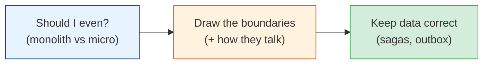

# Microservices & Service Architecture

The most hyped, most misused word in modern engineering. Microservices solve real problems —
and create a dozen new ones. This module covers when to use them, how to draw boundaries, how
they talk, how they handle transactions, and (crucially) **when NOT to use them.** The senior
lesson here is restraint.

## Contents

| # | Topic | File | Level |
|---|-------|------|-------|
| 0 | The map (this file) | *(here)* | Intermediate |
| 1 | Monolith vs microservices (and the honest trade-offs) | [monolith-vs-microservices.md](./monolith-vs-microservices.md) | Intermediate |
| 2 | Service boundaries & communication | [boundaries-and-communication.md](./boundaries-and-communication.md) | Advanced |
| 3 | Distributed data: sagas, outbox & the patterns | [distributed-data-patterns.md](./distributed-data-patterns.md) | Advanced |

---

## How to read this module

- **Everyone should read chapter 1.** The monolith-vs-microservices decision is one of the most
  consequential (and most botched) choices in software. The honest answer surprises people.
- **Chapters 2 and 3** are for when you've *decided* on services and now face the hard reality:
  where to draw lines, how services communicate, and how to keep data correct without
  distributed transactions.

## The one warning

> **Microservices are an organizational solution, not a technical one.** They let many teams
> ship independently — at the cost of enormous operational and distributed-systems complexity.
> If you're one team, you almost certainly want a monolith. Choose microservices to solve a
> *people* problem, not to pad a resume.

Start with [monolith-vs-microservices.md](./monolith-vs-microservices.md). **Next >**
