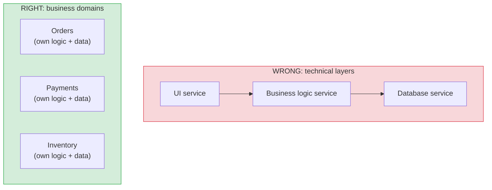
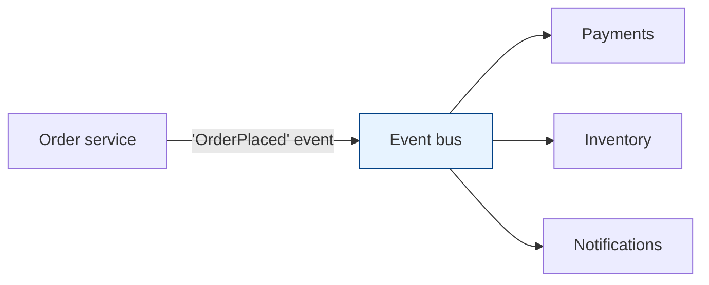

# Service Boundaries & Communication

[< Back](./monolith-vs-microservices.md) | [Index](./README.md) | [Next: Distributed Data Patterns >](./distributed-data-patterns.md)

---

Once you've decided on services, two questions decide whether you succeed or build a
distributed disaster: **where do the lines go?** and **how do services talk?** Get boundaries
wrong and everything else is doomed.

## Drawing boundaries: the hardest part

The #1 microservices failure is bad boundaries — services that are too chatty, too coupled, or
split along the wrong seams. Good boundaries follow the **business domain**, not technical
layers.

**Use Domain-Driven Design (DDD):**
- A **bounded context** = a natural business boundary where terms have one clear meaning
  ("Order" means the same thing throughout). Each bounded context is a strong candidate for a
  service.
- **High cohesion, low coupling** — things that change together live together; things that
  change independently are separate.
- **A service owns its data.** No other service touches its database directly — ever. That
  private database is what makes independent deployment possible. Share data through APIs and
  events, never through a shared DB.

> **The test of a good boundary:** can this team ship this service without coordinating a
> deploy with any other team? If yes, the boundary works. If every change ripples across
> services, you drew the lines wrong.

## How services communicate

### Synchronous (request/response)

| Protocol | Strengths | Use for |
|----------|-----------|---------|
| **REST/HTTP+JSON** | Universal, simple, debuggable, cacheable | Public APIs, broad compatibility |
| **gRPC (HTTP/2 + protobuf)** | Fast, typed contracts, streaming, small payloads | Internal service-to-service, low latency |
| **GraphQL** | Client picks fields, one round trip | Aggregating data for varied frontends |

Sync is simple but **couples availability**: if B is down, A's call fails. Chains of sync calls
multiply latency and failure probability (see
[failure handling](../distributed-systems/failure-handling.md)).

### Asynchronous (events/messages)

Services emit events; others react. Decoupled in time and availability — the classic
event-driven approach. (See [messaging-and-streaming](../messaging-and-streaming/README.md).)

> **Rule of thumb:** use **sync** when the caller genuinely needs the answer now (a read, a
> validation). Use **async events** to decouple services and propagate "something happened."
> Over-using sync creates a fragile chain; over-using async makes flows hard to trace. Balance.

## The patterns you must know

### API Gateway
A single entry point for clients that routes to the right services and handles cross-cutting
concerns (auth, rate limiting, aggregation). Clients don't call 20 services directly. (See
[infrastructure/api-gateway](../infrastructure/api-gateway.md).)

### Service discovery
Services come and go (autoscaling, deploys, failures) — you can't hardcode addresses. A
registry (Consul, etcd, Kubernetes DNS) lets services **find** each other dynamically.

### Service mesh (sidecar)
A mesh (Istio, Linkerd) puts a **sidecar proxy** next to each service to handle mTLS, retries,
timeouts, circuit breaking, and observability — **without** cluttering app code. It moves
network reliability concerns out of your services and into infrastructure.

### Backends-for-Frontends (BFF)
A dedicated gateway per client type (web, mobile), each shaping responses for its client's
needs. Avoids one bloated API trying to serve everyone.

## The anti-patterns (learn to smell these)

1. **Chatty services** — a single user action fires dozens of cross-service calls. Latency
   explodes, failure probability compounds. Fix boundaries or batch.
2. **Shared database** — two services reading/writing the same DB. This secretly couples them;
   you can no longer change one's schema without breaking the other. It's a distributed
   monolith in disguise.
3. **Nano-services** — services so small the overhead dwarfs the logic. "One function per
   service" is a joke that stops being funny at 3 a.m.
4. **Synchronous call chains** — A calls B calls C calls D, all sync. One slow link stalls
   everyone; availability multiplies downward.
5. **Distributed monolith** — services that must be deployed together. You paid for distribution
   and got none of the independence.

## The takeaways

1. **Boundaries follow business domains (DDD bounded contexts), not technical layers.**
2. **Each service owns its data. No shared databases. Ever.**
3. **Sync when you need an answer now; async events to decouple.** Don't build long sync chains.
4. **Push network reliability into a mesh/sidecar** so app code stays clean.
5. **The right size is "a team can own and deploy it independently"** — not as small as possible.

---

[< Back](./monolith-vs-microservices.md) | [Index](./README.md) | [Next: Distributed Data Patterns >](./distributed-data-patterns.md)
