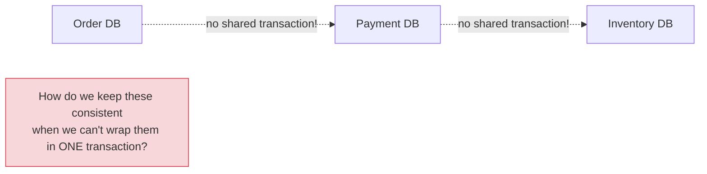
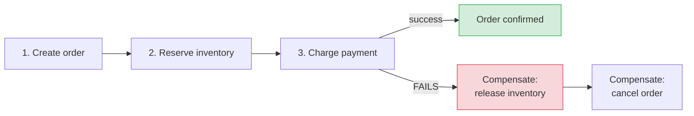
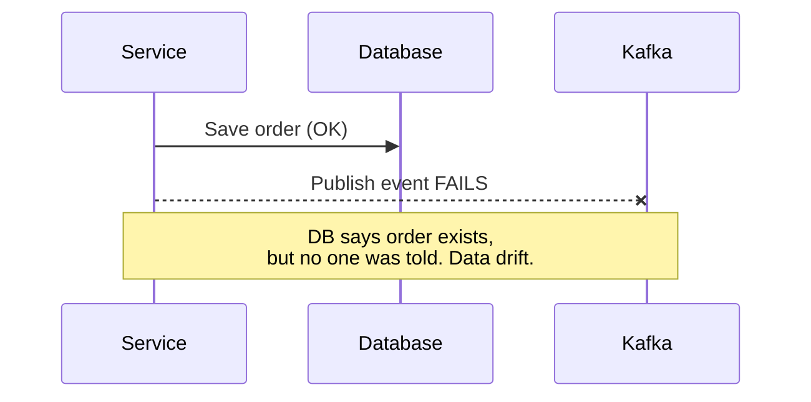
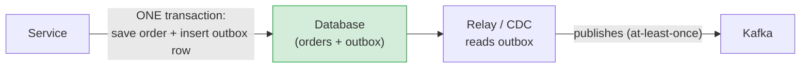

# Distributed Data: Sagas, Outbox & the Patterns

[< Back](./boundaries-and-communication.md) | [Index](./README.md)

---

Here's the wall every microservices team hits: **each service owns its own database, so you
can't use a single ACID transaction across services.** How do you place an order that must
reserve inventory *and* charge a card *and* create a shipment — atomically — when those live in
three different databases? Welcome to the hardest part of distributed data.

## The problem, illustrated

You gave up cross-service ACID the moment you split the database. Your two real options are
**two-phase commit (avoid it)** and **sagas (use this)**.

## Sagas: distributed transactions without the lock

A **saga** breaks one distributed transaction into a sequence of **local** transactions, each
in its own service. If a step fails, you run **compensating transactions** to undo the previous
steps. It's eventual consistency with an explicit rollback story.

### Two flavors of saga

| | Choreography | Orchestration |
|-|--------------|---------------|
| **How** | Services react to each other's events, no central brain | A central orchestrator directs each step |
| **Pro** | Loosely coupled, no single point of control | Clear, centralized flow; easy to trace/debug |
| **Con** | Flow is implicit, hard to follow, easy to create cycles | Orchestrator is coupling + a bottleneck |
| **Use when** | Few steps, simple flows | Complex flows with many steps/branches |

> **Compensation is not rollback.** You can't "un-charge" instantly the way a DB rolls back —
> you issue a *refund*. Compensating actions are real business operations, and they must
> themselves be idempotent and reliable. Design them deliberately; they're where saga bugs hide.

## The dual-write problem (and the Outbox pattern)

A subtle killer: a service often needs to **update its database AND publish an event** ("order
created" → save to DB + emit to Kafka). But these are two systems — what if the DB write
succeeds and the event publish fails (or vice versa)? Now your data and your events disagree,
silently.

### The Transactional Outbox pattern (the fix)

Write the event **into your database, in the same transaction** as the business change, into an
`outbox` table. A separate process then reads the outbox and publishes to the broker. Because
the business write and the event write are one local ACID transaction, they can't disagree.

The relay publishes **at-least-once** (may duplicate), so — as always — **consumers must be
idempotent.** **Change Data Capture (CDC)** tools like Debezium implement exactly this by
tailing the DB transaction log.

## Other essential distributed-data patterns

### CQRS (Command Query Responsibility Segregation)
Separate the **write** model from the **read** model. Writes go to a normalized store; a
denormalized, query-optimized read model is built from events. Powerful for read-heavy systems,
but adds complexity and eventual consistency between write and read sides. Don't reach for it
unless read/write needs genuinely diverge.

### Event sourcing
Instead of storing current state, store the **sequence of events** that produced it. Current
state is a replay of events. Gives you a perfect audit log and time-travel, but querying
"current state" is harder and schema evolution of old events is painful. A specialized tool —
not a default.

### API composition
To answer a query needing data from several services, an aggregator calls each and joins in
memory. Simple, but can be slow and chatty for complex joins — sometimes CQRS (a materialized
read model) is the better answer.

## The consistency reality check

In microservices, you trade the monolith's easy strong consistency for **eventual consistency**
across services. This changes your UX and your data model:

- "Order placed" may show before inventory is fully reserved — design the UI for it.
- There will be brief windows where services disagree — that's normal, not a bug.
- Reconciliation jobs that detect and fix drift are part of the system, not an afterthought.

## The takeaways

1. **No cross-service ACID.** Use **sagas** with compensating transactions; avoid 2PC.
2. **Compensations are real business operations** (refunds, releases), must be idempotent, and
   are where the bugs live — design them carefully.
3. **The dual-write problem is real and silent.** Use the **Outbox pattern** (or CDC) to keep
   your DB and your events in agreement.
4. **Everything is at-least-once → consumers must be idempotent.** (This theme never stops.)
5. **Embrace eventual consistency** — design UX, data models, and reconciliation around it.
6. **CQRS and event sourcing are powerful but heavy** — use them for specific proven needs, not
   as defaults.

---

[< Back](./boundaries-and-communication.md) | [Index](./README.md)
