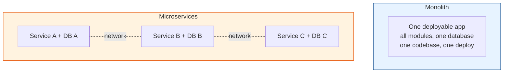

# Monolith vs Microservices

[Index](./README.md) | [Next: Boundaries & Communication >](./boundaries-and-communication.md)

---

The industry swung hard toward microservices in the 2010s, and a lot of teams got burned. The
pendulum has swung back toward "modular monolith first." Here's the honest picture, free of
hype.

## What each actually is

- **Monolith** — one codebase, one deployable, usually one database. All features run in one
  process.
- **Microservices** — many small, independently deployable services, each owning its own data,
  communicating over the network.

## The honest trade-offs

| Dimension | Monolith | Microservices |
|-----------|----------|---------------|
| **Initial dev speed** | Fast — one repo, one deploy | Slow — infra, CI/CD, plumbing per service |
| **Local dev / debugging** | Easy — run one thing | Hard — spin up many services |
| **Deployment** | One unit (all or nothing) | Independent per service |
| **Scaling** | Scale the whole app | Scale hot services independently |
| **Team autonomy** | Teams step on each other | Teams own services, ship independently |
| **Transactions** | Easy (single DB, ACID) | Hard (distributed, sagas) |
| **Failure isolation** | One bug can crash everything | A service can fail in isolation |
| **Operational cost** | Low | High (observability, networking, orchestration) |
| **Tech diversity** | One stack | Polyglot possible |

## The seductive lie and the hidden tax

Microservices *sound* like pure upside: independent, scalable, resilient. The tax nobody
mentions up front:

- **Distributed transactions** become sagas (chapter 3) — no more simple ACID across features.
- **Network calls everywhere** — latency, retries, timeouts, partial failures (see
  [distributed-systems](../distributed-systems/README.md)).
- **Observability is mandatory** — you *need* distributed tracing to debug a request that hops
  five services. (See [observability](../observability-and-reliability/README.md).)
- **Operational overhead** — CI/CD, service discovery, config, secrets, and monitoring
  multiply by service count.
- **Data consistency** — each service owns its data, so joins across services become API calls
  and eventual consistency.
- **"Distributed monolith"** — the worst outcome: services so coupled they must deploy together,
  giving you all the pain of distribution with none of the independence.

## When microservices actually make sense

Microservices solve a **scaling-the-organization** problem. Reach for them when:

1. **Many teams** need to ship independently without blocking each other (the #1 real reason).
2. **Different parts scale very differently** (a compute-heavy image processor vs a light auth
   service) and you want to scale them separately.
3. **Different parts have different reliability/tech needs** justifying isolation.
4. **The codebase/team is too large** for one codebase to stay sane.

## When to stay a monolith (usually)

1. **You're a small team or a startup.** You need to move fast and change direction; a monolith
   is faster to build and easier to refactor.
2. **You don't know your domain boundaries yet.** Premature service boundaries are worse than
   no boundaries — you'll draw the lines wrong and pay to move them.
3. **Your scale doesn't demand it.** A well-built monolith serves enormous traffic. "Might need
   to scale someday" is not a reason to eat the complexity today.

## The pragmatic answer: modular monolith first

Build a **modular monolith**: one deployable, but with clean internal module boundaries (clear
interfaces, no tangled cross-imports). This gives you monolith simplicity *and* the option to
extract a module into a service later, once real pain and clear boundaries emerge. This is the
approach most senior engineers now recommend.

> **Martin Fowler's "MonolithFirst":** almost every successful microservices system started as
> a monolith that grew and got split. Almost every system built as microservices *from scratch*
> struggled. Start monolith, extract services when the boundaries prove themselves.

## The takeaways

1. **Microservices are for scaling teams, not code.** If you have one team, default to a
   (modular) monolith.
2. **Don't build a distributed monolith** — the worst of both worlds. If services can't deploy
   independently, they're not really microservices.
3. **Extract services from a monolith once boundaries are proven** — don't guess them up front.
4. **The complexity is real and permanent.** Every service is CI/CD, monitoring, on-call, and a
   network hop. Only pay it for a real, present benefit.

---

[Index](./README.md) | [Next: Boundaries & Communication >](./boundaries-and-communication.md)
