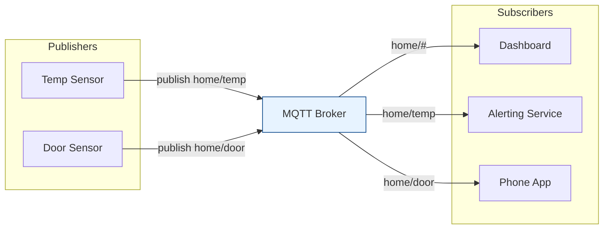

# MQTT Tech Docs

A deep-dive into **MQTT** — the lightweight publish/subscribe protocol that powers
most of the IoT world — split into focused topics with code examples.

## Contents

| # | Topic | File |
|---|-------|------|
| 0 | Intro & the big picture | *(this file)* |
| 1 | MQTT protocol internals (topics, QoS, sessions, LWT) | [mqtt-protocol.md](./mqtt-protocol.md) |
| 2 | Using MQTT effectively (patterns, scaling, security) | [effective-mqtt.md](./effective-mqtt.md) |

> Code examples use Python with [`paho-mqtt`](https://pypi.org/project/paho-mqtt/).
> Install it with:
> ```bash
> uv pip install paho-mqtt --index-url https://pypi.ci.artifacts.walmart.com/artifactory/api/pypi/external-pypi/simple --allow-insecure-host pypi.ci.artifacts.walmart.com
> ```
> Spin up a local broker fast (Mosquitto):
> ```bash
> brew install mosquitto && mosquitto -v   # verbose, listens on 1883
> ```

---

## 1. What is MQTT?

**MQTT** (Message Queuing Telemetry Transport) is a **lightweight, publish/subscribe
messaging protocol** designed for constrained devices and unreliable, low-bandwidth
networks. It runs over **TCP** (default port `1883`, or `8883` for TLS).

Instead of clients talking directly to each other, everything flows through a central
**broker**. Publishers send messages to a **topic**; the broker fans them out to every
subscriber of that topic. Publishers and subscribers never need to know about each
other — they're fully **decoupled** in space, time, and synchronization.



> The headline: **MQTT = a broker + topics + a tiny binary protocol**, optimized so a
> battery-powered sensor with 2 KB of RAM can still speak it happily.

---

## 2. Why MQTT (and not plain HTTP)?

| Concern | HTTP request/response | MQTT pub/sub |
|---------|----------------------|--------------|
| **Overhead** | Verbose headers per request | ~2-byte fixed header |
| **Direction** | Client must poll for updates | Broker **pushes** instantly |
| **Connections** | New connection per request (often) | One long-lived connection |
| **Coupling** | Client must know server URL | Fully decoupled via topics |
| **Fan-out** | Server loops over clients | Broker handles it natively |
| **Battery/bandwidth** | Costly | Sips power & data |

MQTT wins any time you have **many devices**, **push semantics**, or **flaky networks**:
IoT telemetry, home automation, connected vehicles, mobile push, live dashboards.

---

## 3. Core Vocabulary

- **Broker** — the central server that routes all messages (e.g., Mosquitto, EMQX, HiveMQ).
- **Client** — anything that connects: a publisher, a subscriber, or both.
- **Topic** — a hierarchical UTF-8 string like `home/livingroom/temp`.
- **Publish** — send a message to a topic.
- **Subscribe** — register interest in a topic (or wildcard).
- **QoS** — Quality of Service: the delivery guarantee (0, 1, or 2).
- **Retained message** — the broker stores the *last* message on a topic for new subs.
- **LWT (Last Will & Testament)** — a message the broker sends if a client dies ungracefully.

Start with [mqtt-protocol.md](./mqtt-protocol.md).
