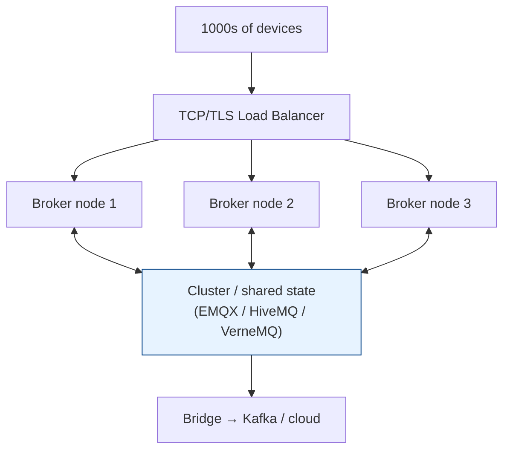

# Using MQTT Effectively

[< Back](./mqtt-protocol.md) | [Index](./README.md)

---

MQTT is easy to start with and easy to misuse. Here's how to run it like you mean it.

## 1. Topic design that scales

- **Structure general → specific:** `region/site/building/floor/device/metric`.
- **Keep topics stable & predictable** so wildcard subscriptions stay clean.
- **Don't overload topics** with variable data you'll want to *aggregate* — that belongs
  in the payload (usually JSON or a compact binary like Protobuf/CBOR).
- **Never start a topic with `/`** (creates an empty leading level) and avoid `#`/`+`
  characters in published topic names.
- Reserve a **`$SYS/`**-style prefix awareness — brokers publish their own stats there.

```
 acme/plant1/floor2/press-04/vibration
 data/press-04-floor2-plant1-vibration-mm-s   (unfilterable soup)
```

---

## 2. Pick the right QoS (don't default everything to 2)

| Scenario | QoS |
|----------|-----|
| 10 Hz temperature stream | **0** — losing one reading is invisible |
| "Turn on the pump" command | **1** — must arrive; make the command idempotent |
| "Charge the customer $5" | **2** — must never duplicate |

> QoS 2 doubles round-trips and broker state. Reach for **QoS 1 + idempotent handlers**
> as your default; escalate to QoS 2 only for truly once-only actions.

---

## 3. Design for offline-first

- Use **persistent sessions** (`clean_start=False` + stable `client_id`) so queued QoS 1/2
  messages survive reconnects.
- Set a **Last Will** for presence so consumers know when a device drops.
- Use **retained messages** for "current state" so a freshly-connected dashboard isn't
  blank until the next publish.
- Tune **keep-alive**: shorter = faster dead-client detection but more chatter on battery.

---

## 4. Security checklist

MQTT ships insecure by default (plaintext on 1883). Lock it down:

1. **TLS everywhere** — use port `8883`, verify the broker cert, ideally mutual TLS
   (client certs) for device identity.
2. **AuthN** — username/password at minimum; client certificates or JWT for production.
3. **AuthZ (ACLs)** — restrict which client can publish/subscribe to which topics.
   A sensor should *only* be able to publish its own topic.
4. **Unique client IDs** — a duplicate `client_id` kicks the other client off. Great for
   accidental DoS. Namespace them.
5. **Rotate credentials** and disable anonymous access.

```python
c.tls_set(ca_certs="ca.crt", certfile="device.crt", keyfile="device.key")
c.username_pw_set("sensor-42", "s3cr3t")
c.connect("broker.acme.com", 8883, keepalive=60)
```

Example Mosquitto ACL — least privilege per device:

```
# acl.conf
user sensor-42
topic write acme/plant1/floor2/sensor-42/#
topic read  acme/plant1/floor2/sensor-42/config
```

---

## 5. Scaling the broker



- A **single broker** (Mosquitto) handles tens of thousands of connections comfortably —
  fine for many deployments.
- For millions of devices, use a **clustered broker** (EMQX, HiveMQ, VerneMQ) behind an
  L4 load balancer. Note MQTT connections are **long-lived**, so balance by *connections*,
  not requests, and enable sticky/least-connections.
- **Shared subscriptions** (`$share/group/topic`) load-balance a topic across a pool of
  consumers — essential for horizontally scaling backend processors.
- **Bridge** MQTT into Kafka/cloud pipelines for analytics and durable storage; MQTT is a
  transport, not a database.

```python
# Shared subscription: broker round-robins messages across this consumer group
client.subscribe("$share/ingest/acme/+/+/+/vibration", qos=1)
```

---

## 6. Common pitfalls

-  Using QoS 2 for everything → broker meltdown under load.
-  Duplicate `client_id`s → clients constantly disconnecting each other.
-  Giant payloads → MQTT is for small, frequent messages; ship files another way.
-  No TLS → credentials and data in the clear.
-  Treating the broker as storage → it isn't; bridge to a real datastore.
-  Forgetting retained-message cleanup → stale "current state" haunts new subscribers.

---

## 7. When NOT to use MQTT

- **Request/response with a return value** (use HTTP/gRPC). MQTT is fire-and-forget pub/sub.
- **Large payloads / file transfer** (use HTTP, S3, etc.).
- **Strict ordering across topics** — MQTT only orders *within* a topic per QoS.
- **Browser-native clients** — browsers can't open raw TCP; use **MQTT over WebSocket**
  (see the [realtime module](../realtime/README.md)).

---

[< Back](./mqtt-protocol.md) | [Index](./README.md)
