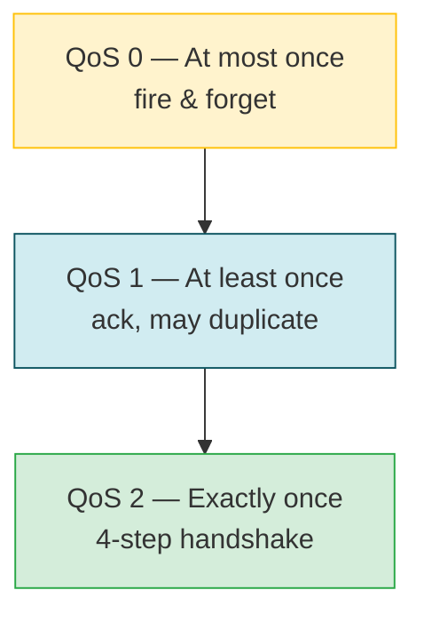
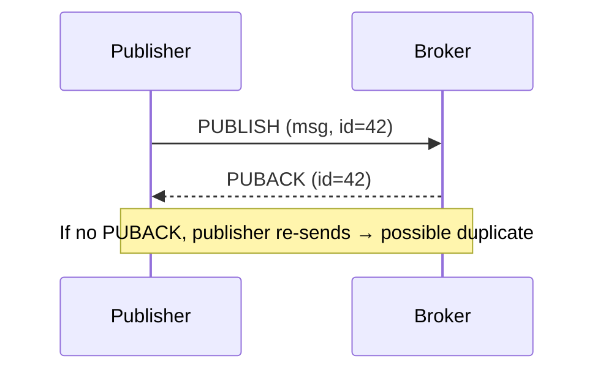
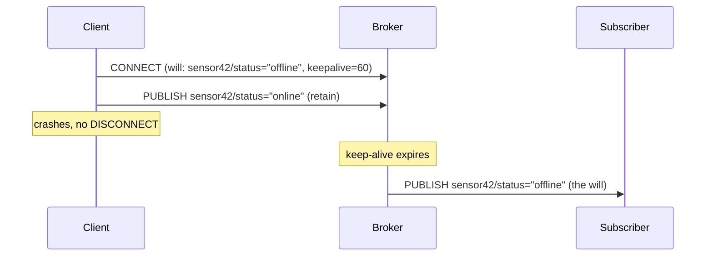

# MQTT Protocol Internals

[Index](./README.md) | Next: [Effective MQTT >](./effective-mqtt.md)

---

## Topics & Wildcards

A **topic** is a hierarchy separated by `/`. There's no need to pre-create topics — the
broker creates routing on the fly.

```
home/livingroom/temperature
home/livingroom/humidity
home/kitchen/temperature
```

Subscribers can use two **wildcards**:

| Wildcard | Meaning | Example | Matches |
|----------|---------|---------|---------|
| `+` | single level | `home/+/temperature` | `home/kitchen/temperature`, `home/livingroom/temperature` |
| `#` | multi level (must be last) | `home/#` | everything under `home/` |

> **Rule of thumb:** design topics from **general → specific** (`site/building/floor/device/metric`).
> Never put data that changes in the *payload* into the *topic* if you'll want to filter by it later — actually, do the opposite: put filterable dimensions in the topic, values in the payload.

---

## Quality of Service (QoS)

QoS is MQTT's killer feature — you pick the delivery guarantee **per message**.



| QoS | Guarantee | Handshake | Cost | Use for |
|-----|-----------|-----------|------|---------|
| **0** | At most once | none | cheapest | high-frequency telemetry where a lost reading is fine |
| **1** | At least once | `PUBLISH` → `PUBACK` | medium | most commands; dedupe on receiver |
| **2** | Exactly once | `PUBLISH`→`PUBREC`→`PUBREL`→`PUBCOMP` | most | billing, "unlock door once" — never duplicate |

**QoS 1 flow (at least once):**



> The QoS between **publisher↔broker** and **broker↔subscriber** are *independent*.
> The effective end-to-end QoS is the **minimum** of the two hops.

---

## Retained Messages

Normally a subscriber only gets messages published *after* it subscribes. Set the
**retain** flag and the broker keeps the **last** message on that topic, delivering it
immediately to any new subscriber. Perfect for "current state" (e.g., last known
thermostat setpoint).

```python
client.publish("home/thermostat/setpoint", "21.5", qos=1, retain=True)
```

Publish an **empty payload with retain=True** to clear a retained message.

---

## Sessions: clean vs persistent

- **Clean session (`clean_start=True`)** — broker forgets everything when you disconnect.
- **Persistent session (`clean_start=False` + a stable `client_id`)** — the broker queues
  QoS 1/2 messages for you while you're offline and re-delivers on reconnect.

Persistent sessions are how a phone that lost signal for 30 seconds still gets its
missed commands.

---

## Keep-Alive & Last Will (LWT)

- **Keep-alive** — the client promises to send *something* (or a `PINGREQ`) within the
  interval; otherwise the broker considers it dead.
- **Last Will & Testament** — a message registered at connect time that the broker
  publishes automatically if the client disconnects *ungracefully* (crash, network drop).
  Great for presence: `home/sensor42/status = "offline"`.



---

## Code Example: publisher & subscriber (Python, paho-mqtt)

```python
# subscriber.py
import paho.mqtt.client as mqtt

def on_connect(client, userdata, flags, rc, properties=None):
    print("Connected:", rc)
    client.subscribe("home/#", qos=1)          # wildcard subscribe

def on_message(client, userdata, msg):
    print(f"{msg.topic} -> {msg.payload.decode()} (qos={msg.qos})")

c = mqtt.Client(mqtt.CallbackAPIVersion.VERSION2, client_id="dash-1",
                clean_session=False)           # persistent session
c.on_connect = on_connect
c.on_message = on_message
c.connect("localhost", 1883, keepalive=60)
c.loop_forever()
```

```python
# publisher.py
import paho.mqtt.client as mqtt, time

c = mqtt.Client(mqtt.CallbackAPIVersion.VERSION2, client_id="sensor-42")
# register a Last Will BEFORE connecting
c.will_set("home/sensor42/status", "offline", qos=1, retain=True)
c.connect("localhost", 1883, keepalive=60)
c.loop_start()

c.publish("home/sensor42/status", "online", qos=1, retain=True)
for i in range(5):
    c.publish("home/livingroom/temperature", f"{20 + i}", qos=1)
    time.sleep(1)

c.disconnect()   # graceful — will is NOT fired
```

Test from the CLI too:

```bash
mosquitto_sub -t 'home/#' -v            # subscribe to everything under home/
mosquitto_pub -t 'home/livingroom/temperature' -m '22.5' -q 1 -r   # retained
```

---

[Index](./README.md) | Next: [Effective MQTT >](./effective-mqtt.md)
