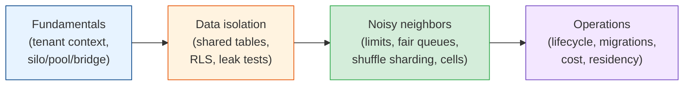

# Multi-Tenant Architecture

Almost every SaaS product is multi-tenant: one deployment serving many customers whose data
must never mix. Sharing is what makes SaaS cheap. One upgrade reaches every customer, and a
thousand small tenants share capacity that would sit idle if each had its own servers. The
price is a new class of bugs. One missing `WHERE tenant_id = ?` shows a customer someone else's
invoices, and one tenant's bulk import slows the product down for everyone. This module covers
how to model tenants, how much to share (silo, pool, or bridge), how to make data leaks hard,
how to keep noisy neighbours in check, and how to run the whole thing for years.

## Contents

| # | Topic | File | Level |
|---|-------|------|-------|
| 0 | The map (this file) | *(here)* | L3 · Intermediate |
| 1 | Tenancy fundamentals: tenants vs users, tenant context, silo/pool/bridge, control plane | [tenancy-fundamentals.md](./tenancy-fundamentals.md) | L3 · Intermediate |
| 2 | Data isolation: database vs schema vs shared tables, row-level security, leak testing | [data-isolation.md](./data-isolation.md) | L4 · Advanced |
| 3 | Noisy neighbors: per-tenant limits, fair queuing, shuffle sharding & cells | [noisy-neighbors.md](./noisy-neighbors.md) | L4 · Advanced |
| 4 | Operating multi-tenant systems: lifecycle, migrations, moving tenants, cost & residency | [operating-multi-tenant-systems.md](./operating-multi-tenant-systems.md) | L4 · Advanced |

---

## How to read this module

- **Chapter 1** is the vocabulary and the big decision. Read it before writing the first
  migration of a new product, because adding tenancy later touches every table.
- **Chapter 2** is about the failure that ends up in the news: cross-tenant data leaks. Shared
  tables, Postgres row-level security, and the caches and indexes people forget.
- **Chapter 3** is the failure that happens every week: one tenant using everyone's capacity.
  Limits, fairness, shuffle sharding, and cells.
- **Chapter 4** is the long game. Onboarding and offboarding, migrations across thousands of
  tenants, moving a tenant to its own database, cost attribution, and the common mistakes.

## Related modules

- [databases/replication-sharding.md](../databases/replication-sharding.md): sharding and
  replication, which multi-tenant systems usually do by `tenant_id`.
- [auth/](../auth/README.md): where the tenant claim in the token comes from, and authorization
  inside a tenant.
- [infrastructure/rate-limiting.md](../infrastructure/rate-limiting.md): the rate limiting
  algorithms behind per-tenant quotas.
- [distributed-systems/failure-handling.md](../distributed-systems/failure-handling.md):
  bulkheads and retries, which shuffle sharding and cells build on.
- [cloud-and-serverless/](../cloud-and-serverless/README.md): regions, multi-region design, and
  cost, which shape tenant placement and data residency.
- [chaos-engineering/](../chaos-engineering/README.md): a GameDay is the cheapest way to find
  out whether one cell's failure really stays in that cell.

## The one idea

> **Tenant context is set once, at the edge, and enforced at every layer.** The token decides
> the tenant; the plumbing carries it to the database, the cache, the queue, and the logs; and
> the database refuses rows that don't match. Multi-tenancy goes wrong when any one layer
> trusts the layer above to have got it right.

Start with [tenancy-fundamentals.md](./tenancy-fundamentals.md). **Next >**
