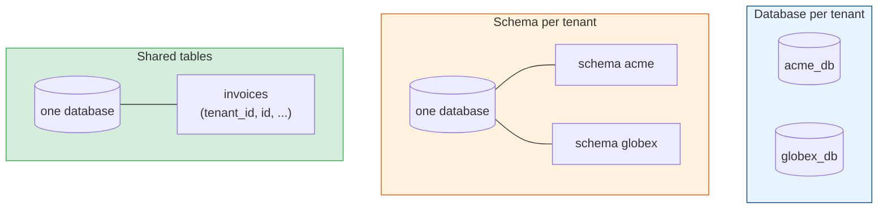
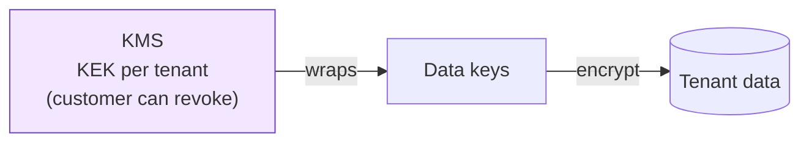

# Data Isolation: Database-per-Tenant, Schema-per-Tenant & Row-Level Security

[< Back](./tenancy-fundamentals.md) | [Index](./README.md) | [Next: Noisy Neighbors >](./noisy-neighbors.md)

---

A cross-tenant data leak is the incident a SaaS company remembers for years. It's rarely
dramatic. Someone writes a new report query and forgets one `WHERE tenant_id = ?`. A cache key
is built from an invoice number that isn't unique across tenants. A search index returns
documents from every customer because the filter was applied in the UI and not the query. This
chapter is about storage designs that make those mistakes either impossible or loud.

## Three ways to store tenant data



| | Database per tenant | Schema per tenant | Shared tables + `tenant_id` |
|---|---------------------|-------------------|------------------------------|
| Leak risk from a missing filter | None | Low (wrong `search_path` is still possible) | High unless enforced by the database |
| Tenants per cluster | Tens to hundreds | Hundreds to low thousands (catalog bloat beyond that) | Millions |
| Migrations | Run N times; some tenants will fail | Run N times | Run once |
| Backup & restore one tenant | Easy | Fairly easy | Hard: restore everything, extract rows |
| Delete a tenant | `DROP DATABASE` | `DROP SCHEMA ... CASCADE` | `DELETE` from every table, in order |
| Cross-tenant analytics | Needs a pipeline | Awkward `UNION`s | Plain SQL |
| Connection pooling | One pool per database; hard at scale | Shared pool, switch `search_path` | One shared pool |

A useful default: shared tables for the pool tier, a database per tenant for the enterprise
silo, and schema-per-tenant only when you have a specific reason (it combines the operational
cost of N migrations with the scaling limits of one cluster).

## Shared tables done properly

If tenants share tables, put `tenant_id` everywhere, and let the database help.

### `tenant_id` in every key

```sql
CREATE TABLE invoices (
    tenant_id   UUID        NOT NULL REFERENCES tenants(id),
    id          UUID        NOT NULL,
    number      TEXT        NOT NULL,
    customer_id UUID        NOT NULL,
    total_cents BIGINT      NOT NULL,
    PRIMARY KEY (tenant_id, id),
    UNIQUE (tenant_id, number),
    FOREIGN KEY (tenant_id, customer_id) REFERENCES customers (tenant_id, id)
);
```

Three details carry most of the weight:

- **`tenant_id` leads the primary key and every index.** Queries are always tenant-scoped, so
  the index matches the access pattern, and it's ready for sharding by tenant later (Citus,
  for example, distributes tables on exactly this column).
- **Uniqueness is per tenant.** Two customers can both have invoice `INV-0001`. A global
  unique constraint on `number` would leak information ("that number is taken") and break
  sign-ups.
- **Foreign keys include `tenant_id`.** `(tenant_id, customer_id)` references
  `customers (tenant_id, id)`, so an invoice can't point at another tenant's customer even if
  application code passes the wrong ID.

### Row-level security: the database as the last line

Application filters fail when someone forgets them. Postgres row-level security (RLS) moves the
filter into the database, so a query without a `WHERE tenant_id` still returns only the
current tenant's rows.

```sql
ALTER TABLE invoices ENABLE ROW LEVEL SECURITY;
ALTER TABLE invoices FORCE ROW LEVEL SECURITY;   -- applies to the table owner too

CREATE POLICY tenant_isolation ON invoices
    USING      (tenant_id = current_setting('app.tenant_id')::uuid)
    WITH CHECK (tenant_id = current_setting('app.tenant_id')::uuid);
```

Then, at the start of every transaction:

```sql
BEGIN;
SET LOCAL app.tenant_id = 'b7e4c0a2-...';
SELECT * FROM invoices;                 -- only this tenant's rows, no WHERE needed
INSERT INTO invoices (...) VALUES (...); -- rejected if tenant_id doesn't match
COMMIT;
```

The details that bite:

- **Use `SET LOCAL`, not `SET`.** With a connection pooler like PgBouncer in transaction mode,
  a plain `SET` survives on the connection and the next request (from another tenant) inherits
  it. `SET LOCAL` ends with the transaction.
- **If the setting is missing, fail closed.** `current_setting('app.tenant_id')` raises an
  error when the setting doesn't exist, which is what you want. Don't use the
  `missing_ok` form and return everything.
- **Superusers and roles with `BYPASSRLS` ignore policies.** The application must connect as an
  ordinary role. Keep the migration role separate.
- **Watch query plans.** The policy adds a predicate to every query. With `tenant_id` leading
  the indexes this is cheap; without it, RLS can turn index scans into sequential scans.

RLS doesn't replace application-level scoping. It's a seat belt: the code still filters by
tenant, and the database catches the query that didn't.

### Enforce it in the application too

```python
class TenantScopedRepository:
    def __init__(self, session):
        self.session = session
        self.tenant_id = current_tenant.get()        # raises if no tenant context

    def invoices(self):
        return self.session.query(Invoice).filter(Invoice.tenant_id == self.tenant_id)
```

Then make the unsafe path hard to reach. A lint rule or code-review check that flags raw
queries against tenant tables outside the repository layer, plus a test that runs every
repository method under tenant A and asserts nothing from tenant B comes back.

## Beyond the main database

Most real leaks happen in the stores people forget are multi-tenant:

| Store | The leak | The fix |
|-------|----------|---------|
| Cache | Key `invoice:1042` collides across tenants | Prefix every key: `t:{tenant}:invoice:1042`. Build keys in one helper |
| Search index | Filter applied in the UI, not the query | Always add a `tenant_id` filter in the query builder; or an index or alias per large tenant |
| Object storage | Predictable paths like `/exports/1042.csv` | Prefix by tenant, use signed URLs, check tenant on every download |
| Message queues | A worker processes a job with stale tenant context | Tenant ID in every message; set context from it before any work, clear it after |
| Analytics / data warehouse | Dashboards built on raw tables | Tenant column on every fact table; row-level policies in the BI tool |
| Logs & traces | Customer data in logs readable by all support staff | Tag with tenant ID; restrict who can query which tenants; redact PII |
| LLM features | Retrieval pulls another tenant's documents into a prompt | Tenant filter inside the vector query, never post-filtered ([ai-ml](../ai-ml/README.md)) |

## Encryption per tenant

Enterprise customers often ask for their own encryption keys. The usual design is envelope
encryption: each tenant has a key-encryption key (KEK) in a KMS, which wraps the data keys used
for that tenant's data.



That gives you per-tenant revocation ("bring your own key", BYOK): if the customer revokes
their KEK, their data becomes unreadable, even to you. It also makes tenant deletion
verifiable, the same crypto-shredding idea from
[event-sourcing-and-cqrs](../event-sourcing-and-cqrs/event-schema-evolution.md#deleting-personal-data-in-an-append-only-log).
The [encryption module](../encryption/README.md) covers the primitives.

## Testing for leaks

Leak tests are cheap and catch real bugs:

1. **Two-tenant fixtures everywhere.** Every integration test creates data for at least two
   tenants with overlapping IDs and names, then asserts the other tenant's data never appears.
2. **API fuzzing across tenants.** Log in as tenant A, request every endpoint with tenant B's
   resource IDs, and expect 404 (not 403, which confirms the ID exists).
3. **RLS smoke test in CI.** Connect as the application role without setting `app.tenant_id`
   and assert queries fail.
4. **Periodic production audits.** Sample queries from logs and check they all carry a tenant
   predicate or run under RLS.

## The takeaways

1. **Pick the storage model per tier.** Shared tables for the pool, a database per tenant for
   the silo; schema-per-tenant only with a specific reason.
2. **`tenant_id` leads every key, index, unique constraint, and foreign key.** That alone
   blocks a whole class of cross-tenant references.
3. **Turn on row-level security with `SET LOCAL`,** connect as a non-bypass role, and fail
   closed when the tenant setting is missing.
4. **Caches, search, files, queues, logs, and vector stores leak too.** Build tenant scoping
   into one helper per store.
5. **Test with two tenants, always.** Expect 404 for the other tenant's IDs.

---

[< Back](./tenancy-fundamentals.md) | [Index](./README.md) | [Next: Noisy Neighbors >](./noisy-neighbors.md)
